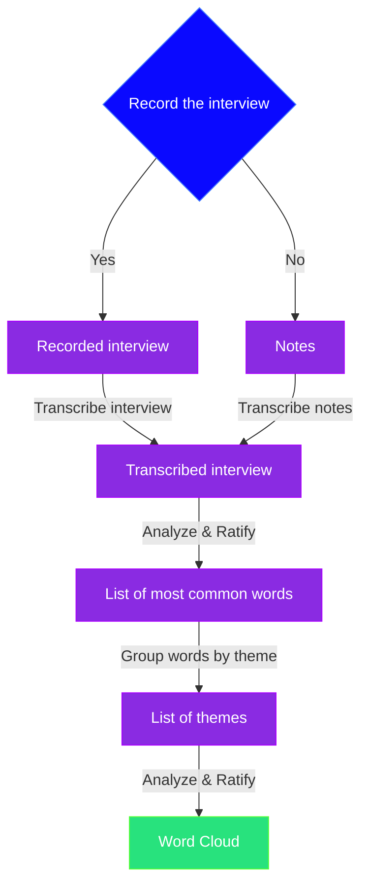

# User Testing Benchmarks

This document outlines the benchmarks we are using for user testing, defined per subject.
For every qualitative data we have to do a quantitive measure as well. If we cannot apply a quantitative measure, write down which analysis type / coding we are going to use.

<!--Tops 6 students per concept-->

## Thematic analysis

We decided to do a thematic analysis of our qualitative data. During the user tests, we have a lot of questions that are not quantitative.
There are 5 ways to do a analysis of a qualitative data set[^1]:

1. Content analysis
2. Thematic analysis
3. Narrative analysis
4. Grounded theory analysis
5. Discourse analysis

We settled on the thematic analysis because, narrative, grounded theory and discourse analysis are all not producing the results that we want and or need.
On top of that our dataset does not suit their processes, making it difficult to perform these types of test.
Content and thematic analysis are somewhat similar, but our data pool fit the process of thematic analysis better, due to being on the smaller side.

The product of this user testing is a word cloud from which you can directly see, what the general consensus are regarding the question.

### Process step by step

1. (Optional) Record the answer to our questions (interview).
2. Let Word transcribe the answers.
3. Thematic analysis[^2]:
   1. Familiarization with the data.
   2. Divide data according to the questions.
   3. Analyze the data, i.e. how often are some words mentioned?
   4. Create themes according to the words used in the answers.
4. Create a word cloud for the themes[^3].

### Diagram

## Functionality

Functionality refers to the capability of the system, software, device, or game to perform its intended tasks or operations. It encompasses the features, abilities, and behaviours that allow users to achieve their goals. In software development, this has been combined with Quality Assurance (QA). Quality assurance is a systematic process used to ensure that products or services meet specified requirements and standards, whilst satisfying customer expectations.

<!-- Missing description of what is functionality? -->

### Subjects

<!-- 

Which areas dor we want to test under functionality? 

Format:

- Thematics subject
 - Question 1
 - Question 2
   - Sub-question 1

-->

- Feedback mechanisms:

  - Does the game provide timely and meaningful feedback to players on their performance and progress?
  - Are feedback mechanisms designed to support learning and promote improvement over time?
- Performance optimization:

  - Is the game optimized for performance across different devices and platforms, ensuring a smooth and responsive user experience?
  - Do players encounter technical issues or performance limitations that hinder their ability to engage with the educational content?

### Metrics

**TBD**

- Feedback mechanisms:
- Performance optimization:

<!-- 

How are the subjects going to be measured? Which metrics best represent the subject? 

E.g. how many seconds does it take for the user to figure out the controls?

-->

### Benchmarks

**TBD**

<!-- 

What are the thresholds for the metrics to be positive or negative? 

E.g. if the user figures out the controls in less than 10 seconds, the result is positive.

-->

## Accessibility

The extent to which individuals with diverse abilities can effectively interact with and enjoy the game.

### Subjects

<!-- Which areas dor we want to test under Accessibility? -->

- Control Clarity
- Text readability
- UI clarity and simplicity
- Feedback

### Metrics

- Control Clarity:

  - How many seconds does it take the player to figure out the control scheme? (quantitative)
- Text readability:

  - How many times did the player ask what was written? (quantitative)`<!--Kind of conditional, can be asked if the player squints his eyes etc.-->`
  - Does the player have any trouble reading the text? and why? (qualitative)
- UI clarity and simplicity:

  - How many clicks does the player require to open/start the level? (quantitative)
  - How many times does the player ask the test supervisor how the UI works? (quantitative)
- Feedback:

  - How many times is the feedback shown / triggered? (quantitative)
  - How many times does the player repeat the same mistake? (quantitative)
  - How many times does the player rely on the feedback to improve his gameplay? (quantitative)

<!-- 

How are the subjects going to be measured? Which metrics best represent the subject? 

E.g. how many seconds does it take for the user to figure out the controls?

-->

### Benchmarks

- Time: seconds, miliseconds
- Whole numbers: 1,2,3...etc.

<!-- What are the thresholds for the metrics to be positive or negative? -->

## User Experience

User experience (UX) encompasses all aspects of an individual's interaction with a product, service, or system, including the interface, graphics, industrial design, physical interaction, and the overall experience. It focuses on meeting the user's needs and providing them with a positive and enjoyable experience.

### Subjects

<!-- Which areas dor we want to test under User Experience? -->

- Fun
- Satisfaction
- Sensation
- Challenge
- Expression
- Submission
- Sense of urgency
- Sense of agency (influence)
- Error prevention and recovery

### Metrics

<!--Some questions do not have to be asked if our main questions have been answered-->

- Fun:

  - Did the player ask to continue the game? (quantitative)
  - Would the player continue play? And if we made more content? (qualitative)
- Sense of urgency:

  - Did the player feel time pressure to finish the prototype / level / game? (qualitative)

---

Ask these questions if the player answers with "No" to the above questions

- Satisfaction:

  - How do you feel after completing the prototype / level / game? Do you feel satisfied? (qualitative)
  - Why? (qualitative)
- Sensation:

  - How well were you immersed in the game? (qualitative)
  - Why, why not? (qualitative)
- Challenge:

  - Do you think the gameplay is challenging? (qualitative)
  - Why, why not? (qualitative)
- Expression:

  - To what degree does the game inspire self-reflection? (qualitative) `<!-- todo: revisit this question and maybe rephrase? -->`
- Sense of agency (influence):

  - Did you feel like you were doing math or playing a game? (qualitative)
  - How/What made you think you were (not) doing math? (qualitative)
- Error prevention and recovery:

  - How many tries did it take the player to finish the concept (/level) to 100%? (quantitative)
  - How many times did the player finish the concept (/level) in one try? (quantitative)

<!-- 

How are the subjects going to be measured? Which metrics best represent the subject? 

E.g. how many seconds does it take for the user to figure out the controls?

-->

### Limitations

- **Fun:** Needs to be defined before each user test. Which kind of fun are we looking for? What is the definition of fun in this scenario / test?
- **Satisfaction:** What is satisfaction, define what it means in the context of the game.
- **Sensation:** What does immersion look like in the context of the game? Does it look like the person is playing the levels quickly, not looking at the clock etc.
- **Expression:** Does the player self-reflect, based on the choices and mistakes that he makes and does he take action to avoid these in the next level / try / iteration.
- **Sense of urgency:** Did the player feel pressured to finish the game in a set amount of time?
- **Error prevention and recovery:** Define what 100% in each concept looks like? Is it to get all the stars, to defeat all enemies etc.

<!-- Describe / write down which metric has which limitations that we should be aware about -> not all of them, but the ones we need to be aware about -->

### Benchmarks

- Whole numbers: 1,2,3...etc.

<!-- What are the thresholds for the metrics to be positive or negative? -->

## Educational Progress

The advancement and development of mathematical knowledge, skills, and capabilities over time within an educational context. It includes the growth and improvement that individuals experience as they play the game.

### Subjects

<!-- Which areas do we want to test under Educational Progress? -->

- Learning objectives alignment
- Assessment of knowledge acquisition
- Engagement with educational content
- Tutorial and guidance options
- Expression

### Metrics

- Learning objectives alignment:

  - Does the player know what mathematical concepts were in the game?  (qualitative)
- Assessment of knowledge acquisition:

  - Are the players able to finish each concept within a set amount of *benchmark* (per level)? (quantitative)
- Engagement with educational content:

  - (See FUN) Would the player continue playing the game? (qualitative)
- Tutorial and guidance options:

  - Are the players able to finish each concept within a set amount of *benchmark* (per level)? (quantitative)
- Expression:

  - Would you play this game / concept to improve your math abilities? (qualitative)

<!-- 

How are the subjects going to be measured? Which metrics best represent the subject? 

E.g. how many seconds does it take for the user to figure out the controls?

-->

### Benchmarks

- Time: minutes, seconds, miliseconds... etc.
- Whole numbers: 1,2,3... etc.
- Collectives: stars, coins... etc.

<!-- What are the thresholds for the metrics to be positive or negative? -->

## Game Flow

The seamless and engaging progression of gameplay experienced by the player throughout their interaction with a game. It encompasses the pacing, rhythm, and overall structure of the game experience, ensuring that players remain immersed, motivated, and challenged as they navigate through different levels or stages.

### Subjects

<!-- Which areas dor we want to test under Game Flow? -->

- Complete concentration on the task / The experience is intrinsically rewarding:
- Clarity of goals and reward in mind and immediate feedback
- Effortlessness and ease
- Balance between challenge and skills

### Metrics

- Complete concentration on the task:

  - How many times would the players let themselves be interrupted / distracted? (quantitative)
- Clarity of goals and reward in mind and immediate feedback:

  - How many times did the players aks questions? (quantitative)
- Effortlessness and ease:

  - Are the players able to finish each concept within a set amount of *benchmark* / tries / time (per level)? (quantitative)
- Balance between challenge and skills:

  - Did the player make a remark about the difficulty of the game (i.e. too easy/difficult)? (quantitative)
    - Does the player feel like the level / concept / game was too challenging / too easy? (qualitative)
    - Why or why not? (qualitative)

<!-- 

How are the subjects going to be measured? Which metrics best represent the subject? 

E.g. how many seconds does it take for the user to figure out the controls?

-->

### Benchmarks

- Time: minutes, seconds, miliseconds... etc.
- Whole numbers: 1,2,3... etc.
- Collectives: stars, coins... etc.

<!-- What are the thresholds for the metrics to be positive or negative? -->

### Benchmarks

> This subchapter does not have any quantitative metrics.

<!-- What are the thresholds for the metrics to be positive or negative? -->

<!--

1. Complete concentration on the task;
2. Clarity of goals and reward in mind and immediate feedback;
3. Transformation of time (speeding up/slowing down);
4. The experience is intrinsically rewarding;
5. Effortlessness and ease;
6. There is a balance between challenge and skills;
7. Actions and awareness are merged, losing self-conscious rumination;
8. There is a feeling of control over the task. 

Information on benchmark vs metric: https://thecontentauthority.com/blog/benchmark-vs-metric

-->

[^1]: Hotjar, “5 Qualitative Data Analysis Methods,” www.hotjar.com, 2022. https://www.hotjar.com/qualitative-data-analysis/methods/ (accessed 14/05/2024)
    
[^2]: ATLASti, “The Ultimate Guide to Thematic Analysis,” https://atlasti.com/guides/thematic-analysis (accessed 14/05/2024)
    
[^3]: “Free Word Cloud Generator,” Free Word Cloud Generator. https://www.freewordcloudgenerator.com/ (accessed 14/05/2024)
       ‌
