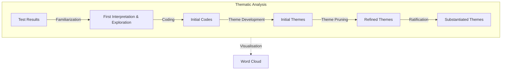

# Qualitative Text Analysis

<!--Needs to be reworked and simplified, e.g. only Word Clouds approach with sentimental analysis of 10 most used words etc.-->

This document outlines our approach to analysing qualitative data from user testing.

## Framework

For analysing our qualitative data, we will be using thematic analysis. Thematic analysis is a method for identifying, analysing, and reporting patterns (themes) within data. It is a flexible method that can be adapted to suit the needs of the research. Thematic analysis is a widely used method for analysing qualitative data in psychology, but also in other fields.

We have chosen this method because of the low barrier to entry and the flexibility it offers. It is a method that can be used by researchers with varying levels of experience and expertise. It is also a method that can be used with different types of qualitative data, such as interviews, focus groups, and open-ended survey questions.

### Limitations

All methods have their limitation and therefore we acknowledge the shortcomings of thematic analysis. It cannot capture complex narratives and true meaning, does not take context into account, and might drive results which do not necessarily reflect reality[^1]. Currently we take these limitations as is, which means results might not be as accurate as we would like them to be and be treated with nuance.

## Methodology

The methodology for our qualitative text analysis is as follows[^2]:

1. Familiarization

    

    The initial step in thematic analysis is to become thoroughly acquainted with the data. This means immersive reading and re-reading the data, such as interview transcripts or survey responses, to gain a deep understanding of its breadth and depth.

    During this phase, researchers should start noting in memos initial ideas, impressions, and potential patterns that merit further exploration.

    

2. Coding

    

    After familiarization with the data, researchers proceed to generate initial codes. This involves systematically working through the data set and coding segments of text that are relevant to the aspects of the user test.

    > Codes are concise labels that categorize important features of the data that may form the basis of emerging themes. This step requires meticulous attention to detail and an organized approach to segment and codify the data.

    

3. Theme Development

    

    Once the data have been coded, the next step is to collate codes into potential themes. This involves examining the codes and the data extracts associated with them to identify significant broader patterns that capture something important about the data in relation to the user test aspects.

    > Themes are not always just clusters of codes; they represent a level of patterned response or meaning within the data set.

    

4. Theme Pruning

    

    After identifying potential themes, it's crucial to review & prune them. This step involves two levels of review: first, checking the themes against the coded extracts to ensure they form a coherent pattern, and second, ensuring each theme is distinct and meaningful in relation to the other identified themes. During this phase, some themes might be split, combined, or discarded as the analysis refines and sharpens the thematic map of the data.

    

5. Ratification

    

    Having reviewed the themes, the next task is to define and refine them, giving each one a clear and informative name. Defining themes involves articulating what each theme captures about the data and why it is significant in relation to the research question.

    Naming a theme should succinctly convey the essence of what it represents, allowing readers to understand the core of what was found.

    

After having performed the thematic analysis, we will visualize the results in a word cloud using [Free Word Cloud Generator](https://www.freewordcloudgenerator.com). This visualization will help us to quickly identify the most common words and themes that emerged from the data.

### Diagram

[^1]: Hotjar, “5 Qualitative Data Analysis Methods,” www.hotjar.com, 2022. https://www.hotjar.com/qualitative-data-analysis/methods/ (accessed 14/05/2024)

[^2]: ATLASti, “The Ultimate Guide to Thematic Analysis,” https://atlasti.com/guides/thematic-analysis (accessed 14/05/2024)