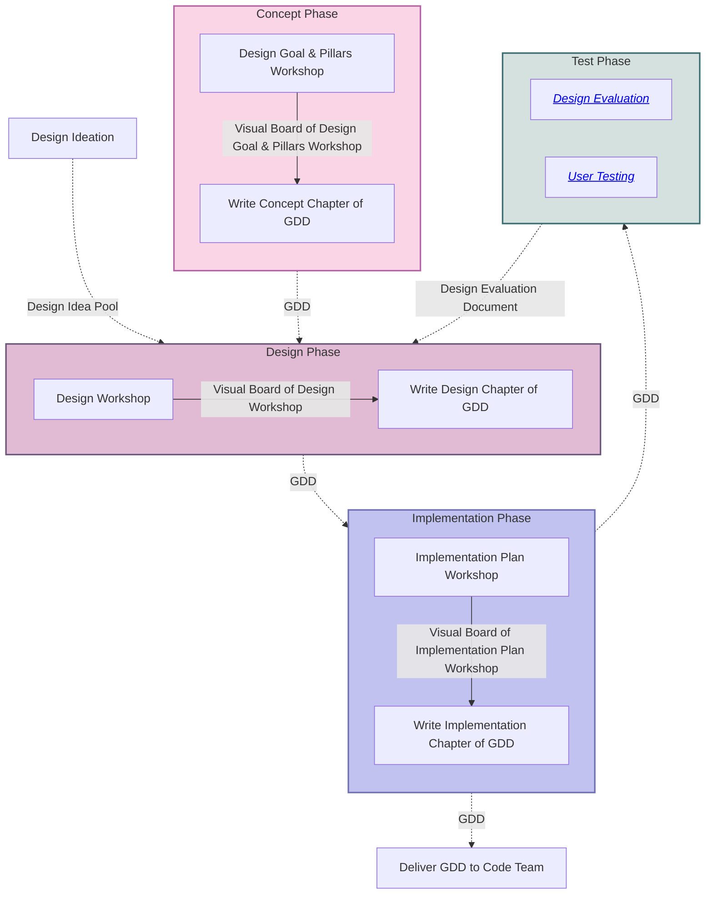

# Concepting Process & Products

This document outlines the process, products and tools used during the creation of our game designs.

## Tools

For creating the designs we will be using the following tools:

- `Microsoft Whiteboards`: visual workspace for concepting, voting, mindmaps, etc.
- `Teams OneDrive`: version control for the visual workspace
- `GitHub`: knowledge base & version control for design & process documents
- `mermaid.js` & `draw.io`: for creating diagrams
- `Penpot` & `Figma`: for creating wireframes & mock-ups
- `FigJam`: for creating moodboards

## Design Process

Our process is divided up into four distinct phases:

1. Concept
2. Design
3. Implementation
4. Test

Each phase has its own set of products and processes that are used to achieve specific layers of concretisation of the game design. Meaning it starts off high level and then gets more detailed as the process progresses.

> A game design document template has been created to support this process. It presents a structured way of documenting the design process and is used as a process guideline for the design team.

### Concept

The concepting phase is all about what the goal of the game is and what emotional core, is. The player experience is foundational to defining these high-level definitions and are therefore approached with a player-centric mindset.

> This phase is very abstract, to support the understanding of these abstract concepts, the game design document template contains examples.

During this phase there are two products created:

- `Visual Board of the Design Goal & Pillars Workshop`
  
  This product will be a timestamped version of the visual workspace used during the design goal & pillars workshop.

- `Concept Chapter of GDD`
  
  This product will be a chapter in the Game Design Document (GDD) that outlines the goal of the game and the design pillars. The chapter will be a written version of the visual board of goal & pillars.

### Design

After the concepting phase is completed, the design phase will start. This phase is all about how the game will be designed to meet the goal and pillars. The design phase will be approached with a game-centric mindset.

> To support the design phase, an ideas pool is setup to collect the ideas of all team members and is updated regularly with new ideas from the team. This pool will be used during the design workshop to brainstorm on ideas.

During this phase there are two products created:

- `Visual Board of the Design Workshop`
  
  This product will be a timestamped version of the visual workspace used during the design workshop in which the systems and mechanics of the game are designed. During this workshop multiple artifacts will be created, such as a mindmap of brainstormed mechanic ideas, game loop flow charts, onion diagrams etc.

- `Design Chapter of GDD`
  
  This product will be a chapter in the Game Design Document (GDD) that outlines the systems & resources of the game. The chapter will be a written version of the visual board's finalized ideas.

### Implementation

Once it is clear how the game is designed, the implementation phase will start. This phase is all about how the game will be implemented to meet the design and will focus on more explicit functional & audio-visual requirements.

During this phase there are two products created:

- `Visual Board of the Implementation Plan Workshop`
  
  This product will be a timestamped version of the visual workspace used. During this workshop multiple artifacts will be created, such as a mindmap of brainstormed implementation ideas, a style board, music & sound effects ideas etc.

- `Implementation Chapter of GDD`
  
  This product will be a chapter in the Game Design Document (GDD) that outlines the functional and audio-visual requirements of the game. The chapter will be a written version of the visual board's finalized ideas.

#### Delivery

After the implementation phase is completed, the Game Design Document (GDD) will be delivered to the code team for a first technical analysis.

### Test

The last phase of the process, is the test phase. This phase is all about testing the game design to see if it meets the goal & pillars, and go back if it doesn't.

#### Design Evaluation

The design is pre-maturely evaluated according to conceptual foundation, core values and game lenses. More information on this process can be found in the `Design Evaluation` folder.

#### User Test

The game is tested by users to gather data on functionality, user experience, accessibility and project contextualised values. More information on this process can be found in the `User Testing` folder.

### Diagram

> The blocks are processes, grouped by phase, while the arrows define a product.

## Sources

Information on this page has been gathered from:

- The design meeting of 06/05/2024
