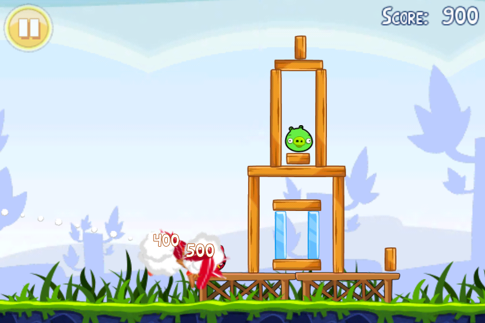

# Angry Equations: Game Design Document

<!-- Be sure to write everything from the perspective of a player! -->

<!-- Be sure to write everything as concise and short as possible! -->

## Concept

Using linear functions, the player fires projectiles to destroy objects in the level and defeat the enemy. The linear function used will determine the trajectory of the projectile, which the player uses to destory the enemy's stronghold of objects.

### Math Learning Goal

1. Playing with the fundamental characteristics of a linear function first individually and then in combination.
2. Applying the fundamental characteristics to transform one representation (verbal, graph, formula, table) into another in a playful way.
3. Solving quests, tasks and problems involving multiple representations of linear function (verbal, graph, formula, table).
4. Applying properties of linear functions to solve equations in a playful way.
5. Applying the appropriate function representation to solve a question or problem in the game.

##### Implementation

The learning goals are implemented through level design; the player adjusts functions to generate a graph which is used for shooting in the game. The levels can be made more difficult and the amount of editing in the linear functions can be made more complex, to further challenge the player and expand on their understanding of the subject.

### Goal (Mission)

*When you are as stuck as you can be, destroy and you will see.* Destroy what I see on the screen, and keep destroying in a way that gets better each time.

### Design Pillars (Vision)

#### Aiming:

As the player, I want responsive and intuitive ways to aim the projectiles. It needs to be clear to me how the projectile will traverse through the air, so I can make informed decisions about my moves and gather an undestanding about the linear function I am applying, without having to guess until I clear a level.

#### Destruction:

I want to experience the projectiles having a true impact by appropriately destroying the objects I fire at. It has to make sense within the realism of the world, so that objects that no longer have another object to stand on will fall down. This will make me feel as though I am properly progressing throughout the level and the game.

#### Adaptability:

I, as a player who might not have the same math skill as my peers, want to be able to play the game regardless of this skill gap. If I am not as experienced, I want the game to be playable by me and help me expand on my math skills so I can progress. Similarly, if my skill is that above of my peers, I do not want to be stuck in levels that are too easy for me for too long.

## Design

### Mechanics

#### Core Mechanic

##### Aiming

The player aims their projectile using linear functions. By adjusting the values in the function, the trajectory of the projectile changes, adjusting to match the graph of the associated function. In addition, the player must consider the most optimal trajectory to destroy the intended targets, actively engaging with the function.

#### Secondary Mechanics

##### Shooting

When the player has determined where to aim, they fire the projectile. This actively engages the game world and allows the player to interact with it, but also displays the direct consequences of their aiming strategy. The projectile explodes on contact with the first object it hits, which gets destroyed, and other objects within the radius are affected by the force.

##### Destruction

Destruction is the measure of progress within the level; once the enemy is defeated, the player progresses. Using the above mechanics to determine how to aim, the projectile will then explode and cause a radius of destruction, which allows the player to destroy the enemy. The destruction is both a goal to complete the level, and a reward for making a correct assertation on the projectile trajectory.

##### Evaluation

After the player has cleared a level, a graph will fade into view to display the visual representation of the functions they put in to launch their projectiles. This allows for a definite connection between the gameplay and the learning goal, but also for the player to review their strategies and absorb knowledge based on their interaction with the subject matter. This knowledge can then be applied in later levels.

After putting in any input, the evaluation shows up and gives the player the option to return to the menu or proceed to the next level:

##### Level Progression

In order to progress throughout the game, the levels have to be cleared in accordance to predefined clearing conditions:

- All the enemies are taken out -> The level is cleared
- If the player is out of ammunition and there are still enemies remaining -> The level is failed
  If the level is failed, no bananas are awarded. In order to progress, at least one banana has to be awarded per level in order to advance.

##### Scoring

How well you completed a level will be represented in amount of bananas rewarded, from 3 (good) to 1 (acceptable).

- Each block that you destroy in the level will awards 100 points.
- Each defeated enemy awards 500 points.
- Each piece ammunition that has not been used awards another 500 points.

The amount of bananas - like a star system on some mobile games - rewarded will be based on the amount points the player scored.

For example: 2000p or more is 3 bananas, between 1500p and 2000p is 2 bananas and less than 1500p is 1 banana. The actual thresholds would have to be tested for.

---

### Dynamics

Throughout the game, the player is challenged in a variety of levels. In those levels, a structure made out of different blocks, holding one or multiple raccoons (enemies), has to be destroyed using projectiles to reach the enemies and destroy *them*. The player adjusts the trajectory of the projectile by adjusting the values on a linear function. Hitting the structure in the right place will cause a collapse, allowing the raccoon to be reached - or for it to fall and be defeated through that avenue.

The player has to experiment which formula develops which trajectory that will do the most damage as ideally, the player solves the level in as few shots as possible. Learning what function creates what graph, but also what effec this has on the puzzle of destroying the level, teaches the skills to handle progressively more difficult levels. They refine their skill over time, handling levels with more efficiency and earning more rewards.

⭐️ Each level earns rewards: getting back the bananas the raccoons have stolen. The more bananas the player earns, the more skill points they achieve, which can be spent on upgrades to make the game easier. Rather than simplifying the game as a whole, these upgrades allow for more efficient experimentation and skill refinement. For example, more ammo; the player has more room to destroy things in their own way.

Through these dynamics, two distinct aesthetics are facillitated.

### Aesthetics

For this game, two aesthetics are prominent in design: Challenge and Discovery.

**Challenge** is found in the levels themselves; the player must learn and understand how to approach destroying the objects in the game to reach the enemy and clear the level as efficiently as possible. They are puzzles to solve that challenge the player's knowledge in order to advance.

**Discovery** comes from experimenting. Firing projectiles and observing how this affects the level, to learn new things and to better understand, allows the player to discover new tricks and more efficient ways of progressing.

### Economy

Depending on their score per level, the player earns bananas as a currency, up to three per level. This is encouraging precision in shots and and understanding of the projectile trajectory and thus the learning material, rather than throwing things at the wall to see what sticks.

#### Resources

The player's primary resource is their ammunition. The player has three shots available per level to destroy the opposing objects; each culmulative shot decreases the player's score, failing the level if all shots of ammunition are used before the level is cleared.

#### ⭐️ Currencies

---

<!--*POSSIBLE EXPANSION OF THE GAME, **DO NOT IMPLEMENT FOR PROTOTYPE***-->

Upon clearing a level, the player is awarded bananas. They can use these bananas as currency to unlock harder stages of the game (see Progression System). In addition, for every 10 bananas earned, the player gains a skill point.

---

#### ⭐️ Consumables

The player gains a skill point once every 10 bananas, which is used to unlock one upgrade on the skill tree.

### Progression

The player progresses through the game by refining their knowledge on linear functions to complete levels with more precision and forethought, allowing for more levels to be unlocked with the in-game currency of bananas. Their journey is quantified by the increasing difficulty of the level constructions, and their progressing understanding of how to break these down with more advanced linear functions.

---

<!--*POSSIBLE EXPANSION OF THE GAME, **DO NOT IMPLEMENT FOR PROTOTYPE***-->

### ⭐️ Progression System

- The player will start with the easy stages, this section is unlocked right from the start.
- The player gathers bananas rewarded from the levels. Once a banana has been earned, that level can no longer reward it to the player's total.
- Intermediate stages section will be unlocked after gathering 20 bananas. This means that if the player is too skilled for the easy stages, they have the option to quickly move on to the intermediate stages.
- After gathering 40 bananas, the hard stages section will be unlocked.

#### ⭐️ Upgrades

- Every 10 bananas, the player can advance the skill tree.

Ideas for the power-ups:

- Increase in ammunition (making it possible to get higher scores because the player can keep more at the end of a level)
- Increase in explosion radius/power Upon impact
- Ammunition splits up into 2 more that cause smaller explosions left and right.

### Loops

#### Game Loop

#### Feedback Loops

The player getting better at math from playing the game is offset by making the levels more difficult in this negative feedback loop.

---

<!--*POSSIBLE EXPANSION OF THE GAME, **DO NOT IMPLEMENT FOR PROTOTYPE***-->

⭐️ The upgrades make the game easier in a positive feedback loop.

---

## Implementation

### Target Platform

The target platform for this game will be mobile-web and desktop-web.

### Controls

The game will entirely be controllable with touch/cursor.

### User Interface

#### Main menu

- Title of the game
- [BUTTON] Play
- [BUTTON] Settings
- [BUTTON] Quit

#### Level Selection

- [BUTTON] Clickable level nodes in a grid that bring you to the level in question
- [BUTTON] back to the main menu
- Amount of banana's gathered

<!--*POSSIBLE EXPANSION OF THE GAME, **DO NOT IMPLEMENT FOR PROTOTYPE***-->

- ⭐️ [BUTTON] Upgrade

#### In Level UI

- [BUTTON] Pause -> Brings up dialogue box with interactable buttons
  - [BUTTON] Resume
  - [BUTTON] Options
  - [BUTTON] Back to the level selection
- Current score
- Current available ammunition
- Current equation
- Visualisation for equation (line following the canon)
- [BUTTON] Increment the a value in 'y = ax + b' Up
- [BUTTON] Increment the a value in 'y = ax + b' Down
- [BUTTON] Fire/Shoot

#### Level Clear UI

- Text indicating the level was cleared
- Amount of banana's reached
- [BUTTON] Retry
- [BUTTON] Go back to level select
- [BUTTON] Next Level (grayed out if not enough bananas)

#### Level Failed UI

- Text indicating the level was failed
- 3 empty banana icons
- [BUTTON] Retry
- [BUTTON] Go back to level select

### Camera Behaviour

The camera is stationary, focussed on both the cannon and the enemy structure, until the level is cleared at which point is zoomed out to fit the entire grid in the camera and shows the entire graph.

### Game Objects

#### Cannon

Essentially the player. The canon moves based off the input from the player. Every increment the player makes to the *a* value in the *y = ax + b* equation moves the canon and the visualised line.

- Cannon (and by extention the equation) operates on a grid of 10 by 10.
- Increments happen in steps of 0.25.
- The cannon should only be able to shoot to the right, the barrel should never be pointing to the left.

#### Bombs

The ammunition for the cannon. The player starts the level with 3 ammunition.

- The shot bomb explode on impact (disable/destroy the bomb), expanding outwards forces to all destructible objects surrouding the impact.
- After the level is cleared, reward the player 500 points for every remaining ammunition.

#### Destructible Blocks

These are blocks used to create the structures within the levels.

- Destroyed on direct impact from bomb.
- Sustain damage from other objects that fall on top.
- Destroyed when taken enough damage.
- When destroyed, reward the player 100 points.

#### Connecting planks

Used to help hold up destructible blocks in order to create roofs and floors.

- Are attatchable to 2 blocks, one on the side of a wall, the other at the bottom of a roof/floor.
- Destroyed when one or both attached blocks are destroyed.

#### Indestructible Blocks

Used to create ground or intentionally indestructible walls and floors to make a level more challenging.

- Can't be destroyed
- Don't move (kinematic)

#### Racoons

- Destroyed on direct impact from bomb.
- Destroyed if they sustain enough damage from falling debris.
- When destroyed, reward the player 1000 points.

#### Example Level

To demonstrate more clearly what is meant by all the objects, look at this possible level design:

The dark grey block is scalable and kinematic, non-destructible. The white blocks are destructible and abide by the rules of gravity. The white blocks that form the roof are held up by the smaller planks. If the block marked by a star is destroyed, the smaller plank will also be destroyed, resulting in the roof block falling down rotating to the left because the right plank is still attached.

### Polish

#### Screenshake

- When a bomb makes impact, shake the screen to convey a sense of power to the player.

#### Particles

- When shooting the cannon, make it so the cannon gives off smoke and fire particles.
- Have smoke particles follow the bomb when travelling to convey a sense of speed to the movement.

Describe the different polish elements in the game, e.g. particles, animations, etc.

### Story

You are a monkey whom got their bananas stolen by raccoons and you're on a quest to get them back.

**Possible names:**

- Banana Blitz: A Monkey's Revenge
- Ape Avenger: The Great Banana Heist
- Monkey Mayhem: Raccoon Rumble
- Banana Quest: The Raccoon Raiders
- Revenge of the Apes: Raccoon Bananapalooza
- Ape Assault: The Great Banana Battle
- Bananageddon: Monkey vs. Raccoon
- The Great Banana Caper: A Monkey's Revenge
- Raccoon Rampage: Monkey Mayhem
- Bananapocalypse: Monkey Retribution

### Sound

The sound should be weighty, to sell the player on the power fantasy of shooting bombs out of a cannon.

### Art

Should be cartoony and colourful. Inviting the player to play. It also deters the play from thinking rationally about the game's premise, since it's so silly.

Examples would be:

`Angry Birds`

|  |  |  |  |
| --------------------------------------- | ----------------------------------------- | -------------------------------------- | --------------------------------------------- |

`Gold Miner`

|  |  |  |
| -------------------------------------------- | --------------------------------------------- | ------------------------------------------- |

`Fleabag vs. Mutt`

|  |  |  |
| ------------------------------------------- | ------------------------------------------- | ------------------------------------------- |

## Testing

Describe the design test outcomes

### Lenses

Describe which lenses are most applicable to the design and describe how the design can answer the questions of the lenses.

<!-- No requirements as checklist, they're made to reach a goal, not to check them -->

<!-- A checklist has to be quantified e.g. the game has to have four levels -->

<!-- A checklist can be quite difficult to defend against teacher! -->
