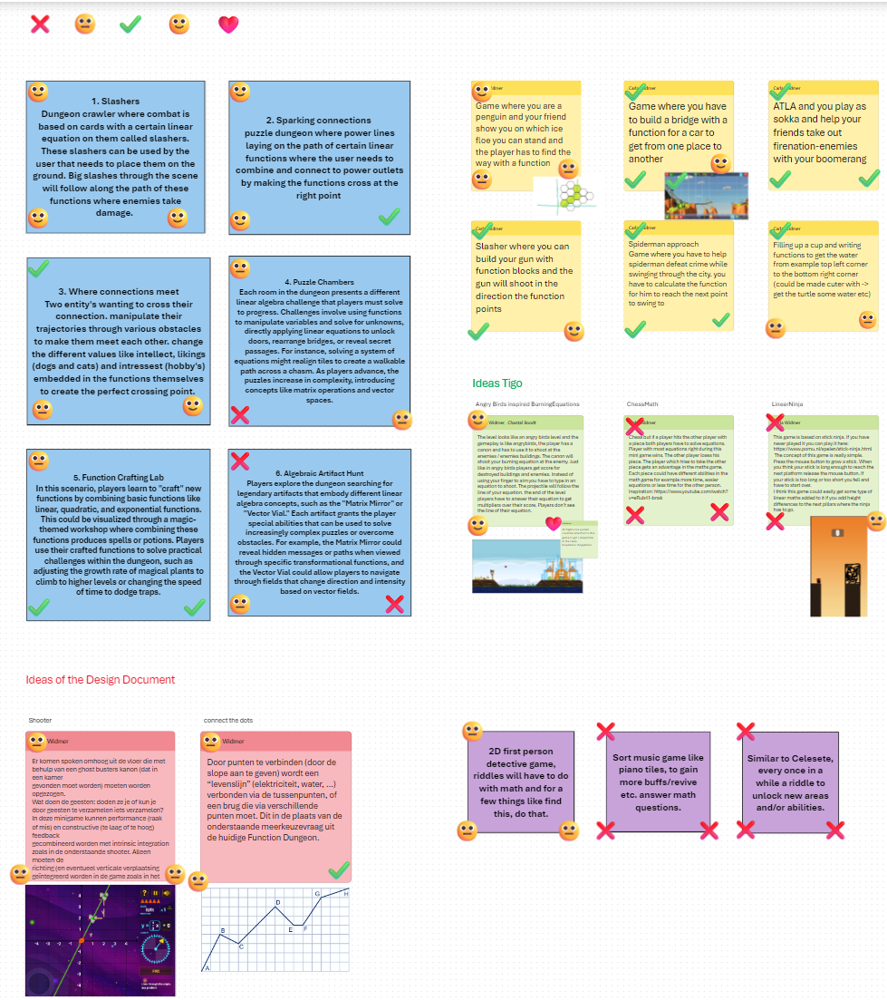

# Process Justification: Angry Equations

For this concept the entire team started of with brainstorming the diverse game ideas. Each idea was rated, keeping application of learning goals, entertainment and scalability in mind. Some requirements had been created upfront, which the idea should be able to include, such as:

- Include linear equations
- Scalability
- Inclusivity (gamers, understanding)
- Adaptability
- Easy to play

These requirements were made after analysing and discussing the information provided by Erwin van Crasbeek. It was discovered that `Function Dungeon` fell into the category of gamification, whilst the client desired more of a serious game. Due to this, **entertainment** became more of a requirement.

All these requirements and ratings combined resulted in the top-voted idea of `Angry Equations`,derived from `Angry Birds`. Now a new challenge arose: "How should linear equations be incorporated into `Angry Birds`?". Another brainstorm session was held to gather a plethora of ideas.

This resulted into the idea that a linear function can be incorporated into the action of shooting a bullet. This simplistic approach allowed for a game which marked our requirements: 

- `Include linear equations`: equations will be used to define the trajectory of the bullet.
- `Scalability`: easy to implement changes to the formula allowing for the possibility to create many levels and tweaking their difficulty as needed.
- `Inclusivity (gamers, understanding)`: the simplistic concept makes the game (and gameplay) easy to understand for players.
- `Adaptability`: the simplicity allows for the possibility to implement and change level-design and/or equations used.  
- `Easy to play`: by combining the simplistic idea and the usage of the right controls the game becomes easy to play for everyone (especially the target audience).