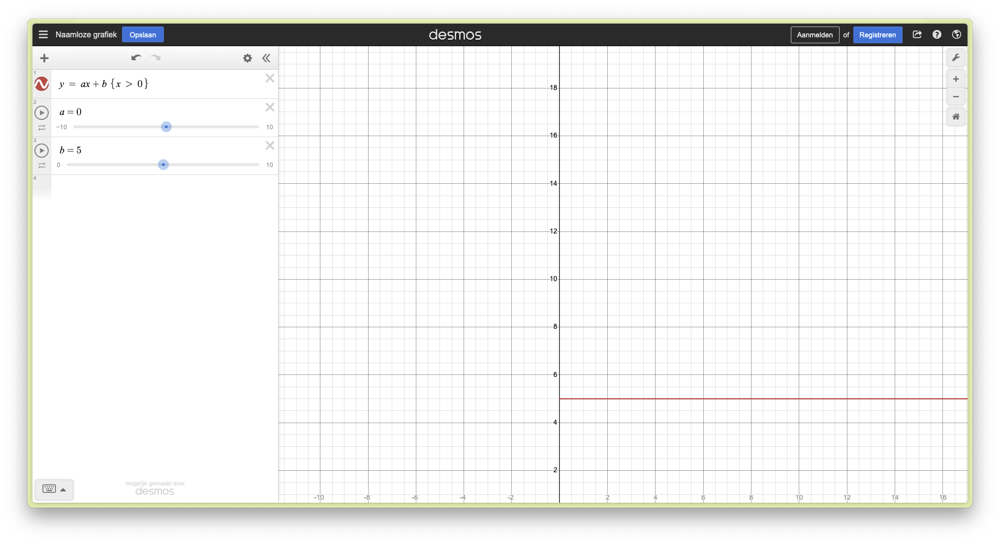

# Feedback For the design team

The epics for our functional requirements can be found in [Angry Equations](../../../Technical%20Design/Requirements/01%20Angry%20Equations.md)

- We want a Graph at the end so when the user did their shooting and when the ammunition has hit its targets. The camera shows the function on a graph in the game world to further establish the connection between the game and the math principles [Epic 2]
  
- We want to know if the game should formulate if something is right or wrong [Epic 4 & 5]
  
  > "It is now difficult to determine if there is a right answer."
  
- Define a winning condition [Epic 4]
  
  - Point system? and how would that be displayed to the user?
    
- Have a mechanic to have a drive for the player to play the game [Epic 1]
  
- How does the ammo work? [Epic 1 & 4]
  
  - Infinite or finite supply?
    
  - What happens to the ammunition after it has hit targets and lays still?
    
- Needs to be tested [Epic 1 & 2]
  
  - What we want to have it defined if the steps of the slope since larger values result in a decrease in slope steps (see desmos with $y=ax+b$)

  
    
- How are we going to measure the student's math ability to determine where they need to start in the game [Epic 3 & 5]
    - For example a questionnaire at the start of the game

- Game progression
    - How do we display game progression [Epic 4 but may be connected to 5]
        - if infinite ammo: do you get stars for how many balls it took to kill or hit all the targets?
        - if not infinite ammo: what then?

- How does the camera interact with the game environment. does it move with the cannon? is it fixed? does it zoom in on certain parts?

- The bullet should slow down after it has hit an object and then do less damage. Does this do less damage to the targets or do no damage under a certain speed threshold?

- Do we have different types of blocks (glass blocks, stone blocks)? Do we need to worry about different breaking behaviours or structural integrity
