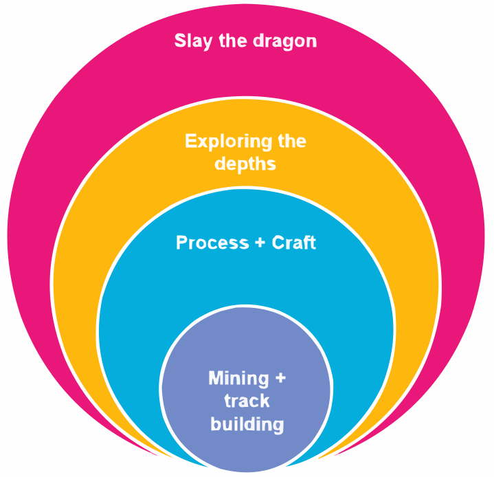
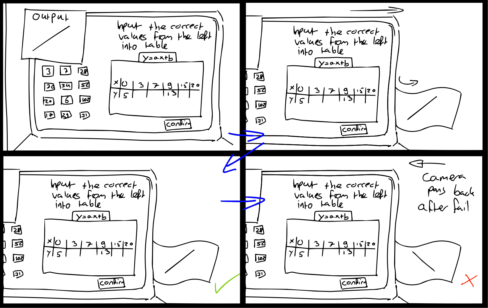
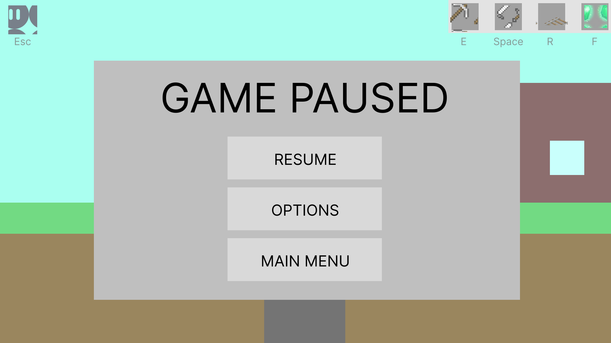

# Myth Digger: Game Design Document

<!-- Be sure to write everything as concise as possible! -->

The player is someone who intends to find the supposed answer to the dying planet under the crust. Doing so will require the gathering of materials so they can craft tools necessary to dig further and be able to find the answers you're looking for. Building rails, processing ores, and using them in crafting allows you to progress through the game by digging deeper each time.
The game has a side view and the depths are dark. The light source is glowing gems that you can mine and use motes of to light up the path you're mining.

## Concept

<!-- Describes the theoretical/high-level conceptual foundation of the game. -->

### Mission

1. Reach the dragon using your wit!
2. Reach the core using your wit!
3. Dig, process, dig further!
4. Unearth the secrets and treasures down below!
5. Construct a network of caves and train tracks!

<!-- E.g. "When you're stuck as can be, just destroy and you'll see" -->

### Design Pillars

- :star: `Exploration`: I want to explore the world below and find out its secrets.
- `Crafting`: I want to use what I have gathered to craft new tools so that I can explore more.
- `Experimentation`: I want to see what different resources can do for me.
- `Challenge`: I want to keep being pushed to try new things to continue.
- :star: `Management `: I need to manage my resources in a logical way in order to advance.

### Aesthetics

- Fantasy
- Challenge
- Discovery

## Design

<!-- Describe the high-level design of the game. -->

### Mechanics

<!-- 

*What are the mechanics of the game?* #ONION :D 

If using the onion diagram using draw.io or others, please use/export as svg (not png)!

-->

#### Core Mechanics

##### Mining 
The player mines down tunnels to gather resources and to progress further down the elevator shaft using the newfound materials. :star: The player mines into sideways resource tunnels and glowstone nests, and downwards through the elevator shaft.

##### Track Building
The player can put down tracks so that they can transport the mined ores back to the surface. The tracks need to be placed along the obstacles within the tunnel, adjusted in their angle and height by changing values within a linear function.

#### Secondary Mechanics

##### :star: Exploring

The player is incentivised to explore beneath the surface in hopes of finding the mystical dragon rumoured to be hiding in the core. They must find the ore tunnels by climbing up the elevator shaft and tapping the sides, until they encounter the right tunnel. Additionally, they need glow crystals to light their path in dark tunnels, found in separate pockets lined along the elevator shaft.

##### Processing
In order to use the newfound materials, they need to be processed. The player processes them at the refinery, by solving an equation given to them by their professors. Afterwards, the material can be used in crafting.

##### Crafting
To be able to advance through the tunnel, the materials must be used by the player to strengthen their tools to be able to dig deeper and slay tougher enemies. They do at their workbench, solving an equation to determine y- and x-intercepts so they know where to strike their hammer.

### Dynamics

In Myth Digger, the player tries to reach the core to slay the world-eating dragon. In order to do so, they must gather resources to help break through the hard stone and create weapons to defeat enemies blocking their path. On the surface, they have their elevator to take them into the mines, and the warehouse. In the warehouse are the machines for processing and crafting, which can be interacted with independently.

:star: The player starts with an elevator shaft that has already been excavated. When headed down, they need to find the ore deposit tunnels. They tap around the walls, able to scale them on their own, until they break through into a tunnel. The most important tunnel - the ore tunnel - is littered with rock that cannot be broken or moved - the player can scale them to the other side where the ore vein sits, but transporting the material efficiently is another thing. However, some tunnels are also empty, leading to no ore deposit and pushing the player to search for tunnels with the rewards they need.

If they open a tunnel but still can climb higher, a ladder will appear after the tunnel is opened, allowing them to continue to scale the walls.

To move the materials, the player must build rail tracks. Players place pieces of rail track along the obstacles, adjusting their rotation and height based on a function they manipulate, challenging their knowledge and skill. Once they confirm the function and the track is in the right place, it will click into place with the previous piece and the player continues until they reach the elevator shaft. From there, the resources are mined automatically and transported topside.

Eventually, the player cannot descend further down the shaft and there are no more ore tunnels to excavate. They need to return to the surface to process the resources they have gathered. Processing is done in a separate building on the surface, holding a refinery and a crafting table. In the refinery, the materials are processed.

The materials, infused with mana, make them unusable in their current state. However, with help of off-screen scientists, a data output for processed material can be predicted. The player then has to calibrate the output on the refinery console, placing the correct values in the table to represent the line for the data output. Once they press the button, a paper representing the graph they created with their table is printed, showing either the correct output line or an incorrect one. In the latter case, the player has to try again; if it is correct, the calibration has been completed and the resources are processed.

Processed materials can be used in crafting on the workbench. Using the output line from the processing, two more lines are given, as well as the corrosponding functions. The player has to calculate the x- and y-intercepts to determine where to hit the hammer for correct structural integrity. This has to be done for both their pickaxe to cut through the tougher rock, as well as their sword to defeat increasingly tougher enemies.

:star: As the player descends down, the ore deposit tunnels carry increased challenge and danger. Not only are the obstacles in the way harder to navigate around, but some tunnels are so dark they need glow crystals for lighting which can be mined out of separate pockets also connected to the main elevator shaft. Enemies also begin to patrol this area, glowing with mana and getting increasingly more prehistoric looking as the player continues down. To help along the way, the player can find health tunnels to increase their own defense after battling a small 'boss monster' section.

:star: Eventually, they breach the dragon's nest and attack. This is a full test of the player's skills in both the game and the math puzzles given to them. 

### Math Didactics

#### Learning Goals

1. Playing with the fundamental characteristics of a linear function first individually and then in combination.
2. Applying the fundamental characteristics to transform one representation (verbal, graph, formula, table) into another in a playful way.
3. Solving quests, tasks and problems involving multiple representations of linear function (verbal, graph, formula, table).
4. Applying properties of linear functions to solve equations in a playful way.
5. Applying the appropriate function representation to solve a question or problem in the game.

#### Implementation

The learning goals are incorporated within the core mechanics of the game; the player uses linear functions to create the rail, transforms one representation to another, and solves intercepts. This is needed to progress, either by processing their materials or by crafting the necessary tools to advance. The difficulty of these challenges can be increased or decreased as needed, and scales throughout the level to continue teaching and testing the math skills.

### Economy

#### Resources

Myth Digger has 3 primary resources:
- :star: Health
- :star: Glowstones
- Resources (referred to in this chapter as materials)

##### :star: Health

Health is the player's life force and main resource to maintain in combat. The player starts with three hearts; when attacked by an enemy that amount of hearts is reduced. The player slowly generates health back over time (half a heart/??sec) or regains it completely when returning to the surface. When health is fully depleted, the player dies and hits a game over. They can return back to the game at their last checkpoint - the checkpoint is placed when they excavate down to the next depth, the 'next level'. 

The player has the opportunity to expand their total health by finding and clearing boss tunnels; empty tunnels with clusters of enemies trapping life-essence in a cage of mana. Once the enemies are defeated, the life-essence can be collected and expands the players health by one heart. 

##### :star: Glowstones

The further the player goes, the darker the ore deposit tunnels become. To light their path, the player uses glowstones. Glowstones are obtained through glowstone pockets, found along the elevator shaft similar to ore tunnels. Glowstones are a finite resource, but can be picked back up once placed. Glowstones light an area of a radius of ??.

##### Materials

The main goal of the player is to reach the core of the tunnel by breaking through the rock that stands in their way. The rock progressively gets harder and the player needs more and more materials of increased strength to break through this rock. The player mines these materials in ore deposit tunnels and processes them for crafting. :star: The materials are not a finite resource, constantly mined from the ore tunnels they are found in; however, for crafting, the influx of raw materials may need to be of a certain level before it can be utilized (eg. to upgrade to a pickaxe of material B, the player needs to have 2 ore deposit tunnels open and connected that harvest material B).

:star: What these materials are, and what order they present themselves to the player, will have to be determined later; for the sake of the prototype, using letter designations will suffice. **Add to this for finalized document!** <!-- Flowchart? -->

### Progression

##### Opening
:star: [CUTSCENE] Player is climbing and attempting to mine in the shaft, finds a tunnel. Walks into the tunnel. Camera exponentially pans down to the dark center of the planet. Dragon roar ensues (You don't see the dragon, its presence is implied by the roar). Camera pans back up to the player. [CUTSCENE END] 

The player now starts in the tunnel. UI element appears detailing the player to walk to the left so that they encounter the ore at the end of the tunnel and don't try to walk back to the shaft.

Once the player is at the end of the tunnel, a UI element pops up 'Press R to place tracks'
After placing the first one another instruction will pop up: 'Once you complete the rail, the ore will be transported topside.'

(We assume the player will walk to the elevator and take it topside, since there are no other interactibles currently)

Once the player arrives topside an NPC will initiate dialogue. The dialogue details that the player's current equipment isn't strong enough to dig deeper. But since they just brought some ore topside, the player should check out the warehouse.

UI element pops up signaling the direction in which the warehouse is. Once the player enters the warehouse, the first interacible is the processor and the second is the crafting.

If the player opens the crafting minigame first, UI warns them that they need to process the ore first.

Once the player has done the processing and has crafted the new equipment, the NPC initiates dialogue again. Detailing that the player should go back down to the shaft to see how far they can dig now.

##### :star: General Progression

As the game progresses, the world becomes more complex. The ore tunnels become more and more cluttered with obstacles, needing more refined use of the rail tracks in order to transport the neccesary materials. Enemies increase in number and strength, as well as having their movement patterns changed or speed increased. Tunnels become darker and require better use of glowstones to light them. The resources they gather become more and more complex in nature, requiring more knowledge to process and use in crafting - for example, processing no longer provides the direct formula and the player has to determine this based on the numbers they're given in the table, or having to draw the lines based on functions for the intersection point before calculating what that point will be. This scales the math difficulty, but leaves a lot of room for how it can be scaled.
The player grows in their skill to overcome these increasing difficulties, inching ever closer to the resolution of the story.

Visually, the 'levels' in the game change as they go deeper, becoming more saturated in color and unnatural in shape to reflect the increase of mana as the player descends deeper. Every layer has its own color scheme and ore types to collect, giving them distinction from one another and make the player really feel like they are travelling deeper and deeper into uncharted territory and unfamiliarity.

To indicate how much progress the player is making in a more practical way, every time they dig down to the next level, the camera will pan to the dragon (But it's obfuscated by the dark) and hear it roar and then have the camera pan up again. The camera will have less distance to travel the closer the player gets to the dragon, subtly hinting that the player is closing in on it.

### Loops

#### Game Loop

```mermaid
flowchart LR
%% Nodes
A(Gather New Resources)
B(Process Resources)
C(Craft Tools To Dig Deeper)
D(★ Advance Tunnel)

A --> B --> C --> D --> A

```

#### Feedback Loops

When the player unlocks a new area, that means they get access to new resources. They'll need those to dig deeper to the next area. In order to do that they can use the new resources to craft stronger tools.

:star:

:star: When the player goes down further, the enemies become more difficult. The player can also increase their health pool if they can find the boss room and defeat the challenge. Increasing the health will give them an easier time fighting enemies without dying.

:star:

:star:
When the player goes down further, the infusion of resources gets more complex which results in the puzzles getting more difficult. However, the player also gains more knowledge which allows them to complete the puzzles and progress further down.

## Implementation

<!-- Describe the implementation of the game. -->

### Target Platform

The target platform for this game will be mobile-web and desktop-web.

### Camera

The camera will follow the player. If the player enters a cave, the camera will zoom in to fit the bounds of the cave in view. We do this so there is more visual clarity for the challenges imposed on the player within the caves.

### Controls

- WASD for movement (W is jumping)
- E for mining
- :star: F for lights
- :star: Spacebar for slash (weapon)
- R for rail
- Escape for pause

### User Interface

<!-- Use tools like Penpot & Figma -->

### Game Objects

Describe the different game objects in the game, their purpose and how they interact with the player.

#### Elevator
The elevator is the main entrance and exit point for the player and for the materials they find. The material transport is passive once the track has been built, but the player can interact with the elevator to transport themselves back to the surface and down to the mine. When the player is close enough to interact, a prompt will appear on their screen.

#### Tunnels
The player can encounter three different kinds of tunnels:
- **An ore tunnel**, where the player has to build railtracks to transport the ore from the vein to the elevator shaft. As the player finds ore at the end of the tunnel, the first track is automatically placed. When the tracks are completed, a railcart appears that drives back and forth to transport ore. The player does not interact with this, and all ore is transported automatically.
- :star: **An empty tunnel**, where there is no ore. 
- :star: **A glowstone pocket**, where glowstones can be mined.
- :star: **A boss tunnel**, where the player has to defeat a horde of enemies to unlock the trapped life essence and increase their health.

:star: All tunnels can be of varying depth. Tunnels can be covered in darkness, and have to be lit up by glowstones. 

#### Machines
The machines can be interacted with to open respective puzzles for processing and crafting. When the player is close enough to interact, a prompt will appear on their screen.

--- 

#### :star:Glowstones

Glowstones can be mined. Once mined, they'll be added to your glowstone total. The player can place glowstones on the wall by pressing 'F'. This will light up the area surrounding it, making it easier for the player to spot points of interest. Pressing 'F' Whilst standing next to a placed glowstone, the player retrieves the glowstone and gets added back to their glowstone total.

#### :star: Enemies

Enemies can move vertically within tunnels. If there's a slope that's too steep or a wall, they can't move over it. If an enemy gets hit by they player's swing, they take one damage and get knocked back a small distance. Once the enemy's health is depleted, they are killed.

If the enemy makes direct contact with the player, the player loses one HP.

---

### :star: Polish

- Animations are straightforward motions; enough to show the life of the character, but not too complex. 
- Tunnels being exposed causes the screen to shake and rocks to fly outward of where the tunnel opens, showing dust until it clears and displays the correct tunnel. 
- The processing machine topside has a steady flow of objects on a conveyer belt leading into it to show the materials being moved.
- Entering and exiting the elevator to go topside or hit the area below is a simple fade to black in a circle:

- Each new layer of rock that is exposed has a gradually more saturated color scheme. The visual design of these areas become more jagged and unnatural in shape to reflect the increase of mana, but also to distinct every layer from one another and visualize progression.

### Story

The world is at an end. The mana that fuels the world is slowly being depleted. There are rumors and beliefs that the answer lies deep underground - but whether these are hopeful grasps at saving the world or meaningless superstitions, no one seems to know. You want to believe, though.

You have been appointed by an unknown benefactor to burrow your way to the core of the Earth to find this possible answer. But the rock gets harder the deeper you go, and you need newer and stronger materials to break through. You prepare for the possible danger and learn to utilize your newfound tools, digging deeper and deeper, until you uncover the answer.

The answer, as it turns out, is a dragon who has been eating the mana away, slowly draining the world of its life. The final test of this burrowing adventure is to slay it, and allow the world to heal and continue to prosper.

### Sound

##### Music
Chiptune-like sound library that gradually increases in complexity; starting off with a basic, mellow tune composed of only a handful of instruments, that climbs to multiple instruments. This is to reflect the increased complexity of the world below, the infusion of mana within the resources, enemies and even the ground the player walks on, as they descend further down.

##### Effects
Sound effects aim for a satisfying confirmation of actions; placing a railtrack correctly results in a *clang* sound that the player recognizes instantly and feels rewarded by. Picking up objects has a similar feel to the sound, a joyful pling (https://youtu.be/l2nFoftimzY?si=qpaoKqLd0KpdBZDL&t=120) to indicate the player has found something that is good and helps them progress. 

The general theme of the sound should be aimed around simplicity - not too many layers to the sound, matching the game's visual direction.

### Art
With this game, the art design aims at simplicity to be able to be run on any platform in webGL - the graphic requirements should be low, with simple animations and ideally a pixel art style. Visual effects should be aimed at making things clear to the player and convey what it means; for example, a tunnel wall crumbling when the player hits it with their pickaxe.

Below are examples of a visual style this game should attempt to achieve. 

