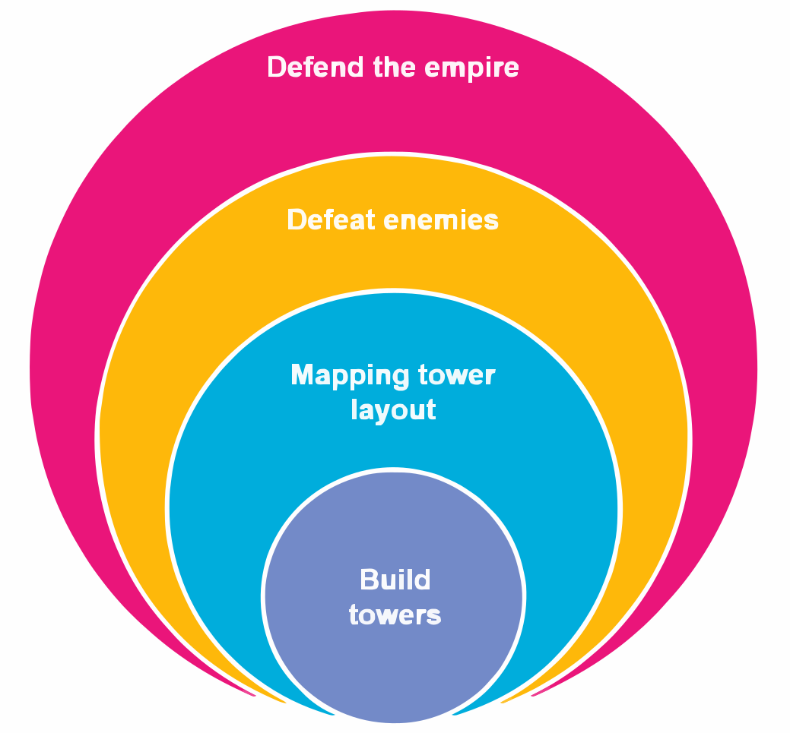
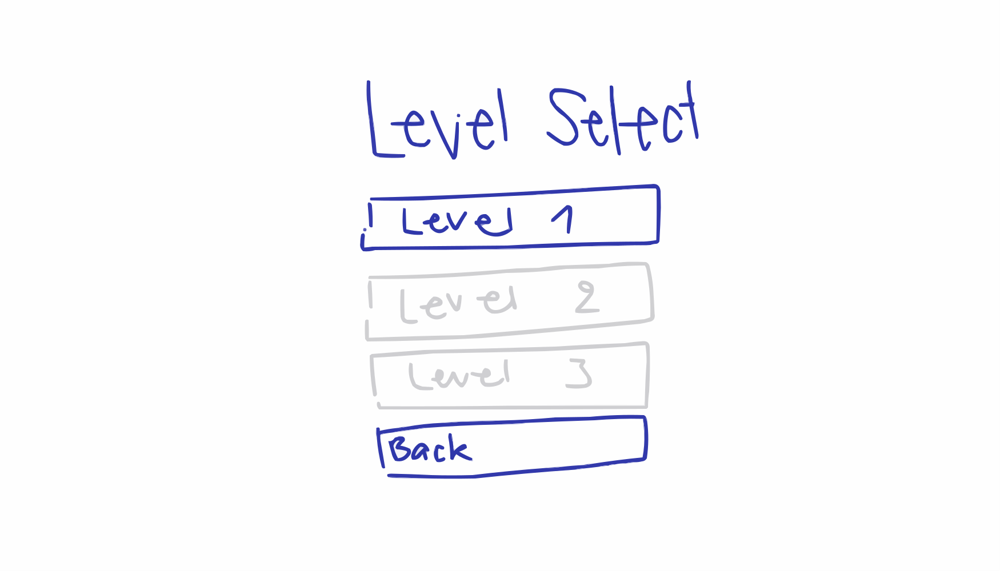
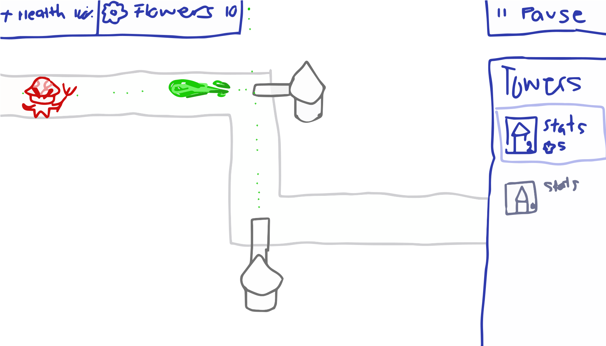

# Mushroom of BLOOM

<!--

Bloons TD 6

Enemies are approaching and you have to build defense towers that strike in a line based on a function

Equation Based:
Easy: you'll receive a card with the function
Moderate: 
  - 3 cards with a similar function
  - tweak a variable in the function (i.e. you'll get something like y = ax + 1, fill in a)
Hard: you have to write the function on your own

Game Based:
Easy: no turn in road, straight line
Moderate: simple level 1-2 turns or less in the road
Hard: 3-5 turns or a weird shaped

Extreme: Hard but everything has been made very complicated.

Single player but has lots a potential for multiplayer!
-->

## Concept

### Mission

**Let's defend our empire, and unleash our hellfire!**:fire:

### Design Pillars

- `Instant Feedback`: I can see the result of the attacks instantly.
- `Chaos`: It is chaotic and unpredictable I don't know what will happen next.
- `Variety`: I want to have a variety of options etc.
- `Anticipation`: I want to feel excitement and fear for when the challenge pops up?(i.e. Am I going to make it?)

### Aesthetics

- Sensation ⭐️
- Challenge
- Expression ⭐️
- Submission ⭐️

## Design

<!-- Describe the high-level design of the game. -->

### Mechanics

#### Core Mechanic

`Build towers`: A variety of towers can be build, using different trajectories, bullets etc.

#### Secondary Mechanics

- **Mapping out the towers**
  - Place towers strategically.
- **Defeating enemies**
- **Gathering the resources**
- **Shooting**
  - *Defining coordinates*
    - Write down on which coordinates a destructive object will be dropped by a tower
  - *Choosing the matching function (card-style)*
    - Choose a function which the tower will then use as a trajectory
  - *Altering a function* :star:
    - Using graph lines adjust a function to determine a trajectory for a destructive object
  - *Writing a new function* :star:
    - Using graph lines create a function to shoot a destructive object

### Dynamics

#### Sensation ⭐️

- **Visuals and animations**: Use decent and stylized graphics and animations.
- **Immersive sound effects and music**: Implement dynamically changing sound effects and music.
- **Feedback**: Incorporate feedback, i.e. when towers are placed, upgraded, enemies are destroyed etc..

#### Challenge

- **Limited resources**: Limit the amount of resources to increase difficulty.
- **Increasing difficulty**: Implement a progressive difficulty curve where each level and/or wave becomes more challenging.
- **Varied enemy types**: Introduce varying enemies, i.e. more health, different type of bloom disease etc..
- **Boss enemies**: Introduce powerful boss enemies at the end of certain waves or levels.
- **Complex maps** :star:: Design maps with varied terrains and/or obstacles that affect tower placement and/or enemy movement.
- **Time constraints** :star:: Add a time-based challenge mode.

#### Expression ⭐️ 

- **Customize player character**: Provide options for players to customize their character, i.e. different mushroom hats, colours etc..
- **Player-created levels**: Implement a level editor where players can create and share their own maps/challenges.
- **Upgrade and modify towers**: Include a system for upgrading towers, i.e. tower elements, more damaging firepower etc.. 

#### Submission ⭐️

- **Progressive levels**: Implement progressively challenging levels that gradually introduce new towers, enemies and bosses.
- **Daily/Weekly challenges**: Introduce daily or weekly challenges and rewards to keep players coming back.
- **Idle mechanics**: Implement idle game mechanics where progress can be made even when the player is not actively playing.

### Math Didactics

#### Learning Goals

1. Playing with the fundamental characteristics of a linear function ~~first individually and then~~ in combination. `<!-- Dependents on the implementation -->`
2. *Applying the fundamental characteristics to transform one representation (verbal, graph, formula, table) into another in a playful way.* `<!-- Dependents on the implementation -->`
3. Solving quests, tasks and problems involving multiple representations of linear function (graph, formula).
4. Applying properties of linear functions to solve equations in a playful way.
5. Applying the appropriate function representation to solve a question or problem in the game.

#### Implementation

1. Playing with the fundamental characteristics of a linear function ~~first individually and then~~ in combination. :star:

> Shooting, by altering the *A* and *B* values of the formula the trajectory of the destructive object (i.e. a tornado) can be defined.

2. *Applying the fundamental characteristics to transform one representation (verbal, graph, formula, table) into another in a playful way.*

> Shooting, by choosing a matching card with a formula displayed on it to aim the trajectory of the destructive object. 

> Shooting :star:, when the player wants to place a tower, the moment it snaps to the pathway, a table pops up which you have to complete in order to calculate where the bullet is going to land. place the tower definitely.

3. Solving quests, tasks and problems involving multiple representations of linear function (graph, formula).

> Shooting, whilst altering the *A* and *B* values of the formula graph lines are shown for more clarity.

> Shooting, whilst altering the coordinates the player can see where the bullet is going to land.

4. Applying properties of linear functions to solve equations in a playful way.

> Shooting, using cards the player can choose the best trajectory for the bullets of the tower.

5. Applying the appropriate function representation to solve a question or problem in the game. :star:

> Shooting, by performing any of the shooting types appropriately multiple enemies will be defeated.

> Placing the towers, the player has to think about what tower (function type) would fit best on each location.

### Economy

#### Resources

- `Health`: To survive in-game (i.e. the home base). 
- `Towers`: To defeat the enemies.
- `Bullets`⭐️: To defeat special/certain type enemies.

> Purple = Resources

#### Currencies

- `Flowers`: Bloomers drop flowers when defeated.

> Purple = Currencies

### Progression

**Tutorial level**: For the first level we imagine a predefined layout of two towers. One is the bullet tower and the other one is a bomb tower (explained more in depth below). This is to make the introduction to the game as easy as possible. The enemies will come from the bottom left. This level serves as a example on how a full game level could look like.

> Dark red = shooting tower (card-style)

> Lime green = bomb tower (coordinates)

*Tutorial Level without HUD*

**Normal level**: In this Level the players can place the towers they unlocked / bought alongside the path to their liking / stratagem. For further levels different towers can be used to defeat the enemies and different input types for the functions which makes the progression and difficulty more nuanced. In this Level we have a more complex path and the players can place the two towers freely in along the path. The enemies will come from the left side and move along the path to the right side. This level design consist solely of the path. On the right end of the path will be the arch to the entrance of the kingdom which we did not add here. The tutorial Level can be used as a reference on how the level looks like in the end.

**Level editor**:star:: The game can be expanded by creating a level editor. In this level editor teachers will be able to create the pathway and therefore implement the functions they'd like to see. 

*Normal Level without HUD*

Below the increase in difficulty will be described for each subject.

#### Tower

- **Implementing tower updates** :star:
  - New types of bullets, i.e. herbicides/pesticides etc.
  - Differing elements, i.e. different types of herbicides/pesticides etc.
- **Implementing linear equations in a different fashion i.e.**
  - *Defining coordinates*
    - Write down on which coordinates a destructive object will be dropped by a tower
  - *Choosing the matching function (card-style)*
    - Choose a function which the tower will then use as a trajectory
  - *Altering a function* :star:
    - Using graph lines adjust a function to determine a trajectory for a destructive object
  - *Writing a new function* :star:
    - Using graph lines create a function to shoot a destructive object
- **Implementing new towers**
  - Build new/unlocked towers
  - Include research for new tower types :star:
  
##### Enemies
- **Implementing new/different enemy types**
  - Differing stats, i.e. more health, destructive power etc.
  - Differing elements :star:, i.e. different bloom disease etc.
- **Implementing new/different boss types** :star:
  - Differing stats, i.e. more health, destructive power etc.
  - Differing elements, i.e. different bloom disease etc.

> Blue = Starting event

### Loops

Below the game loops and feedback loops are described.

#### Game Loops

- **Failed wave**: Restart the level
- **Failed level**: Restart the level

A failed wave is when all of your towers have been infected by the bloomer disease. The kingdoms health is the health from all placed towers combined. If they are all infected the kingdom is rendered defenceless and therefore defeated. 

##### Short-term

*Wave progression*

> Blue = Start

> Purple = Product

> Pink = Action

> Light Blue = Events

> Green = End

##### Medium-term

*Level progression*

> Blue = Start

> Purple = Product

> Pink = Action

> Light Blue = Events

> Green = End

##### Long-term

*World progression*

> Blue = Start

> Purple = Product

> Pink = Action

> Light Blue = Events

> Green = End

#### Feedback Loops

##### Positive

**Difficulty**

The loop starts-off with the enemy wave. Clearing the wave will allow the player to gain more resources. These resources can then be used to build more towers making it easier to defend in the next wave.

**Flowers**

During the wave enemies will be defeated, who will drop flowers. 
Flowers can be used to buy more towers, which in turn will allow more enemies to be defeated.

**Towers**

Upgrading towers leads to stronger towers, which results in more enemies being defeated. 
This results in more flowers being dropped meaning more towers can be upgraded and/or build.

**Combos**:star:

A combo can be started once five enemies have died within two seconds of each other. 
This will activate a combo bonus, these can differ per level, i.e. one level could have a defence boost, another one an attack boost etc.
These temporary boosts will reinforce the overall defence.
This results in more opportunities for combos, allowing more enemies to be defeated.

##### Negative

**Defence**

Stronger enemies give a more difficult challenge.
By improving their stratagem and placing or repairing more towers the player can improve their defence to ward of these enemies.
This in turn will allow the player to defend their castle.

> Stronger enemies do not drop more flowers.

**Upgrades**:star:

Upgrading and/or building towers will decrease the player's resources.
Stronger and/or more towers will be able to defend against more/stronger enemy waves, which require a better defence.

**Purification**:star:

Infected towers require resources to purify. This will impact the amount of resources the player has to upgrade towers.
In turn this will affect the defence of the player, who will need to use their resources wisely.
Purifying their towers might lead to being able to upgrade less towers.
However upgrading their towers will limit the amount of purifications the player can perform on their infected towers.

## Implementation

### Target Platform

The target platform for this game will be desktop-web (and mobile-web).

### Camera

The camera is static. The view is top down and is tilted backwards just a bit.

Examples

|                          |  |
| -------------------------------------------------------------------------------------------------------------------------------- | --------------------------------------------------------------------------------------------------------------------------------------------------- |
| Bloons TD 6                                                                                                                      | Overcooked!                                                                                                                                         |
|  |                                 |
| Pokémon Ruby                                                                                                                     | Little Witch in the woods                                                                                                                           |

### Controls

The player uses the mouse to click and/or select.
To write the function, the player uses the keyboard.

- :star: Drag and drop the towers to place them.
- :star: Drag the trajectory of the Function, 
    - See: *HUD layout -> Adjust Function idea (Intermediate), Idea 2.*

### User Interface

#### Main menu

- Title of Game
- [Button] Play
- [Button] Settings 
- [Button] Quit

#### Settings :star:

- Settings
- [Button] Volume
- [Button] Textsize 
- [Button] Back to Start

#### Level Selection

The player can choose from different levels which differ from each other in the way the player interacts with the function. Level one is the card level, where you choose a card matching the given function, level two is adjusting the function and level 3 can be writing the function. These levels can be adjusted and leave a lot of room to add more levels with different input systems like tables etc.

- Level Selection
- [Button] Level 1
- :star: *[Button] Level 2*
- :star: *[Button] Level 3*
- [Button] Back to Start

#### Pause Menu

- Pause
- [Button] Resume
- [Button] Restart
- [Button] Back to Start

#### HUD

- Health
- Flowers (Collectable)
- [Button] Start / Pause
- Towers
    - Selection of available towers and the cost
- Function (The function is always visible when the tower is active. The muzzle moves under the function, the function is hovering)
- Global grid of coordinate system.

- The screen is tiled with these measurements: 
    - Width = 20 tiles
    - Height = however many tiles fit

##### Cards Idea (Easy)

Function is missing one variable and player can choose from a selection of cards. 

##### Coordinates Idea (Easy / Medium)

Tower drops a bomb / missle on defined coordinates. 

##### Adjust Function Idea (Intermediate)

Function can be altered / adjusted with an interaction. 

###### Idea 1

Function can be altered with arrows that in- or decrease the value of a variable. 

###### Idea 2

Function can be altered by dragging the handler on the displayed function. 

##### Write Function Idea (Hard)

Function needs to be written by the player. 

### Game Objects

The screen 

- `Flowers`: Automatically collected by the player when a enemy dies. They can be used to buy towers.
    - The player starts the game with already 100 flowers in his possession.
- `Towers`: Strategically placed by the player before each wave starts, to defeat enemies. The towers snap automatically to the path on the screen where the enemies will walk along. Just like the grid system in the Sims, a tower will be unable to be placed and appears red unless it is close to the path. When the tower gets placed near the path it will turn green and be automatically placed upon the the right position in the grid. When a tower is placed by the player on the grid, it has to be placed along the path and the `b-value` will automatically be added to the function according to where the tower was placed. This results in the player only needing to change the `a-value`. If a tower is infected it is essentially destroyed and rendered useless. After the wave is won, the player can choose to upgrade his towers, place new ones or purify the infected towers and putting them back in action with flowers. If they have enough flowers, they may also upgrade the newly purified tower. If the player choses not to purify a tower, it will occupy the tile it stands on and cannot be removed. Only purified towers can be removed.

    - Bomb (coordination) tower: *(Input are coordinates)*
        - Price: 75
        - Damage: 30
        - Fire rate: 4 sec.
        - Health: 420
        - Range Tower: 10 tiles straight to the left/up/right/bottom.
        - Range of Bomb: 2 Tiles x 2 Tiles

    - Drops (/ bullets, Card-style) tower: *(Input is function)*
        - Price: 50
        - Damage: 10
        - Fire rate: 0.5 sec
        - Health: 360 damage points to be destroyed
        - Tower Range: 8 tiles straight to the left/up/right/bottom.
        - Bullet Range: First enemy it hits

    - Final castle: (defenceless)
        - Price: none
        - Damage: none
        - Fire rate: none
        - Health: 100 damage points to be destroyed
        - Tower Range: none
        - Bullet Range: none

- `Enemies`: Attack the towers and infect them with the bloomer disease. When defeated by the player / the towers and bullets they drop flowers.
    - The very first wave will have 5 enemies type 1, 2 enemies of type 2.
    - Enemies will crowd below towers to attack, the limit of how many enemies a tower can handle will be calculated by: ⌈Number of enemies ÷ Number of towers⌉. It is always rounded up

    - Due to the size of the game just 2 enemy types have to implemented.
        - type 1:
            - Damage: 20 
            - Health: 50 damage points to be killed
            - Attack speed: 1 sec.
            - Drop: 10 Flowers

        - type 2:
            - Damage: 60 
            - Health: 30 damage points to be killed
            - Attack speed: 3 sec.
            - Drop: 30 Flower

- `Bullets`⭐️: Used to defeat special/certain type enemies. One type of 

### Polish :star:
- **Particles**
    - When damaged, whenever an object hits another object
    - On pickup, whenever a flower gets picked up
    - On placement, whenever a tower is placed on the map
- **Animations for**
    - enemies (walking, attacking, dying)
    - bullets (being shot, exploding)
    - tower (placement, moving of the muzzle, being attacked, being infected)
- **Ambient lighting**
    - Use coloured lighting to emphasize emotions, i.e. blue for sad, red for angry, yellow for happiness etc.
- **Personification**
    - For the player to feel immersed and personified in the game the character of the royal strategist is added at the bottom right corner under the tower selection. He reacts to the input from the player for example looks at a map, points to the place where the tower is placed, looks at the battle field while the wave is incoming etc.

|  |  |
| -------------------------------------------------- | --------------------------------------------------------- |

### Story :star:

In recent times a plague has been spreading across the land of mushrooms.
The awful disease of BLOOM has spread amongst you kin.
Friends, family and even royalty has been struck by this disaster.
During the fight against this disease it has become apparent,
that whoever has been struck will change into... into.... A BLOOMER!!!
After much deliberation the king and queen have decided the time to take action is here. 
Your time has come to take up the mantle of royal strategist and defend the kingdom!

### Sound :star:

**Menu and Story**: The sound should be cute and light, a simple but memorable soundtrack that fits the light-hearted theme of the game.
**Level**: For the level we have two soundtracks that are similar.
- *Battle phase*, in the battle phase we imagine a soundtrack that is intense but still light-hearted and cute.
- *Strategic phase*, during the placing of the towers the music is a bit more calm-hearted, but still similar to the battle phase.

**Game objects sound effects**:
- *Enemy*, skreetching for dying, attack sound, hurt sound.
- *Flower*, a light pling sound for when a flower is picked up
- *Tower*, boom for when a cannon is shot, a thump sound when the tower is placed, and a breaking sound when the tower breaks.
- *Bullet*, depending on the type of bullet different sounds could be used for example a swish sound for a tornado, or a deep humming for bees etc.

### Art :star:

As can be seen below the artstyle is cartoon style, clean lines, cute characters and the view from top down.
The colours are bright, vibrant and happy.

Inpsiration for the mushroom kingdom style can be found below.

