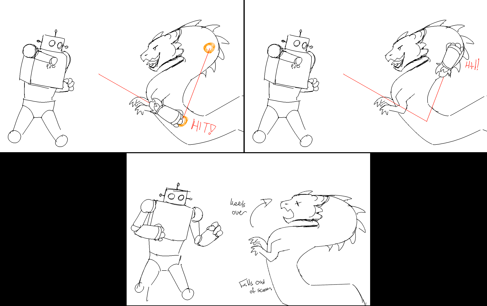
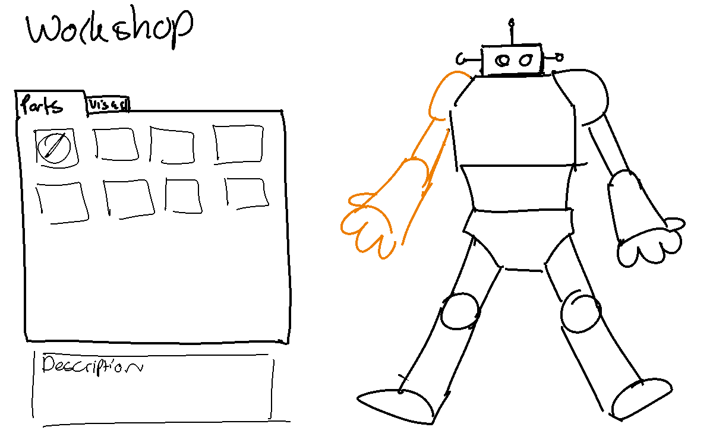

# Kaiju Killer: Game Design Document

`v1.0`

<!-- Be sure to write everything as concise as possible! -->

## Concept

You are in control of a giant robot to slam down the kaiju invasion threatening to plunge the world into chaos! The robot - ROBB-E -had to be built quickly, so its capabilities are limited; using limited amounts of punches per turn you have to work your way through waves and waves of enemies by hitting them on their weak points. You can do so by adjusting the arc of the punches, taking them out before they get too close - and your poor robot gets hurt.

### Mission

1. Aim and wallop!
2. Whack and punch to victory!

### Design Pillars

**Destruction:** I want to destroy the monstrous opponents to win.

**Excitement:** I feel thrilled at seeing my robot succeed in big, flashy ways.

**Calculation:** I can consider my moves carefully to make sure I make no mistake.

### Aesthetics

- Sensation
- Fantasy
- Challenge
- Expression

## Design

<!-- Describe the high-level design of the game. -->

### Mechanics

#### Core Mechanics

##### Punching
The player can punch. The trajectory of the punch is decided by the input of the user through linear functions. :star: How these functions are presented varies on the kind of wave the player has to face; most waves are simple drawings of lines, while there are more challenging representations down the line. 

#### Secondary Mechanics

##### Defeating Kaiju
By punching kaiju, the player can defeat oncoming kaiju. Kaiju have weak spots that need to be hit so the beast takes damage; every turn that passes where not all weak spots are taken out, the kaiju moves closer. 

##### Collect Parts
Kaiju sometimes drop parts usable for the player's mech. By punching at the location where the part dropped, the player can pick it up and then use it to customize the mech. After some time, the parts disappear when not interacted with. The player can customize their mech after each wave passes.

### Dynamics

In the game, the player fights waves of kaiju with their large mech, ROBB-E. ROBB-E can fire its fists in an arc as a punch, hitting the kaiju on their weak spots to defeat them. The fists only have enough fuel to complete two arcs to start, which can be improved later on. 
Each wave is structured like turn-based combat. One wave exists out of kaiju approaching for 3 turns; in those three turns, the player has to align their punches to hit the weak spots vizualised on the kaiju. The turns are not timed; the player has as much time as they need to align their fist. :star: Taking fewer turns per wave grands a higher overal score and increases the potential for part drops.

For common kaiju, the player calculate the arc by adjusting a linear function. The graph of this function is shown as a preview for the player to visualize their line. Once they have confirmed this line, this is set in stone - they cannot return to realign their arc. Fists only connect with weak points, or sail past and hit the edge of the screen. When all the arcs are set, the fist launches and hits the kaiju.

In order to actually get the player to engage with the mathematics behind these mechanics, they are interacting with this very directly. The functions are not adjusted by gradually increasing the values by pressing a button; they have to enter these values themselves. Only when a value has been entered does the line preview change. 
:star: The interaction with the function changes based on difficulty, such as removing the line preview altogether and instead presenting them with various value options of which only 1 is correct. 

If the targets are missed and the kaiju lives, the first turn ends and the kaiju moves closer one step. Every wave has 4 states; 3 approach states and one hit state. Every approach state moves the kaiju closer until it makes contact with the mech, upon which it loses a portion of health and the kaiju 'escapes', and is removed from the screen.

:star: Every so often, a huge kaiju will appear as the sole opponent in a wave. This 'boss kaiju' requires different methods of calibrating punches such as filling in a table with values, or calculating specific intercepts for a double-whack. These kaiju require more effort to take down, needing multiple punches on different weak points to defeat it. When hit successfully, the kaiju will not approach; on errors, it will move up one state. 
The purpose behind these special kaiju is to introduce new math mechanics and give the player some room to practice these and try them out for the final challenge of that section.

:star: The section boss, the massive kaiju, appears at the end of all waves of that section. This creature requires the player to bundle all their skills in various aiming challenges that combine the basic kaiju and the huge kaiju posed to take it down. Afterwards, the player completes the section and moves to the next one.

:star: At the very end of the run, te player encounters the world-shattering Kaiju. This final boss poses the final challenge, combining all skills taught per section into one massive final fight. Mechanically, all boss kaiju work the same in terms of state changes, but the length of these fights are increased.

:star: Each section unlocks a new body part for modification; the right arm, the head, and the body. Each part has a different attribute that modifies the playstyle of the player. During the waves, some basic kaiju drop a mod part that the player can then pick up with one of their punches; this is then added to their inventory for that run. The section boss always awards an upgrade - the player gets a choice out of three modifications, and they can pick one they enjoy.

:star: Modifications are not necessarily upgrades; they are playstyle changers. They change one aspect of the mech for the better, but come with a drawback that forces the player to change how they approach their playstyle. For example, one modification could be that the player has fewer punches per round, but significantly buffed health. 
Not interacting with modifications does not pose a lose condition, nor does interacting with certain modifications grant a guaranteed win condition. They are gameplay modifiers, making certain areas easier and others more difficult to play into a player's preferred playstyle.

:star: At the very end of that run, the player can select a modification out of a choice of 3 that they have picked up to add to their main inventory. In later runs, they can then apply that modification right off the get-go to change their playstyle per run.

:star: A key element about Kaiju Killer is that the order, difficulty, and presentation of these kaiju and their corrosponding mechanisms to defeat them can be interchanged by a controller - in this case, the teacher. Mech parts can be individually enabled and disabled to allow for a more playful environment, or one more focused on practicing the math only. They can adapt the game's course, such as the length of the waves or the amount of huge kaiju, or swap around the mechanisms to shift focus on a specific skillset, or let it play out as described above for a more overarching game flow. 

<!--

In Kaiju Killer, the player defeats hordes of kaiju in order to save the world from demise. To achieve this goal, the player pilots a mech that they can use to punch the oncoming kaiju. Defeating these kaiju can net the player parts to customize and upgrade their mech. Since this is a turnbased game, the menu can be opened up at any time to change mech parts. This allows the player to adapt on the fly so they can efficiently take out the kaiju.

Every so often, a huge kaiju will appear as the sole opponent in a wave. This kaiju will serve as a boss and requires more effort to take down. After taking it down, the player will get an option to pick one out of three random parts (They don't have to pick it up, it just gets added to their inventory).

After a certain number of waves, the world shattering kaiju will appear. This is the final boss of the game and will test the player's skill in both mathematics and understanding of the mech parts. After this kaiju is defeated, the world is saved and the player can choose to play the game again. 

-->

### Math Didactics

#### Learning Goals

1. Playing with the fundamental characteristics of a linear function first individually and then in combination.
2. Applying the fundamental characteristics to transform one representation (verbal, graph, formula, table) into another in a playful way.
3. Solving quests, tasks and problems involving multiple representations of linear function (verbal, graph, formula, table).
4. Applying properties of linear functions to solve equations in a playful way.
5. Applying the appropriate function representation to solve a question or problem in the game.

#### Implementation

The game's core mechanics are structured around functions; all turns require the player to solve some sort of question regarding linear functions in order to make the mech attack. Basic kaiju teach the player linear functions in the most basic form, while every boss introduces a new method of solving the equation and thus defeating the enemy in a new way. (:star:) The player is routinely tested on their new skills, while reinforcing knowledge of previously gained skills. 

The way these functions are interacted with gradually increases in difficulty during a run or depending on a difficulty setting made by the player or by the teacher. While many aspects of the game are determined in advance, there is a desire to allow the teachers to adjust how the game is interacted with to allow better fit within the curriculum or the teacher's style of teaching these particular subjects and skillsets. 

In addition, Kaiju Killer does allow for expansion into different concepts such as quadratic equations, though the game will always be focused around graphs and visualizing due to the nature of the mechanics.

### Economy

#### Resources

Kaiju Killer has the following resources:

- Health
- :star: Parts

##### Health

The player has health that will deplete when Kaiju come into direct contact. The standard rate of health depletion on basic kaiju is one heart per hit.

##### :star: Parts

The player collects parts that they can use to customize/upgrade their mech. Each part will have a rarity and effect, that bolsters one attribute but makes another weaker to adjust the playstyle. The parts are applied to 4 different areas of the mech, which are unlocked by completing each section:

- Head
    - Mostly focused on utility, this might give the player more options for deciding the punch trajectory.
- Left Arm
    - Focused on offense, this is used to take out the kaiju. 
- Right Arm
    - Focused on offense, this is used to take out the kaiju. 
- Body
    - Focused on defense, the stance of the mech is important for survivability.

#### Currencies

Kaiju Killer does not have currencies.

#### Consumables

Kaiju Killer does not have consumables.

### :star: Progression
The game is based on a roguelike structure: play a run, gain modifiers, finish a run, play a new run with new modifiers. The starting difficulty does increase slightly per run achieved, but can be adjusted manually if this increase is too much for the player.

The game is divided into 4 sections:

Each section is composed of several waves of kaiju, interrupted by huge kaiju, or minibosses. These minibosses require a special method of punching, pushing the player to approach the linear function from a new angle such as aiming by filling out a table rather than adjusting the function directly. These bosses require more effort to defeat, but do allow the player time to uncover these new mechanics and practice them accordingly.

At the end of every section stands a section boss that once again forces the player to grapple with these new mechanics while also testing their abilities on the mechanics practices on the basic kaiju. Once this section boss is defeated, a new part of the mech unlocks for modifications and the player progresses to the next section.

The following section plays out similarly to the one before, but with a new miniboss - and a new math mechanic. The section boss is tougher than the one before, requiring all previous mechanics to be applied to defeat it.

This loop continues until the end of the fourth section, where the player has to defeat the world-shattering kaiju. This kaiju requires all previously applied mechanics to be used multiple times with different functions in order to be defeated. Once the player has managed to take down this kaiju, they are taken to the main menu where they are given their rewards, and they can start another run with different modifiers. If enabled, the runs gradually increase in difficulty depending on how many succesful ones the player has to their name.

#### :star: Difficulty Levels

Difficulty levels can be set manually and gradually increases as the player completes more successful runs. Some proposals for difficulty increase on regular kaiju are:

**Easy**

The player has to fill in the values of the function by hand. The preview trajectory is shown.

**Medium**

The preview trajectory is not shown. The player gets to choose out of 3 options of filled in equations. One of them will always be correct.

**Hard**

The preview trajectory is not shown. The player has to fill in the values of the function by hand.

### Loops

#### Game Loop

#### Feedback Loops

The player needs to familirize themselves with the current input method. Huge kaiju will introduce new input methods that will eventually come back in boss battles. This is to make sure the game doesn't become too monotonous.

---

Defeating kaiju will sometimes reward the player with new parts, which the player can use to customize their mech. Customizing their mech (if done correctly) will make it easier to defeat kaiju.

---

When a part drops, the player has to make a decision whether or not to use one of the punch's arcs to pick up the part. This will make it harder to defeat the current kaiju in that moment. But collecting parts will make fighting kaiju easier in the future.

---

If the player misses one or more weakpoints, the kaiju will move closer to the player the following turn. The threat of taking damage from the kaiju will pressure the player. Some players might not be able to perform well under pressure, making the player more likely to miss weakpoints.

## Implementation

<!-- Describe the implementation of the game. -->

### Target Platform

The target platform for this game will be mobile-web and desktop-web.

### :star:Camera

The camera will be a side view of the mech and oncoming kaiju. Then a weak spot is hit, the camera can shake to show the impact, though not too intensely to not be too repetitive.

### Controls

The mouse can be used to navigate the menus and in game UI. The keyboard should be active to facilitate input from the player when deciding functions. On mobile devices, touch input and on-screen keyboards will facilitate this.

### User Interface

<!-- Use tools like Penpot & Figma -->

#### Opening and Main Menu

:star: Menu is styled after Tekken 7 and 8 - games with costumization before 'running' the game without a larger area for customization and run specifications (like Hades) - art on the side to be visually pleasing, while keeping the rest of the menu simple. Highlighted menu buttons are pushed outward and underlined so signify they're selected.

#### :star: Workshop
From the main menu, the player can both access run-modifying parts and visual parts to change around. On the modifiers, the player selects the component they want to change, and then the associated parts appear for them to select. Selected parts are highlighted with an outline and by being larger than the rest.

Within a run, the aesthetic modifiers are not enabled for modification.

#### HUD and Pause

### Game Objects

#### Mech: ROBB-E
ROBB-E (pronounced like Robbie) is the mech that the player controls and as such the 'player character'. The player uses this robot to punch the incoming kaiju and must maintain the mech's health in order to not fail the run. :star: The mech can be customized using parts that change their playstyle, but also aesthetically, allowing the player some self-expression in visuals.

ROBB-E has four areas that can be improved upon with parts: its arms, its head, and its body.

#### Kaiju
The Kaiju are the monsters invading the earth that the player has to stop. The kaiju come in four types, each requiring a different method to defeat them:
- The Basic Kaiju: Kaiju that populate most of the waves in the game. To adjust the trajectory of the punch for these kaiju, the player has to adjust a function until it has the correct graph to hit the kaiju on its weak spots.
- :star: The Huge Kaiju: section minibosses that appear once or twice per section before that section's boss. This boss introduces a new math mechanic that the player then actively practices on this boss, as it requires multiple hits on different weak spots that appear after the previous ones are hit to be taken down. 
- :star: The Section Boss Kaiju: these larger bosses are meant as a final challenge for the player for that specific section, forcing them to use the mechanics they have learnt so far from previous section minibosses as well as the current section's miniboss to further sharpen their skills. Similarly to the Huge Kaiju, it takes multiple hits on different weak spots to take down.
- :star: World-Shattering Kaiju: the final boss. This beast combines all mechanics in varying order and on multiple occasions to be taken down, and completes the current run when defeated.

Kaiju come in a several different shapes and angles, allowing for the weak spots to be placed with more variety across their bodies.

#### :star: Parts
Parts are used to adjust areas of the mech in order to bolster some aspects of its power, but diminish others. This alters the player's playstyle, playing into their strengths as individuals or what they prefer to use in a game like this.

### Story

You are in control of a giant robot to slam down the kaiju invasion threatening to plunge the world into chaos! The robot - ROBB-E -had to be built quickly, so its capabilities are limited; using limited amounts of punches per turn you have to work your way through waves and waves of enemies by hitting them on their weak points. You can do so by adjusting the arc of the punches, taking them out before they get too close - and your poor robot gets hurt. Unfortunately, the waves of kaiju never seem to fully go away, constantly overtaken by a new alpha, so your work is never truly done...

### Sound

Describe the sound design of the game, what feelings should the player have when hearing the sounds?

### Art

- Art style should focus on simple shapes with soft edges, e.g rounded corners on cubes.
- Lineless vector for the visuals allow for quick changes on resolution without compromising on quality.
- Keeping the general style somewhat goofy, especially in the designs of the kaiju and mech, tone down on the somewhat serious narrative and keeps the game more entertaining.
- Animations should be puppet-style animations over frame-by-frame. 
- Colors on the mech should start with pastel and allow for more saturated colors over time, as long as they are light and bright. Darker tones only in combination with lighter shades.
- Colors on the kaiju must be dark, saturated, and contrasting with each other.

<!--

- Player punches Kaiju on weak spots by launching their fist into arcs. x
- Kaiju can drop a part - an upgrade that also comes with a caveat that changes the playstyle. x
- Any playstyle is viable, but they are different. x
- Not picking up parts does not pose a lose condition, just a different kind of gameplay. x
- Additional parts of the body are unlocked as the player progresses through each stage, after which parts for that bodypart can be collected. x 
- At the very end, the player gets a choice out of 3 parts they picked up during their run to select one to add to their main inventory. x
- At the start of the next run, the player can select a part that they have taken to their main menu on previous runs right off the bat. x
- The faster a kaiju is defeated (eg. lower amount of turns) the higher the score of the player. x
- The teacher can select which upgrades, if any at all, are available for their class. x
- The player can customize their robot visually by earning aesthetic rewards on top of their gameplay rewards.
- Adjusting the line is directly filling a value- not pressing arrow keys up or down. The line preview only changes after the player has filled it in. x
- Scaling the math can be done in steps. First the preview is not visible before input but the player gets offered 3 completed equations to choose from. The second step up in difficulty will take away the 3 completed equations to choose from and expects the player to put in the va x

-->
