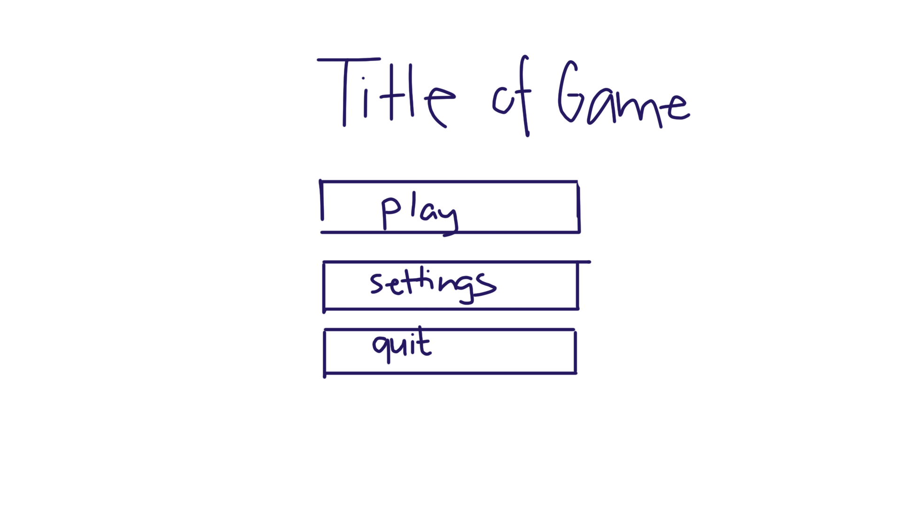
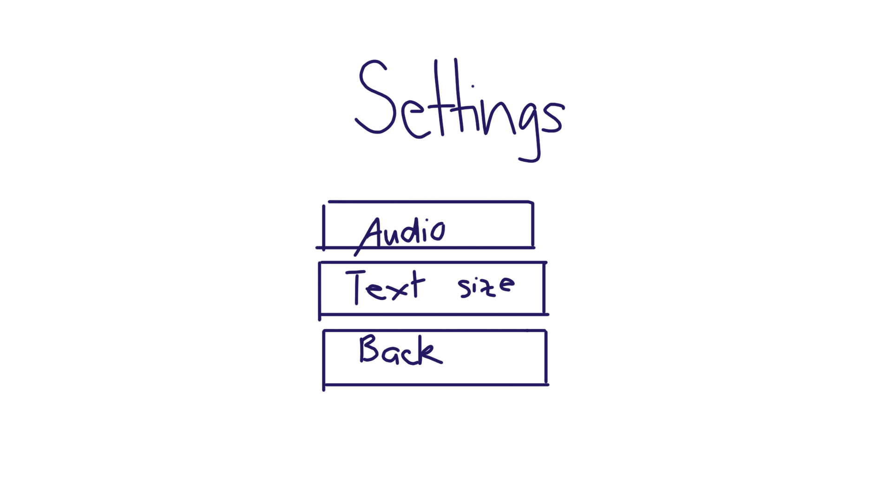
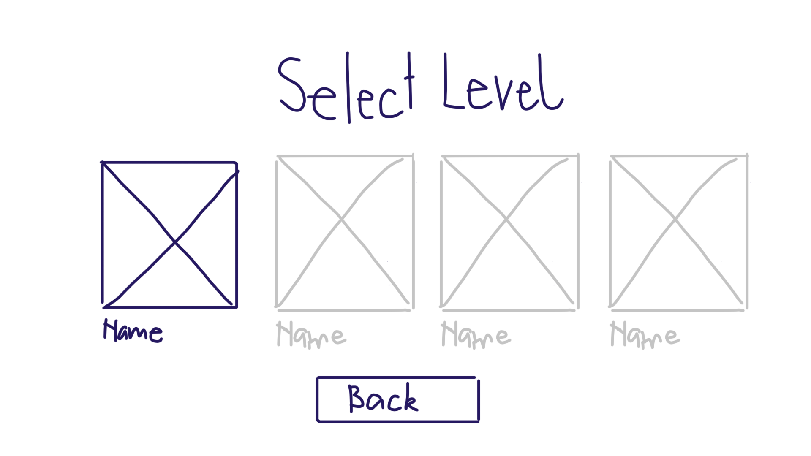
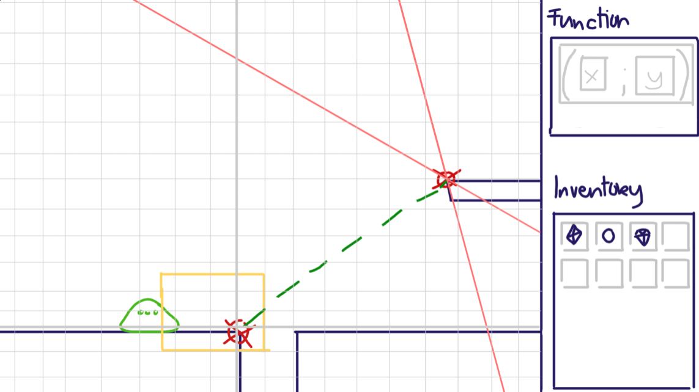
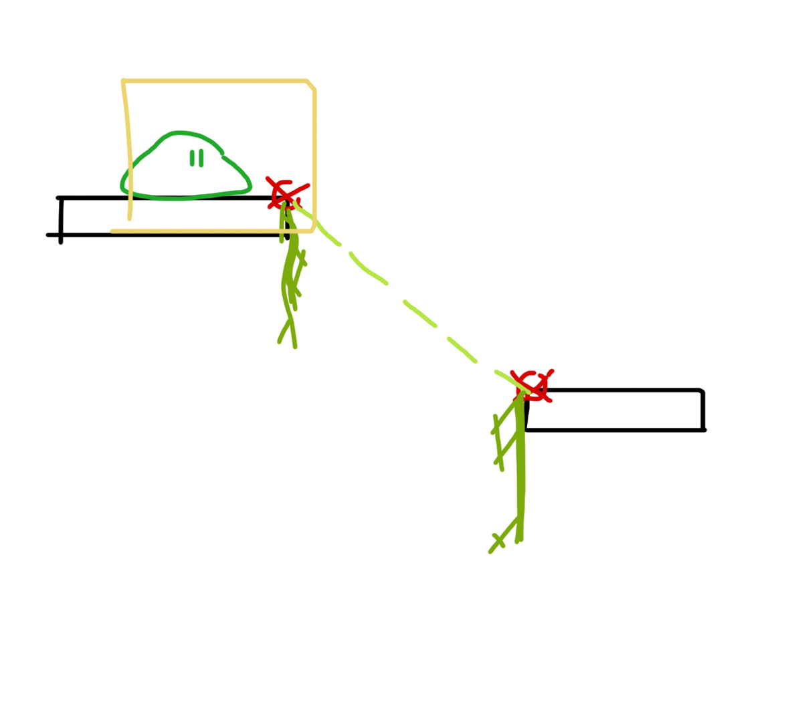
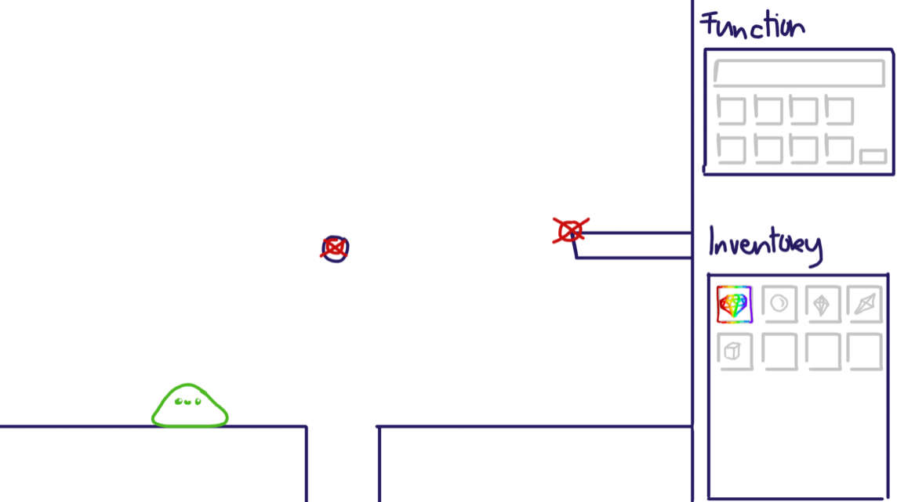
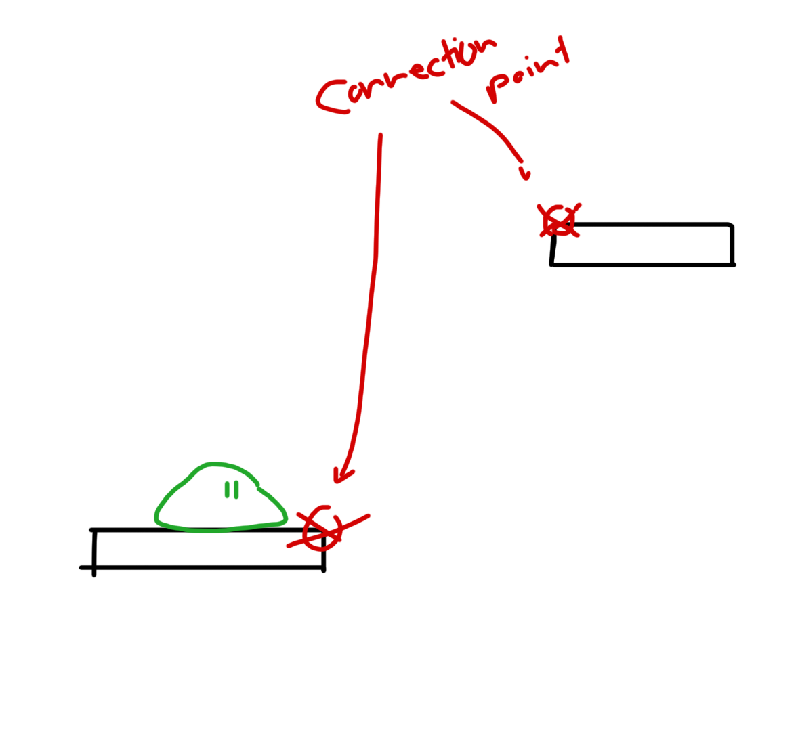
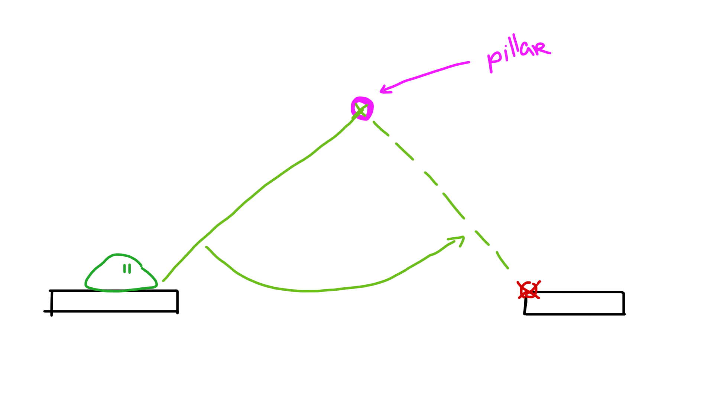

# Architect of Goo

`v1.0`

## Concept

<!-- 
Create bridges between two points in the game to get the character to a specific place in the game by using linear functions.
Create bridges, using linear equations, to collect, connect and reach the end.

Story: you're a rare (and cute) slime who was kidnapped to be used in a potion.
After some hard trials you've managed to escape.
Find your way home!
-->

### Mission

Lost and alone, find your way and come home ❤️
<!--
1. Lost and alone, find your way and come home ❤️ <3
- Lost and alone, build a bridge and come home
  - Lost and alone, find your way home
- Lost and alone, build, improve and outgrow!
  - Lost and alone, build, improve and come home!
- Lost and alone, get yourself some mustard from Dijon
- Lost and alone, find your way and say geronimo!

2. Time to grow, onwards we go!
3. When you're stuck as can be, create and you'll see
4. Spanning Gaps with Slimey Maps!
5. Building paths with gooey maths
-->

### Design Pillars

`Creativity`: I want to be challenged to think of a new solution / course of action. 
<!-- Completing puzzles -->

`Variety`: I want to have a diversity of options etc. 
<!-- Different types of gems -> different types of bridges (and slime :D) -->

`Discovery`: I want to satiate my curiosity and discover new possibilities (by trial and error) 
<!-- 
- Trial and error 
- Gem types, slime types 

-->

### Aesthetics

Challenge
  > We want our player to be challenged by the gameplay and the math aspect. The player should use his grey brain cells to solve the equations and by extension the levels

Discovery
  > We want our player to use his curiosity and creativity to discover different possibilities to solve the level and to advance through the game by trial and error

<!--
    Possible aesthetics:
    1. Sensation
    2. Fantasy
-->

## Design

### Mechanics

#### Core Mechanics

Building bridges
 
> The player builds bridges between platforms with linear equations, after defining the function the player can move along on his newly designed bridge. Depending on what type of gem/ability has been selected a different kind of movement will be used (i.e. slime your way up, walking, swinging etc.).

#### Secondary Mechanics

Pick up gems

> While crossing the bridge the player can pick up gems which give him special abilities. In designated areas he can equip the most suitable gem before he defines a function which allows the player to create new types of bridges for example he can use a gem to burn through a obstacle, to walk on water or to climb up a vertical function.

### Dynamics

Challenge
  > We want our player to be challenged by the gameplay and the math aspect. The player should use his grey brain cells to solve the equations and by extension the levels

  - Building bridges
    - New/Multiple types of bridges
  > In the game multiple types of gems can be found which give the player a unique ability. During the game the player is challenged to select the right type of ability by looking at and analysing the layout and materials of the platforms. 

  - Solving mathematical problems (equations)
  > Each gem has a different way of introducing lineair equations. Switching between altering the *A* value of the formula, calculating coordinates and intercepts, the player has to give the right answer in order to successfully build the appropriate bridge. By introducing new mathematical problems and increasing their difficulty the player gets challenged.

  - Solving the puzzles
  > Each stage of the level presents itself with different kind of problems / puzzles to be solved. They all vary in how the player needs to solve them, some of them can be solved right away with the help of a specific gem, others need some preparation like the usage of a specific gem to alter the layout of the level in order to then apply the matching gem and in extension the matching function.

Discovery
  > We want our player to use his curiosity and creativity to discover different possibilities to solve the level and to advance through the game by trial and error

  - Exploration of new areas
  > We want our players to discover new areas inside of the level. The player can interact with caged friends in the level which them give them keys which he in turn can use to open magic doors. Those magic doors lead to new areas where the player encounters harder challenges he can solve to collect coins. These are not needed to complete the level but support the design pillar of discovery.

  - New/Multiple types of gems
  > The player uses gems to solve different math equations. He can collect them throughout the level and apply them. On his journey he encounters varying types of gems which all support different ways to interact with the math-aspect/functions in the game.
  
  - Different kinds of puzzles
  > Due to the fact the player has multiple different ways to solve a math question with different gems, the puzzles also vary in challenge and appliance. The player can encounter obstacles, different bridges he needs to build or repair, and places where he cannot build any bridges. He needs to be creative to solve various kinds of puzzles, which support the design pillar discovery.

### Math Didactics

#### Learning Goals

1. Playing with the fundamental characteristics of a linear function ~~first~~ individually ~~and then in combination.~~
2. Applying the fundamental characteristics to transform one representation (graph, formula, table) into another in a playful way.
3. Solving quests, tasks and problems involving multiple representations of linear function (graph, formula).
4. Applying properties of linear functions to solve equations in a playful way.
5. Applying the appropriate function representation to solve a question or problem in the game.

#### Implementation

1. Using the different gem types: 
    - Acid Gem: uses an adjustable function like in the first Concept (Angry Equations)
2. Different types of representations
  - Using the different gem types: 
    - Vlimes Gem: uses tables to connects two broken points of a bridge back together
    - Acid Gem: uses an adjustable function like in the first Concept (Angry Equations)
    - Sticky Gem: uses coordinates to calibrate where the player has to shoot
    - Goo Cannon Gem: uses intercepts to calculate where the function has to end up
3. Building bridges
  - To progress through the Level the player has to build bridges using linear functions. He can use different gems which all have different abilities and different ways of creating, writing or adjusting a function.
4. Solving puzzles in a playful way: 
  - the player progresses through the level using linear functions to build bridges. He is a little slime trying to get home <3. Along the way the player encounters different challenges, can free friends, explore additional content, collect coins etc.
5. Applying the appropriate function: 
  - Once the player gets to a new challenge, it is up to him to decide what gem he is going to use to solve the puzzle. He has to think for himself and come up with a solution to the problem at hand.

### Economy

#### Resources

- `Sliamond in the rough` :star:: Unlocks all the gem abilities. 

##### Collectables
- `Coins`:star:: Collect coins to complete the level to 100%.
- `Friends`:star:: Friends can be freed and their signature style can be copied and used to customize the main character

#### Consumables

- `Gems` : To use different abilities. 
In the final game, the Gems are consumables. They can be collected throughout the level and can only be used once.

- `Keys` :star:: Keys can be used to open magic doors throughout the level.

### Progression

**Prototype level**: For the prototype we imagine one level with three stages in total, in between the stages two checkpoints can be found along the way. Throughout the level the player can pick up gems which get added to his inventory, each gem has infinite use and will not disappear from their inventory. When the player enters a calculation zone he has to choose the according gem. Followed by this the player has to write and/or solve the accompanying equation. Along the road the player has to select the right gem/function to build the appropriate bridges to reach the next stage or complete the level.

> *Prototype level*

> *Insert sketches of the tutorial level (per stage)*

**Normal level**:star:: During the game the player has to pick-up the different gems. Whilst trying to progress in the game the player has to decide which ability is best suited to progress in the game. Once a gem has been used to change the slime's ability, and appearance it will disappear from the inventory and re-spawn at it's original location. Each level consists of at least two stages with one checkpoint. In higher levels, and more difficult worlds the levels can progress both horizontally and vertically allowing for more variety in level design.
- *Sliamond in the rough*: Once a player gets stuck in a stage, i.e. dies three times in one stage, the *Sliamond in the rough* will be able to be used by the player.

**Level editor**:star:: The game can be expanded by creating a level editor. In this level editor teachers will be able to create the pathway and therefore implement the functions they'd like to see. 

**Procedural level generator**:star:: By adding the right limitations a procedural level generator can be added to this game allowing for easy game content expansion.

#### Gems

- **Acid**: By adjusting the *A* value in the equation the player can aim the acid blob.
  - *Difficulty increase*:star:: The player has to fill out the complete equation instead of altering it. On top of that besides just lineair equations, quadratic functions can be used as well.
    
- **Goo**: By calculating the intercept of two lineair equations the player can aim where the goo will be shoot at. The goo will automatically be connected from the place the player is standing to the calculated coordinate.
  - *Difficulty increase*:star:: The player has to calculate multiple intercepts before a multiple segment bridge can be build.

- **Sticky**: The player can read the coordinate from the visible grid.
  - *Difficulty increase*:star:: Calculate the coordinate by using the given function.
     
- **Vlimes**: By using the given table the player has to calculate the coordinates of the desired edges.
  - *Difficulty increase*:star:: Instead of just lineair equations, quadratic functions can be used as well.
    
  - **Sliamond in the rough**: This gem inherits all of the gems mentioned above: Acid, Goo, Sticky and Vlimes.
    - *Difficulty increase*:star:: The *Sliamond in the rough* gem inherits all difficulty increases as well.

### Loops

#### Game Loop

- **Failed stage**: Restart the stage

Each level will have been divided into multiple stages, each stage has a save-/checkpoint at its start. Once the player walks into a trap and/or abyss they will have failed the stage and restart it.

- **Failed level**: Restart the level

- **Completed level**: Reach the end of the level

:star: Find and save your friends from the dungeon. This will unlock extra game content such as rewards, skins, and abilities.

##### Short-term

*Stage progression*

> Blue = Start

> Purple = Product

> Pink = Action

> Light Blue = Events

> Green = End

##### Medium-term

*Level progression*

> Blue = Start

> Purple = Product

> Pink = Action

> Light Blue = Events

> Green = End

##### Long-term

*World progression*

> Blue = Start

> Purple = Product

> Pink = Action

> Light Blue = Events

> Green = End

#### Feedback Loops

##### Positive

**_Sliamond in the rough_**

The loop starts-off with collecting the *Sliamond in the rough*. This gem will allow the player to use all abilities. By using the *Sliamond in the rough* the player no longer has to collect other gems for that level. The *Sliamond in the rough* allows the player to select a different ability in each calculation zone to build the right bridge. This in turn allows the player to progress in the level easier.

**Checkpoints**

The loop starts off with reaching a checkpoint. This checkpoint saves the player's progress at a certain point in the level. By using the checkpoint, the player no longer has to start from the beginning of the level if they die. The checkpoint allows the player to resume their progress from that point, making it easier to continue and eventually complete the level.

##### Negative

**Gems**

 The loop starts off with collecting gems. These gems allow the player to transform into a slime with a unique ability. Each gem is a one-time-use item, so the player must collect them to build bridges and progress through the level. Each gem is associated with a different type of math equation, increasing the game's difficulty and balancing the use of the gem abilities.

**Platform layout**

 The platform layout dictates what type of bridge should be build. In the game different kinds of platforms, pillars and obstacles can be found, each one made of a specific material. The layout can change from stage to stage, or level to level. By paying attention to the platform material and/or layout the decision on what type of bridge has to be build is made a lot easier. This balances the game as the layout of stages, and levels gets progressively more difficult.

## Implementation

### Target Platform

The target platform for this game will be desktop-web (and mobile-web).

### Camera

The camera moves sideways and the player starts at the utmost left of the screen. After leaving the left side and reaching the middle of the screen the camera wil follow the player around for the rest of the level. (Mario like)

:star: Once a level is big, transition points have to be added. A transition point is for example the black screen you get in games when opening a door (type of loading screen).

### Controls

To control the character movement the player uses the keyboard.
- a/left-arrow: move left
- d/right-arrow: move right
- w/up-arrow: climb up vertical bridges
- s/down-arrow: climb down vertical bridges
- space: small jump / jump off
- keyboard: define function

### User Interface

Describe the different interfaces like the main menu, settings, HUD, etc.

#### Main menu

- Title of Game
- [Button] Play
- [Button] Settings 
- [Button] Quit

#### Settings :star:

- Settings
- [Button] Audio
- [Button] Textsize 
- [Button] Back

#### World Selection

The player can choose from different worlds (Mario like) and in each world there are multiple Levels.

- World Selection
- [Button] World 1
- :star: *[Button] World 2*
- :star: *[Button] World 3*
- :star: *[Button] World 4*
- [Button] Back

#### Level Selection

The player can choose from different levels. Each level is split up in 3 parts, each part needs to be completed for the player to get to the next checkpoint and in extension to complete the level. 

- World Selection
- [Button] Level 1
- :star: *[Button] Level 2*
- :star: *[Button] Level 3*
- :star: *[Button] Level 4*
- [Button] Back

#### Pause Menu

- Pause
- [Button] Resume
- [Button] Restart from checkpoint
- [Button] Restart level
- [Button] Main menu

#### HUD

The HUD consists of a sidebar which is divided into two sections:
  - Functions: the player can edit here tables, write functions, calculate intercepts etc. This part of the HUD will be grayed-out if the player is not in the calculation zone.
  - Inventory: this is where all the gems gets stored.

### Game Objects

Describe the different game objects in the game, their purpose and how they interact with the player.

`Calculation zone`: A special zone in which the calculation will be shown and the player has the ability to create the function. For the demo level the player has the ability to equip gems unlimited and everywhere, this includes the calculation zone.

`Gems`: Gems are objects that the player can pick up during the game. In the prototype the player can use the  gems unlimited times. In the real game, the player can only use the gem once and then has to collect a new one. These gems are scattered throughout the level and are added to the inventory where the player can equip them when he steps into a magic cirlce.
  - *Acid*: Acid can be used to burn through obstacles and walls like wood or slate. It cannot be used to build bridges, but only to destroy objects in the path of the player. Not every wall can be destroyed though, solid stone walls for example cannot. 
    - Math problem: 

    |  By adjusting the *A* value in the equation the player can aim the acid blob. The origin of the equation is at the connection point of the platform the player is standing on. If a description of the math problem is needed this will be shown in the 'Function' area as well.  |      |
    | --- | --- |
    - Limitations: the player can only use acid on specific surfaces
      - Destroyable surfaces: Wood, slate
    - Future updates :star:: More surfaces to destroy
    
  - *Goo*: The goo cannon can be used to build bridges, by walking into the "calculation zone". The bridges built from goo cannons can go vertical and the player can climb upwards / vertical. The bridge is static and cannot be used for swinging. To use the cannon the player has to calculate the intercept between two functions. The player has to actively walk  / climb on the built bridge with the keyboard.
    - Math problem: 

    |  By calculating the intercept of two lineair equations the player can aim where the goo will be shoot at. The goo will automatically be connected from the place the player is standing to the calculated coordinate. If a description of the math problem is needed this will be shown in the 'Function' area as well.   |     |
    | --- | --- |
    - Limitations: The goo-cannon can only be used on platforms in a specific area and has a certain range.
    - Future updates :star:: In future upgrades for the goo cannon, the player can connect multiple single connection points to extend the range of the bridge. The player has to shoot a single connection point and then from there shoot the final platform, because the bridge has not been built yet and will only be built when the last bridge / function is connected to the platform.
  
  - *Sticky*: With the sticky gem the player can calculate / read coordinate to shoot sticky goo and swing from one point to another. (Like spiderman) The player automatically swings as soon as the connection has been created and has to actively jump off using the space bar.
    - Math problem: 
    
    |  The player can read the coordinates from the visible grid. If a description of the math problem is needed this will be shown in the 'Function' area as well.   |     |
    | --- | --- |
    - Limitations: The range of this sticky goo is limited and it can only be used on round single pillars which stick out of the wall.
     - Future updates :star:: As a future update, the range will be extended.
     
  - *Vlimes*: Can be used to repair broken bridges. The player can write two sets of coordinates to connect them (starting point of the bridge and end point) or a table to calculate the connection. From both the end and the starting point, slimey vines will grow, connect and repair the bridge for the player to walk on.
    - Math problem: 
    
    |  By using the given table the player has to calculate the coordinates of the desired edges. If a description of the math problem is needed this will be shown in the 'Function' area as well.   |     |
    | --- | --- |
    - Limitations: The vlimes gem can only be used on broken bridges and not to create completely new ones.
    - Future updates :star:: In the future, when the player gets introduced to more types of functions like quadratic or exponentional ones, this type of gem can be used to build bridges that resemble the curve.

    |  |  |
    | ---------------------------------------- | --- |
  - *Sliamond in the rough*: This gem combines all of the mentioned gems from above into one: Acid, Goo, Sticky and Vlimes. It inherits all of the abilities the player gets from each gem. It appears when the player dies 3 times in a row and cannot complete the level / stage. It disappears at the end of the level and is not permanent in the inventory. The sliamond in the rough is of unlimited use within each level; in the demo level but also in the finished game. 
    - How to use: 
    
    | The 'Sliamond in the rough' automatically selects the right ability for the player when they walk into a calculation zone. Other gems will be grayed-out and unusable once the 'Sliamond in the rough' has been activated.    |    |
    | --- | --- |
    - Limitations: Sliamond gem inherits all of the limitations of the gems.
    - Future updates :star:: Sliamond gem also inherits all of the expansions for the future from each gem. 

`Platforms`: To progress through the level the player has to get from platform to platform. The player can stand and walk on these platforms. The platforms have connection points which serve as the targets for the functions, when the player creates a function it automatically snaps to the connection point if it is in a certain "acceptance"-range.

`Pillars`: Pillars are round objects that stick out from the wall. They can be used by the player to swing from one point to another. He can do that by equipping the sticky gem and use the pillar as an anchor point.

`Obstacles`: Obstacles consist mainly of walls made of different materials. Some of them can be destroyed with the acid gem, others are solid and indestructible.
  - Solid Walls (Stone) 
    - cannot be destroyed
  - Slate
    - can be destroyed
  - Wood
    - can be destroyed
  - Gravel
    - can be destroyed

`Single connection points` :star:: Single connection Points are the extension to the goo cannon. The goo cannon can be used to connect two connection points from platforms but is limited in range. With this extension, the goo cannon can be used to connect multiple points together and create longer bridges. The player has to write all the multiple functions in one go until he reaches the final platform. The player cannot stand or walk on these connection points or the bridge as long as they are not connected to the main platform.

`Magic circle` :star:: In the final game, the player has not the ability to equip all the gems all the time and unlimited. The gems are consumables and are of single use. If he wants to use a specific gem again, he needs to collect it first. The player can also not equip them everywhere he wants to, he has to stand in a magic circle. These magic circles appear before every puzzle in the final game. For the demo level, the player can equip all the gems everywhere and is not limited to only the magic circle. 

`Checkpoints`: Each level is split up into stages, between each stage there is a checkpoint. If the player dies, he can infinitely re-spawn from the newest unlocked checkpoint.

`Friends` :star:: Friends are little slimes that are caged. You can find them throughout the level and free them. Once you freed them, the player can copy their style and customize their own character.

`Coins` :star:: The player can collect one Coin in each stage of the level, so three stages means three Coins per level. there is a coin that the player can reach by solving more difficult equations.

`Magic doors` :star:: The player can unlock magic doors which then lead him to an additional stage of the level. There he could find a caged friend or a coin.

`Keys` :star:: Keys can be picked up in order to unlock magic doors. The keys could be more integrated into the game such as complete this picture using bridges.

### Polish :star:

- **Particles**
    - When death, whenever the player walks into traps and/or the abyss
    - On pickup, whenever a gem gets picked up
    - On selecting a new gem, both in the inventory and the player
    - On completion, whenever a bridge is completed
    - Shooting acid, whenever platforms, obstacles etc. get destroyed by acid
- **Animations for**
    - bridges (shooting, growing vines)
- **Ambient lighting**
    - Use coloured lighting to emphasize emotions, i.e. blue for sad, red for angry, yellow for happiness etc.
- **Hover/Selection emphasis**
    - Different colour, when something is selected in the inventory 
    - Different colour, when a table/part of the function can be edited

### Story :star:

*you're a unique slime with capabilities to copy abilities from gems.*
*Due to your unique skill an evil alchemist has taken you from your home.*
*Once you had awoken you realised you've been taken to their dungeon.*
*Dreaming of meeting your friends and family again, you've taken the challenge to try and escape the dungeon.*

> Once upon a time a sweet child 'o slime was born in the magical woods.
> Live was a breeze and the child enjoyed everyday, as he should.
> The child was beloved by all and soon found a slimey village it could call its home.
> Soon he went on a journey, and made new friends as he may roam.
> As time went on, tragedy struck.
> The child got taken, as he was out of luck.
> A special slime he was, known as *the copycat*.
> Locked away there he sat.
> How to escape, he pondered.
> And as the door broke he wondered,
> Time to leave, run fast and far,
> As he will reach back home, as bright as a star.

### Sound :star:

**Menu and Story**: The sound should be cute and light, a simple but memorable soundtrack that fits the light-hearted theme of the game.
**World**: Each world has a soundtrack that is specific to that area. The levels and stages inherit that sound. The soundtrack should be upbeat and happy. 

**Game objects sound effects**:
- *Player (slime)*, wet and slimy sounds.
- *Gems*, little pling for when you pick them up, a magical glitter sound when you equip them and a specific sound for each gem when you apply them.
	- Acid: kind of burning sound when the acid hits a obstacle, a shooting sound when deployed
	- Sticky: sticky and slimy type of sound when it latches on to the pillar, a shooting sound when deployed
	- Goo Cannon: sticky and slimy type of sound when it fires to the connection point, a shooting sound when deployed
	- Vlimes: a earthy, planty kind of sound when the vines connect to each other, a shooting sound when deployed
	- Sliamond in the rough: a magical light sound when used and a shooting sound when deployed
- *Coins and Keys*, a light pling when picked up
- *Friends*, a sad type of calling when in the cage, a happy pling when released and a slime sound

### Art :star:

The art style is cute, clean and the view is sideways. The colours are vibrant and happy. and cute <3 ^^ :heart: (*/ω＼*)

| .png) |  | .png)  | .png)  | .png)  |
| ----------------------------------------------------------------------- | --------------------------------------------------------------------------- | ------------------------------------------------------------------- | ------------------------------------------------------------------------- | ----------------------------------------------------------------------------- |