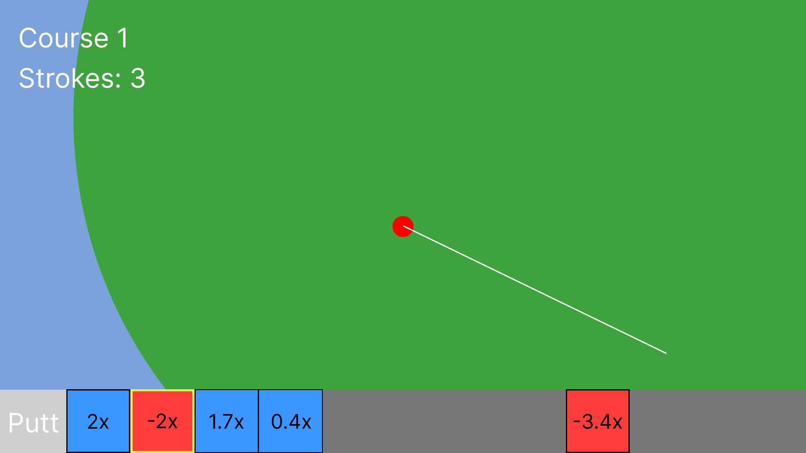
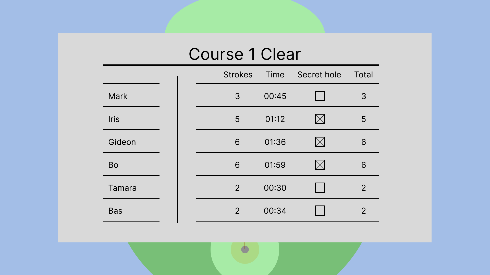

# Slope Swing: Game Design Document

`v2.3`

<!-- Be sure to write everything as concise as possible! -->

## Concept

<!-- Describes the theoretical/high-level conceptual foundation of the game. -->

Golf with friends but with equations.
<!--
- multiplayer lobby system [Socializers]
- leaderboard after every level [Killers]
- secret hole for every level [Explorers]
- metrics for competition: fastest, most accurate, most secret holes found [Achievers]
- phone a friend option for those who've already finished the course [Socializers]
- Host has a big overview of the course and where everyone is (presentation screen is the map)
- alternate gamemode where you get cards on a conveyerbelt and the host feeds the equations [Authoribility]
-->
### Mission

Within one or two sentences describe in abstract terms what (action, feeling, gameplay) the game should achieve, the core of the game.

<!-- E.g. "When you're stuck as can be, just destroy and you'll see" -->
1. Graph out the competion

### Design Pillars

Choose words that fit the emotional core of the game and describe them as if you are currently experiencing them during gameplay.

<!--

  E.g.

  `Chaos`: It is chaotic and unpredictable I don't know what will happen next.

  `Instant Feedback`: I get instant feedback on my actions.

  `Destruction`: I can destroy almost everything in the game.

 -->

- `Multiplayer`: I want to play with my peers to have fun with others. [Socializer]
- `Competition`: I want to be the best. [Killer]
- `Exploration`: I want to see what the courses have to offer. [Explorer]
- `Challenge`: I want to look for challenges to overcome. [Achiever]

### Aesthetics

The types of fun we want to achieve with our design.

- Challenge
> The game needs to provide a challenge to the students. They need the option of competing with each other.
- Fellowship
> The game needs to connect the students in the classroom. A feeling of comradery or chaos should be present.
- Discovery
> The game needs to let players discover. For those who want to explore deeper than the surface.

<!--

    Choose the aesthetics that fit the emotional core that should be at the heart of the game.

    1. Sensation
    2. Fantasy
    3. Narrative
    4. Challenge
    5. Fellowship
    6. Discovery
    7. Expression
    8. Submission

-->

## Design

<!-- Describe the high-level design of the game. -->

### Mechanics

<!-- 

*What are the mechanics of the game?* #ONION :D 

If using the onion diagram using draw.io or others, please use/export as svg (not png)!

-->

#### Core Mechanics

##### Putt
You can putt your ball using a linear equation. The only variable that can be changed is the 'a' value. This is because changing the 'b' value would have to move the ball up and down. The strength of the putt will be decided by a power bar that alternates between minimum and maximum power.

#### Secondary Mechanics

##### Phone a friend
When the player stuck in a rut, they can phone a friend. This will show a pop up for the people who've already cleared the course. The 'friend' can then input a putt for the player. Upon submission, the player themselves has to choose to excecute the putt or decide on a different trajectory.

##### Secret hole
A hole that is hidden in every course that is an alternate way to finish the course. Players need to explore to find this one.

### Dynamics

<!--Place the mechanics into the game's conceptual context and argue if they evoke the correct aesthetics -->

The game operates on a lobby system. The host (teacher) displays on a big screen and players can join the lobby by entering a code. The host can start the game whenever they deem there are enough players in the lobby. Once the game starts, players are all placed in the starting position and the camera moves from the hole to the starting position to indicate to all the players where they need to go.

The host will not participate, instead their game will display the entire course, the hole (not the secret one) and the location of all the players. The players all have a zoomed in (static) view of their own ball. They all have a differently coloured ball and they do not collide with each other. The players have to focus on their own gameplay and can use the host's game to view what their position is in relation to the hole.

Players will see a trajectory of where their equation will shoot them towards. They can adjust the 'a' value to adjust accordingly. Once they press the 'Putt' button, a bar shows up to determine the strength of their putt.

Players also have the option to 'Phone a friend'. This entails asking a player that has already finished the course to give them one input. If the player presses the 'Phone a friend' button, a pop up will appear for all the players that have already finished. The first person to respond is the one that'll get to give the input. Once the input has been given, the caller can decide to putt or adjust in case of sabotage. This encourages in class interaction with other students and gives the players that have already finished something to do.

Every course also has a secret hole that isn't as easy to reach/find as the normal hole. To illustrate how this would work, take a look at this example level:

The purple circle is the secret hole. It's hidden underneath the bridge. If a player is obstructed by a higher plane/object, a small ring surrounds them so they can see the level they're on. If they are inquisitive enough to check under the bridge, they might spot the secret hole.

If the player gets in a secret hole, a metric will be updated for them that will keep track of how many secret holes the player finds at the end of the game.

As soon as a player putts their ball into a hole, they are no longer visible on the map. This ensures that player's can't just look at where other players are to find the secret hole.

A course is finished once all the players have putt their ball into a hole. There is no need for a time limit because of the 'Phone a friend' mechanic.

Once a course is finished, an overview pops up on the host's screen that displays:
- the amount of time each player spent
- how many strokes each player has done in the course
- the amount of total strokes the player has in the game
- if the player putt their ball in a secret hole or normal one

After all the courses are done, the game is over. The metrics will be tallied up and show the top 3 of all categories:
- fastest player (spent the least time)
- most accurate player (least amount of strokes)
- columbus (most secret holes)

There is no overall winner because that would devalue the achievement of the explorers. It's possible for one player to be number 1 in all categories but all they would get is personal achievement.

Alternatively, the game also has a conveyerbelt mode. This mode works the same as the regular gamemode but the teacher can constantly supply equations that will show up for the players on a conveyerbelt. If the player picks a card from the converyerbelt, the trajectory for the golfball is set and then the player has to decide the power of the putt. The phone a friend button allows a different player to pick a card for you, it would **NOT** consume the card before the asker decides to putt in that trajectory. So they have an option to pick a different card regardless.

### Math Didactics

#### Learning Goals

1. ~~Playing with the fundamental characteristics of a linear function first individually and then in combination.~~
2. Applying the fundamental characteristics to transform one representation (verbal, graph, formula, table) into another in a playful way.
3. Solving quests, tasks and problems involving multiple representations of linear function (verbal, graph, formula, table).
4. ~~Applying properties of linear functions to solve equations in a playful way.~~
5. Applying the appropriate function representation to solve a question or problem in the game.

#### Implementation

This concept is more focussed on making linear functions accessible and getting the students on board with math in a fun way. But it still encompasses most of the learning goals. The only one that isn't fully applicable is number 4. This is because the there is no deterministic solution to any of the courses since there is variance in the power bar. It's technically possible but we don't expect the students to have perfect control over every shot.

This game also intentionally doesn't give a way to shoot straight up or down. This is because a linear equation can never be perfectly straight up or down. Keeping this in will make the player question why the game doesn't allow perfectly straight up and down shots. At this point, the teacher can take the opertunity to explain this fundamental aspect of linear equations.

### Economy

#### Resources

#### Currencies

There are no currencies.

#### Consumables

There are no consumables.

In an alternate version of the game, there are consumables like in putt party. But the goal of the game is to have the player familiarize themselves with the workings of linear equations. Those powerups would introduce chaos and distract from our main objective.

### Progression

The game starts with the host opening a lobby that other players can join. During the lobby, the host can change the rules and gamemode. Once the host deems the lobby to be full, they can start the game.

Once the game starts, the first course is introduced with a quick camera pan from the hole to the starting position of the players.

Each player can then individually start playing through the course. Whether they go for the normal hole or the secret one is up to the player.

Once every player has finished the course by entering either the normal or secret hole, the results for that course are shown and the host decides when to go to the next course.

This is repeated until all the courses have been played. Once that happens, the game is over and the final results are shown.

### Loops

*What are the loops of the game?*

#### Game Loop

*Course progression*

---

*Game session progression (from host's point of view)*

<!--

Please use mermaid diagrams for this!

Mermaid diagram nodes syntax: https://mermaid.js.org/syntax/flowchart.html

Book about game flow chart diagrams: https://learning.oreilly.com/library/view/practical-game-design/9781787121799/b3322c72-3fbc-4407-be07-0abc2ca5070b.xhtml

- Rounded squares represent terminal blocks (beginnings and ends of processes)
- A parallelogram is used for user input/output
- Diamonds portray decisions. Use these for simple yes/no or true/false forks
- Rectangles are used for processes and operations
- Arrow connectors are used to join parts of the diagram and portray the direction of transitions
- On-page connectors (the circles with letters inside) allow us to avoid long and confusing arrows by connecting two remote parts of the flow

-->

#### Feedback Loops

---

## Implementation

<!-- Describe the implementation of the game. -->

### Target Platform

The target platform for this game will be mobile-web and desktop-web.

### Camera

Each player has a camera on their ball. It doesn't rotate.

The host's camera is a zoomed out shot of the entire course.

Once a player has finished a course, the camera will follow a different player's ball that's still playing. The finished player can click anywhere on the screen to go to the next player in the queue.

### Controls

The game controls with mouse.

### User Interface

<!-- Use tools like Penpot & Figma -->

#### Main Menu

#### Lobby

The gamemode is **NOT** a difficulty setting, rather it can be the regular gamemode or the conveyerbelt gamemode.

#### Host View

#### Player View

#### Direction

Because a linear equation goes through the origin and goes both directions, the player needs to have control over which way they want to putt. Pressing anywhere on the screen will toggle 'Left' or 'Right' direction.

#### Putt

The player can switch between a negative and positive 'a' value. If the player presses the circle, they toggle positive or negative.

When the player presses the 'putt' button, a bar appears that has a slider moving between the minimum and maximum value. The player presses the 'putt' button again to determine the strenght of the putt, depending on where the slider is at that moment.

#### Course Results

#### Final Results

After all the courses of the set have been cleared, the game transitions to the final results on the host's screen. The students can look at the screen to see if they placed in the top 3 for three separate categories:

- Sniper, most accurate player. 
> The lower amount of total strokes, the higher the player will be placed.
- Speedy Gonzales, the quickest player.
> The lower the total amount of time spent on the course, the higher the player will be placed.
- Columbus, the most explorative player.
> The more times a player clears a course by putting their golf ball in a **secret** hole, the higher they're placed.

### Game Objects

Describe the different game objects in the game, their purpose and how they interact with the player.

#### Golf ball

This is the player. Used to depict progression through the level. The player can use the putt mechanic to move the golf ball. Each player has their own instance and colour. Players don't collide with each other.

#### Normal Hole

This is the goal for the player. They need to putt their golf ball into the a hole. The normal hole is shown to the player when the course starts and pans back to the player. The normal hole is always visible on the host's overview screen.

#### Secret Hole

This is a hidden hole in every course that a player has to explore the level thoroughly for. Putting the golf ball into the secret hole finishes the course just like the normal hole, but the game will update a metric for the player.

### Polish

### Story

There is no story.

### Sound

During the setup phase, the game needs to have a simple, catchy melody. Something that communicates to the kids in the classroom they're about to play Slope Swing. Something akin to the [Kahoot lobby theme](https://www.youtube.com/watch?v=yjwJIjNuniQ).

As for the music during gameplay, it depends on the theme of the course set. For a generic golf theme, the music needs to keep the player engaged with an upbeat atmosphere. Think of the [BBC golf classic theme](https://www.youtube.com/watch?v=a-bd5j18N0s) but less eccentric.

### Art

The art should be vibrant and evoke a comfortable feeling. We want the children to be in a relaxed mindset so they are less likely to stress out over the math. Golf Story is a good example. But for this game, the art's complexity would have to be toned down to facilitate WebGL.

