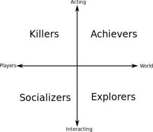

# Research

## Why Make Serious Games

The act of learning in our current education system is more suited for girls to learn compared to boys[1]. Boys are more likely to be gamers than girls[2]. Therefor we can conclude that we can use serious games to help boys get up to par with the girls.
On top of that, kids with ADHD have a hard time with the traditional learning system but are able to concentrate on games for long periods of time[3]. That's why making proper serious games can help a lot of kids learn more efficiently.

## How to Make Serious Games

Making a serious game is a nice gesture but how do you make them appealing so that the kids are actually interested? 

There are multiple forces that drive people to playing games; killers, achievers, socializers and explorers. Research says that lean more towards the killer and achiever incentives while girls are more likely to enjoy the social aspect[4].

**Killers:**

Like to feel superior to other players. Making sure that the player has a way to interpret themselves to be the best will help keep these players interested. A leaderboard for example.

**Achievers:**

Are looking for a challenge to overcome. Putting achievements in your game will help these players give something to aim for.

**Socializers:**

Like the social interaction that emerges from the game. Giving a way to work together for a common goal or competetition will give these players the interaction they're looking for.

**Explorers:**

Like adventure. Giving players the option to wander around and find points of interest will engage them.

## Conclusion

Making sure that your game has something for these different types of players. Doing so will make your game appeal to the widest possible audience. At the end of the day, that is the goal of serious games. While some kids might need it more than others, more options for education is always a positive.

## Sources

- [1]Coenen, J., Meng, C. M., & Velden, R. K. W. (2011). Schoolsucces van jongens en meisjes in het HAVO en VWO: waarom meisjes het beter doen. Researchcentrum voor Onderwijs en Arbeidsmarkt, School of Business and Economics, Maastricht University.
- [2]https://www.gameninfo.nl/cijfers/cijfers-over-gamen
- [3]Pokorny, L. The Impact of Classroom Gamification Technologies on Motivation and Productivity of Students with Attention Deficit Hyperactivity Disorder (ADHD) Laszlo Pokorny New Jersey City University.
- [4]Peeters, W. (2017, januari 27). Game Didactiek: het hoe en waarom van spellen in de les. Opgehaald van Vernieuwenderwijs: https://www.vernieuwenderwijs.nl/game-didactiek-hoe-en-waarom-spellen-les/