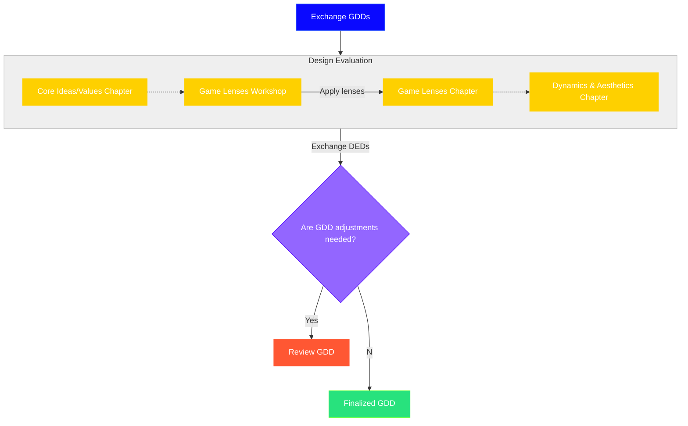

# Design Evaluation: Substantiation & Process

Similar to test-driving a car before purchase, testing allows you to improve and revise a document before committing to a design. Without evaluating, designers risk investing time and resources into solutions that may not work or fit the game. By incorporating evaluation into the design process, designers can identify potential issues early on, iterate on their designs, and ultimately deliver products that are more user-friendly, desirable, and effective[^1].

In order to successfully evaluate our Game Design Document we'll be using Game Lenses. "The book 'The Art of Game Design: A Book of Lenses' lays the groundwork for the *Deck of Lenses*, guiding designers through the game design process with a focus on creating engaging and replayable games[^2].

Covering fundamental principles and drawing from various game genres, it offers innovative approaches applicable to video games.
Designers utilize Game Lenses for inspiration, structured assessment, holistic evaluation, and iterative improvement, providing fresh perspectives and preventing blind spots[^3].

Daniel Cook highlights how these lenses offer a structured framework for understanding and enhancing game design, facilitating iterative testing and collaborative problem-solving through tangible tools like the accompanying card deck[^4].

By leveraging these Game Lenses, designers can can ease their mental workload and continue to improve their game designs." Here are a few examples on how designers can use Game Lenses

- **Inspiration**: When developing an experience, play-testing, or brainstorming, the lenses provide fresh perspectives.
- **Structured Assessment**: The lenses prevent blind spots by encouraging designers to view their game from different angles.
- **Holistic Evaluation**: Instead of relying solely on intuition, designers assess their game holistically using the lenses.
- **Iterative Improvement**: The lenses support an iterative design process, allowing adjustments based on insights.

Due to the encompassing nature of the Game Lenses they are one of the, if not the best choice to use for Design Evaluation. To ensure our Game Design Documents (GDD) aligns with our vision we've decided to incorporate the Game Lenses as our main design evaluation tactic. On top of that a separate, albeit smaller test has to be performed in order to ensure that our Aesthetics are sufficiently supported by our Dynamics. Combining the encompassing nature of the Game Lenses with the assessment of the implementation of the Mechanics, Dynamics, and Aesthetics leads to a detailed and complete Design Evaluation. 

In short, design evaluation should be done to ensure that the design meets its objectives and provides the best possible experience for users. And due to the encompassing nature of the Game Lenses, which allows for more creativity, Game Lenses are the best choice to use during the design evaluation. Followed by a simple assessment of our Aesthetics and Dynamics leads to an encompassing Design Evaluation.

## Process

1. Validate Core Ideas / Values, describe how our core ideas and values apply to our game design. Our game design should align with all the core ideas and values determined by our team. In document "01 Conceptual Exploration & Core Values"[^5] an explanation on how our team describes them can be found.
2. Describe how the Core Ideas align or do *NOT* align to our team vision.
3. Choose matching Game Lenses[^3]. Based on the goal/mission of the game and the game pillars the game lenses which align the most should be chosen.
4. Answer all question for each Game Lens concise and clear, if it cannot be answered describe how and or why.
5. Validate if the Aesthetics are appropriately supported by the Dynamics and why they are (not).
6. Review the Design Evaluation Document, the original group members will review the created Design Evaluation Document.
7. Adjust or finalize the GDD.

All steps in the process will be fulfilled, resulting in a complete Design Evaluation Document (DED) and a finalized Game Design Document.

### Diagram

> The arrows are processes, grouped by phase, while the blocks define a product.

> **GDD**: Game Design Document

> **DED**: Design Evaluation Document

[^1]: B. Kitch, “Testing: A Guide to the 5th Stage of Design Thinking | Mural,” www.mural.co, May 18, 2023. https://www.mural.co/blog/design-thinking-testing
    
[^2]: Taylor & Francis Group, https://www.taylorfrancis.com/books/mono/10.1201/b22101/art-game-design-jesse-schell (accessed May 07, 2024).
    
[^3]: J. Schell, Game Design; A Deck of Lenses, Art of Game Design https://deck.artofgamedesign.com/#/menu/5/?lang=en (accessed May 07, 2024).
    
[^4]: D. Cook, “Book Review: The Art of Game Design,” Game Developer, Feb. 18, 2009. “Book Review: The Art of Game Design,” www.gamedeveloper.com. https://www.gamedeveloper.com/design/book-review-the-art-of-game-design#close-modal (accessed May 07, 2024).
    
[^5]: Team Burning Equations, Github, https://github.com/Burning-Equations/Documentation/blob/main/Game%20Design/01%20Conceptual%20Exploration%20%26%20Core%20Values.md, (accessed May 07, 2024).
