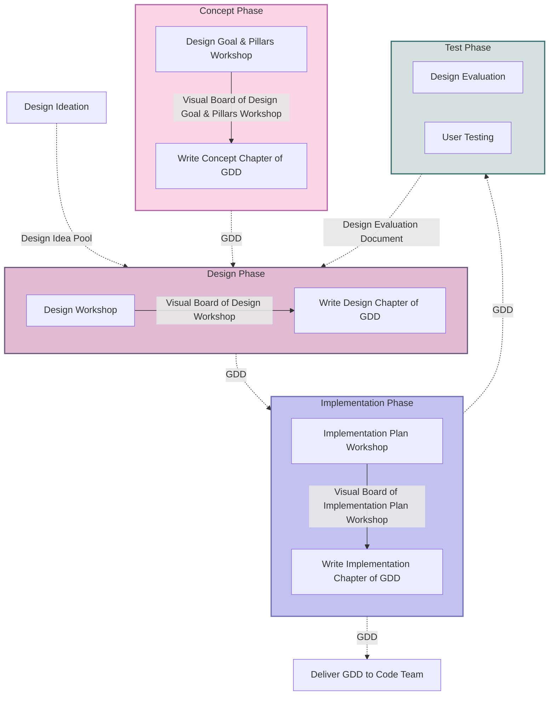
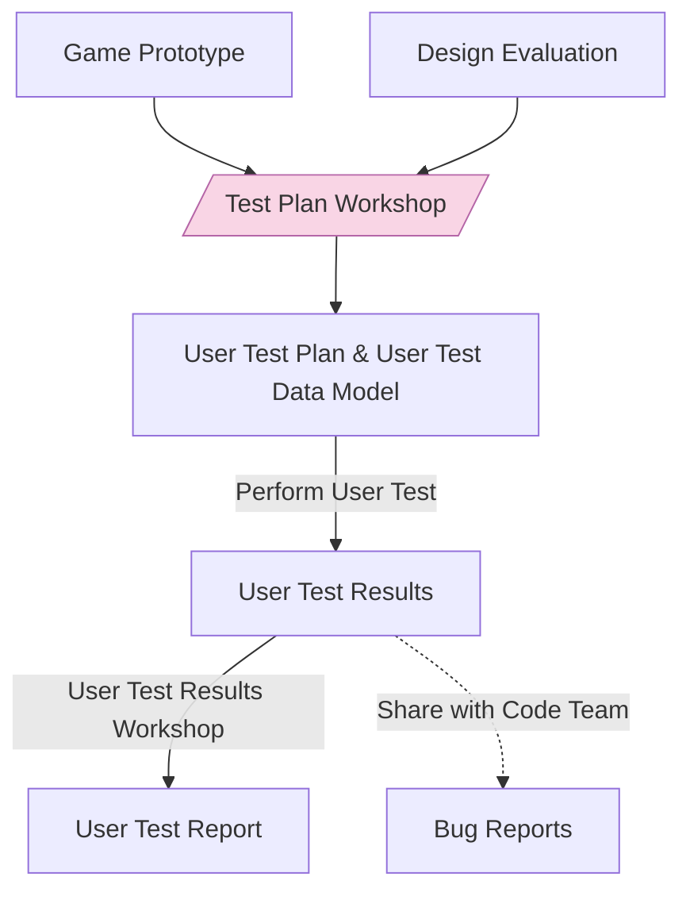

# Engaging & Involving: A Meta-Analysis of Game-Based Learning for Linear Equations

> By team Burning Equations at AUAS

## Abstract

This paper explores the effectiveness of game-based learning (GBL) in teaching linear equations to secondary education students, as part of the GAMMA project under the Erasmus+ Programme. The project focuses on the development and evaluation of six game concepts: Angry Equations, Myth Digger, Mushroom of Bloom, Kaiju Killer, Architect of Goo, and Slope Swing. These games were designed using a structured framework grounded in Design Thinking principles, aiming to balance engagement and educational value.

The heuristic evaluation and user testing of the game concepts revealed varying degrees of success. Kaiju Killer emerged as the most promising concept, demonstrating high alignment with core values and effective integration of didactic content. User testing Angry Equations and Myth Digger, also showed positive results, particularly in engaging players and incorporating linear functions into gameplay.

Key findings indicate the importance of integrating mathematical content seamlessly into game mechanics, ensuring accessibility, and designing for scalability and adaptability. The study recommends enhancing the integration of didactics in gameplay, focusing on scalability, and providing immediate feedback on problem-solving.

This research highlights the potential of GBL in enhancing mathematical learning and provides insights for future development and refinement of educational games. Limitations of the study include the small sample size for user testing and the need for real-world classroom implementation to validate findings. Future research should aim to address these limitations and further explore the balance between engagement and educational impact in game-based learning.

## I. Introduction

### A. Background

Since 2020, the GAMMA project under the Erasmus+ Programme has been dedicated to implementing Game-Based Learning (GBL) to enhance students' mathematical knowledge and skills. During the project's duration, multiple games have been developed, each focusing on a different mathematical topic:

| Game             | Mathematical Concept                   |
| ---------------- | -------------------------------------- |
| Balloon          | Derivatives                            |
| Function Dungeon | Linear Functions                       |
| ProbChallenge    | Probability                            |
| E(qua)scape Room | System of Linear Equation              |
| Hot-Air Balloon  | Direct Proportion & Inverse Proportion |
| Yo-Yo Bird       | Trigonometric Functions                |
| GeomWiz          | Geometry                               |

### B. Function Dungeon

One of the project partners, the Amsterdam University of Applied Sciences (AUAS), developed the game Function Dungeon, which focuses on linear equations. This game targets upper secondary education students aged 12-16, this target when placed in context of the Dutch Education system, are students in years 2 to 4 at HAVO & VWO level.

In the paper "Fostering Joyful Practice with Digital Educational Games: The Function Dungeon Game" by AUAS, the game is described as follows:

> In Function Dungeon the player is an explorer trying to find a way through the dungeon. In order to accomplish this game goal, the player has to traverse through a labyrinth of different rooms. Many rooms are originally locked so it is up to the players to find a way to open them. The players can achieve this by interacting with different objects in the rooms. This will allow them to find function-related problems hidden throughout the rooms. Solving these problems will in turn open the way to other rooms. While exploring the players can make friends by bringing hidden objects to Non-Playable Characters (NPC: a character in a computer game that is not controlled by someone playing the game).

> The main educational goal of the game is to provide students with an opportunity to practice with and learn about linear functions in an appealing and engaging gaming environment. The game is designed to help students strengthen their understanding of the (fundamental) characteristics of linear functions in different representations: textual, numerical, graphical, and analytical.

The paper further evaluates the game's effectiveness through testing and analysis and the findings suggest:

> That the Function Dungeon is an engaging game that helps students master linear functions by allowing them to control their learning pace, choose levels, and receive optional feedback, enhancing both fun and educational value. While players can advance without solving all tasks, they must complete most to progress, with limited, brief feedback available for incorrect answers.

The game content analysis concludes:

> [That] students had the feeling that they learn mathematics with the game. A close analysis of the game shows that the main mechanics in the game (solving math questions) do not differ much from the traditional practice (answering questions from the book or teacher). The exception is the coordinates task, which involves secondary mechanics.

For future development, the paper recommends:

> One way to improve the game is to implement other kinds of mechanics that directly involve the player in the mathematics. Also, aspects of collaboration, problem-solving and social-scientific issues are currently not addressed in the game. In addition, the game should not be presented as a stand-alone activity, but it should be integrated by the teacher with other classroom activities.

### C. Research Problem

The identified research problem is:

> How can the didactic content of linear equations be translated into a game that is both engaging and educational, while directly involving the player in the mathematics?

This paper argues that designing game mechanics that directly involve the player in mathematics will enhance engagement and educational value. Six new game concepts will be developed and evaluated against context-aware criteria to determine the most effective in addressing the research problem. The paper will also discuss the implications of the results and suggest avenues for further exploration.

## II. Design Framework

The design framework used for developing the six concepts is a systematic approach to the development of game designs that are both engaging and educational. It is based on `Design Thinking` [^1] and is guided by five key principles: `Empathy`, `Flexibility`, `Simplicity`, `Evaluation`, and `Collaboration`. These principles underpin every stage of the development process, from the initial concept to the final testing phase. The framework is divided into four distinct stages: `Concept`, `Design`, `Implementation`, and `Test`. Each stage involves specific activities and produces tangible outcomes that contribute to the overall development of the game.

### A. Principles

The key principles at the base of the design framework are:

1. `Empathy`: Understand the player's perspective.
2. `Flexibility`: Be open to changes.
3. `Simplicity`: Avoid over-complication.
4. `Evaluation`: Continuously analyse and reflect.
5. `Collaboration`: Encourage teamwork.

These principles are distilled from several design thinking methodologies [^1] [^2] [^3] and are essential for guiding the development. By incorporating these principles into the development process, the framework aims to foster creativity, innovation, and user-centred design.

### B. Process

The design process is divided into four stages: `Concept`, `Design`, `Implementation`, and `Test`. Each stage includes specific products and processes to achieve its goals. The process progresses from high-level design to detailed implementation and ends with heuristic evaluation and user testing.

A more detailed description of the process can be found in `Appendix A`.

### C. Core Values

An important aspect of the design framework is the definition of core values that guide the development of the game concepts. These values underpin every aspect of the design process and ensure that the games meet both educational and entertainment goals. The core values are:

| Code | Core Value                             | Description                                                                                                           |
|:----:| -------------------------------------- | --------------------------------------------------------------------------------------------------------------------- |
| CV1  | Entertainment Over Education           | Prioritise fun and engaging gameplay to motivate students to learn through enjoyment                                  |
| CV2  | Scalable Complexity                    | Gradually increase the complexity of linear functions to match students' growing skills                               |
| CV3  | Validation Through Play Testing        | Continuously validate gameplay quality through external play tests to ensure effectiveness and engagement             |
| CV4  | Target Audience Specificity            | Design specifically for students aged 12 to 16 at VWO & HAVO education levels to ensure relevance and appropriateness |
| CV5  | Adaptability for Various Environments  | Ensure the game can be used both in classroom settings and independently to maximise accessibility                    |
| CV6  | Web-Based Design                       | Develop the game for web platforms to ensure broad accessibility and ease of use                                      |
| CV7  | Integration of Linear Algebra          | Incorporate linear algebra concepts into the core gameplay to enhance understanding through practice                  |
| CV8  | Facilitating Educational Understanding | Design the game to deepen students' understanding of linear equations through interactive gameplay                    |
| CV9  | Ease of Access and Use                 | Ensure the game is intuitive and easy to pick up and play to reduce barriers of entry                                 |
| CV10 | Consideration of Authorability         | Factor in the ease of content creation and modification during design stages to allow for customisation and updates   |

### D. Learning Goals

To guide the didactics of the concepts, specific learning goals have been used. The learning goals are the same as used in the Function Dungeon game [^4] and provide a clear direction for the educational content of the games. The learning goals are:

| Code | Goal                                                            | Description                                                                                                    |
|:----:| --------------------------------------------------------------- | -------------------------------------------------------------------------------------------------------------- |
| LG1  | Understand the Fundamental Characteristics of a Linear Function | Characteristics are the constant rate of change, Y-intercept (start value), and, sign & magnitude of the slope |
| LG2  | Apply Properties to Translate Representations                   | Translate linear functions between verbal, graph, formula, and table representations                           |
| LG3  | Analyse Multiple Representations                                | Evaluate different representations (verbal, graph, formula, table) of linear functions                         |
| LG4  | Solve Equations Using Linear Function Properties                | Apply properties of linear functions to solve various equations                                                |
| LG5  | Use Appropriate Representations for Problem-Solving             | Select the most suitable representation to solve a given question or problem                                   |

## III. Heuristic Evaluation

During the test phase of the design process, the game concepts are evaluated using a heuristic evaluation method. The method assesses the quality and project alignment of the game concepts against predefined criteria which can be found in `Appendix B`. For this paper, the model has been adapted to suit the context of the research problem and a scoring system has been implemented to quantify the results.

### A. Criteria

The model has been distilled into the following criteria based on the research problem:

| Code | Criteria             | Description                                                                                                                 |
|:----:|:-------------------- | --------------------------------------------------------------------------------------------------------------------------- |
| HE1  | Core Value Alignment | The extent to which the game concept aligns with the core values defined in the design framework                            |
| HE2  | Didactic Content     | The effectiveness of integrating educational material within the game to meet learning objectives                           |
| HE3  | Didactic Difficulty  | The appropriateness of the mathematical difficulty level for the target audience and learning goals                         |
| HE4  | Game Content         | The quality and inclusion of narrative, art, sound, and level design within the game                                        |
| HE5  | Game Difficulty      | The level of challenge presented by the game content and its alignment with the target audience                             |
| HE6  | Scalability          | The potential for the game to scale in complexity and content to adapt to multiple learning goals and future expansions     |
| HE7  | Adaptability         | The game's ability to adapt to different educational settings                                                               |
| HE8  | Accessibility        | The ease with which players can access and play the game regardless of their mathematical skills, game skills, and hardware |

> Describe which criteria have been combined or split up and why

### B. Scoring

To quantify the evaluation results for this paper, a scoring system has been implemented:

#### 1. Core Value Alignment (HE1)

For `HE1`, a scale of 0 to 10 is used to score the alignment of the game concept with the core values. A score of 0 indicates no alignment, while a score of 10 indicates perfect alignment. Each point is based on whether a core value is fully met or not.

#### 2. Didactic Content (HE2)

For `HE2`, a scale of 0 to 5 is used to score the effectiveness of integrating educational material within the game. A score of 0 indicates no integration, while a score of 5 indicates full integration, and this is based on how many learning goals are fully incorporated.

#### 3. Remaining Criteria (HE3 - HE8)

For `HE3`, `HE4`, `HE5`, `HE6`, `HE7`, and `HE8`, the criteria are scaled using `Negative (-1)`, `Neutral (0)`, and `Positive (1)` scores. Negative scores indicate a lack of alignment with the criteria, Neutral scores indicate partial alignment, and Positive scores indicate full alignment.

### C. Sentimental Analysis

To achieve the scores of `HE3`, `HE4`, `HE5`, `HE6`, `HE7`, and `HE8`, a sentimental analysis is performed using ChatGPT 4o(mni) [^5] [^6] on the evaluation results to determine the alignment of the game concepts with the criteria. Per concept a new conversation is started with the following prompt:

`I am going to give you pieces of text and you need to tell me whether the sentiment is negative, neutral or positive`

After which the evaluation results per criteria are fed into the model to determine the sentiment of the evaluation results. The results from the analysis are then quantified using the scoring system defined above to provide a clear overview of the evaluation outcomes.

## IV. User Testing

Besides heuristic evaluation, user testing has been conducted on three of the six concepts to evaluate the game's effectiveness. The user testing process involved observing players as they interacted with the game concepts and collecting feedback on their experience. The results of the user testing were used to identify key areas for improvement and test design assumptions. 

### A. Process

The user testing process created the following products in the defined order:

1. `User Test Plan`: Outlines the specific data that will be collected during user testing and the methods that will be used to collect this data.

2. `User Test Data Model`: Organizes and structures the data that will be collected during user testing. It provides a framework for collecting data in a consistent manner. 

3. `User Test Results`: Is the raw data collected during user testing, including observations, feedback, and other relevant information.

4. `User Test Report`:  Summarizes the results of user testing, and provides an analysis of the collected data with insights and recommendations for each concept. 

The process is visualized in the flowchart below:

> The blocks are products, while the arrows and trapezoids are processes.

### B. Methodology

#### 1. Tools

For user testing the following tools are used for data collection and analysis:

- `Microsoft Forms`: For collecting the data & performing different types of analyses[^9]
- `Visual Studio Code`: For developing the data models & writing down the findings

#### 2. Collection & Analysis

To make sure our data is collected digitally and can be easily analysed, `Microsoft Forms` is used. This means each concept's `User Test Data Model` is turned into a `Microsoft Form` before the test is performed. To make sure the player isn't bothered by the form, an observer fills it during the user test. To perform the test, there should be at least 2 people present:

- A `test conductor` to guide the player through the game & test
- An `observer` who will oversee the test and fill in the form

Once the data is collected, the data is analysed inside of `Microsoft Forms` using the responses view. 

##### a. Quantitative

For quantitative data, the numbers and percentages of the responses are interpreted based on the benchmarks defined in the `User Test Plan`.

##### b. Qualitative

For qualitative data, the methodology will depend on the number of responses:

- `9 or less`: The individual responses are interpreted individually to decide on the overall sentiment of the players and find insightful keywords and phrases.

- `10 or more`: The built-in word cloud tool is used to select insightful keywords and phrases, and to decide on the overall sentiment of the players.

- `20 or more`: The sentimental analysis tool is used to decide on the overall sentiment of the players in combination with the word clouds to select insightful keywords and phrases.

#### 3. Limitations & Justification

These methods are highly sensitive to interpretation and are therefore easily influenced by the personal bias of the person interpreting the data. To mitigate this, we will be using a team approach to interpreting the data. This means that at least 2 team members will be interpreting the data and discussing their findings to come to a consensus.

The tools and methods chosen, are based on the time constraints and need for a digital data collection method. Our qualitative analysis methods are based on the built-in tools provided by `Microsoft Forms`[^10].

### C. Criteria

The criteria used to asses the user testing results are based on the HBOi Domain Description [^7], Game Flow [^8] and core values defined in the design framework:

| Code | Criteria          | Description                                                                                                            |
|:----:| ----------------- | ---------------------------------------------------------------------------------------------------------------------- |
| UT1  | Functionality     | The extent to which the prototype functions as intended and hinders or supports the user experience                    |
| UT2  | User Experience   | The overall experience of the user while interacting with the game concept                                             |
| UT3  | Accessibility     | The extent in which the prototype is accessible to a wide range of users                                               |
| UT4  | Didactic Efficacy | The advancement and development of knowledge, skills, and capabilities over time within an educational context         |
| UT5  | Game Flow         | The seamless and engaging progression of gameplay experienced by the player throughout their interaction with the game |

The generic metrics & benchmarks for each criteria can be found in `Appendix C`, while the test plan & data model with applicable & transformed metrics & benchmarks for each concept can be found in `Appendix D`.

### D. Scoring

The collected data per concept is varying in nature, ranging from qualitative feedback to quantitative observations. The data itself is also different per concept, as the user testing process is tailored to the specific game concept, but all data collected falls within the criteria defined above. Per criteria, a score is given based on the percentage of users that experienced issues or had a positive experience.

> `N%`: Number of users that experienced issues / Number of users that participated in the user test

#### 1. Functionality (UT1)

| Score | N%       | Description                                                            |
|:-----:| -------- | ---------------------------------------------------------------------- |
| 1     | 80 - 100 | Severe issues, multiple critical bugs, frequent hindrance to gameplay. |
| 2     | 60 - 80  | Significant issues, several bugs, moderate hindrance to gameplay.      |
| 3     | 40 - 60  | Moderate issues, some bugs, occasional hindrance to gameplay.          |
| 4     | 20 - 40  | Minor issues, few bugs, rarely hinders gameplay.                       |
| 5     | 0 - 20   | No significant issues, minimal to no bugs, smooth gameplay.            |

#### 2. User Experience (UT2)

| Score | N%       | Description                                                     |
|:-----:| -------- | --------------------------------------------------------------- |
| 1     | 0 - 20   | Very poor user experience, most players did not enjoy the game. |
| 2     | 20 - 40  | Poor user experience, many players did not enjoy the game.      |
| 3     | 40 - 60  | Moderate user experience, mixed feedback.                       |
| 4     | 60 - 80  | Good user experience, most players enjoyed the game.            |
| 5     | 80 - 100 | Excellent user experience, almost all players enjoyed the game. |

#### 3. Accessibility (UT3)

| Score | N%       | Description                                             |
|:-----:| -------- | ------------------------------------------------------- |
| 1     | 80 - 100 | Very confusing controls/UI, most players struggled.     |
| 2     | 60 - 80  | Somewhat confusing controls/UI, many players struggled. |
| 3     | 40 - 60  | Moderately clear controls/UI, some players struggled.   |
| 4     | 20 - 40  | Mostly clear controls/UI, few players struggled.        |
| 5     | 0 - 20   | Very clear controls/UI, almost no players struggled.    |

#### 4. Didactic Efficacy (UT4)

| Score | N%       | Description                                                                        |
|:-----:| -------- | ---------------------------------------------------------------------------------- |
| 1     | 0 - 20   | Very ineffective at teaching, most players did not understand learning objectives. |
| 2     | 20 - 40  | Ineffective at teaching, many players struggled with learning objectives.          |
| 3     | 40 - 60  | Moderately effective, mixed understanding of learning objectives.                  |
| 4     | 60 - 80  | Effective, most players understood learning objectives.                            |
| 5     | 80 - 100 | Very effective, almost all players understood learning objectives.                 |

#### 5. Game Flow (UT5)

| Score | N%       | Description                                                 |
|:-----:| -------- | ----------------------------------------------------------- |
| 1     | 0 - 20   | Very poor game flow, frequent interruptions and confusion.  |
| 2     | 20 - 40  | Poor game flow, several interruptions and confusion.        |
| 3     | 40 - 60  | Moderate game flow, occasional interruptions and confusion. |
| 4     | 60 - 80  | Good game flow, few interruptions and confusion.            |
| 5     | 80 - 100 | Excellent game flow, smooth and uninterrupted experience.   |

## V. Concepts

The following sections will present the six game concepts developed for the research problem. For each concept a description of the concept will be given, after which it will be discussed how the didactics of linear functions is integrated into the mechanics. Finally, the design characteristics will be outlined to better understand the game's place in the design space in regards to the other concepts.

The full game design documents for each concept can be found in `Appendix E`.

### A. C1 Angry Equations

#### 1. Description

In Angry Equations, the player takes on the role of a monkey whose bananas have been stolen by mischievous raccoons. The player's mission is to use linear functions to fire projectiles from a cannon to destroy structures and defeat the raccoons. The game combines elements of destruction and strategy, encouraging players to learn and apply the fundamental characteristics of linear functions to progress through increasingly challenging levels.

#### 2. Mechanics & Didactics

##### a. Aim

- The core mechanic involves aiming the cannon by adjusting the values of a linear function in the form of `y = ax + b`. 
- The player manipulates the slope (`a`) and intercept (`b`) to change the trajectory of the projectile.
- This mechanic allows players to engage with the fundamental properties of linear functions directly.

##### b. Destruct

- The goal is to destroy structures and defeat raccoons by strategically aiming the projectiles.
- Objects affected by the explosions fall and interact realistically, reinforcing the importance of precision in setting the correct function.
- Successful destruction of targets and objects represents progress and rewards the player with points and bananas.

##### c. Score & Progress

- Players earn points for destroying blocks, defeating enemies, and conserving ammunition.
- The scoring system encourages efficient use of functions and strategic thinking.
- Players progress through levels by meeting predefined conditions, such as destroying all enemies or achieving a certain score.
- Difficulty increases as levels advance, requiring more complex applications of linear functions.

##### d. Evaluate

- After each level, a graph fades into view, showing the functions used and their trajectories.
- This visual feedback helps players understand the impact of their decisions and refine their strategies.
- Reviewing the graph aids in reinforcing the learning objectives related to linear functions.

#### 3. Design Characteristics

The design of Angry Equations is characterised by the elements of interactive environment and strategy. This comes from the interactive, destructible, environment for which the player needs to think strategically to destroy the structures and defeat the targets. The UI & UX is based purely on adjusting the linear functions, not needing the player to input values directly, making it feel more intuitive and responsive by directly interacting with the game world.

### B. C2 Myth Digger

#### 1. Description

In Myth Digger, the player is an adventurer tasked with delving deep into the Earth's crust to find a solution to a dying planet. The player mines resources, processes them, and crafts tools to dig deeper and uncover secrets. The game features a side-view with a dark, mysterious underground environment illuminated by glowing gems. Players must manage resources, construct railways, and solve linear function puzzles to progress.

#### 2. Mechanics & Didactics

##### a. Mine

- The core mechanic involves players digging tunnels to gather resources and progress deeper.
- Players build tracks to transport mined ores to the surface.
- Track pieces need to be placed around obstacles, where the player adjusts the slope (`a`) and intercept (`b`) of the `y = ax + b` function to correctly align the tracks over the obstacles.

##### b. Explore

- Players explore the underground to find ore tunnels and glow crystal pockets.
- Exploration involves climbing and tapping walls to find new tunnels.
- Glow crystals are used to light dark tunnels.

##### c. Process & Craft

- Ores are processed in a stabiliser to be used for crafting.
- Players need to stabilise ores by transforming linear functions into tables.
- Stable ores are used to craft tools and upgrade the player's equipment.
- Crafting involves solving linear function intercept puzzles to hit the correct spots on the tool blueprint.

#### 3. Design Characteristics

At the base of Myth Digger is a foundation in narrative and immersion. The game is designed to draw players into the mysterious underground world, encouraging exploration and discovery over any central mechanics. The UI & UX is widely spread over the game, with moments of direct input, adjustment using buttons and choosing the right answer using multiple choice for mathematical content.

### C. C3 Mushroom of Bloom

#### 1. Description

In Mushroom of BLOOM, the player is a royal strategist defending the Mushroom Kingdom from waves of enemies infected with the Bloom disease. The player builds and places defence towers that attack using trajectories based on linear functions. The game offers various difficulty levels where players select, tweak, or create functions to guide the towers' attacks, making it a fun and educational experience focused on linear functions.

#### 2. Mechanics & Didactics

##### a. Build

- The core mechanic involves building and placing various types of towers, each with unique attack patterns.
- Each tower has a different attack area, range, damage output, and attack speed.
- Players must strategically position towers to cover different areas of the map.
- When placing down a tower, players need to configure the attacking mechanism by applying mathematical content related to linear functions.
- Configuration examples are: defining 2D coordinates, choosing the best pre-defined function for the trajectory, altering the slope for changing the attack angle

##### b. Defend & Collect Currency

- Towers attack enemies using the configured attack mechanism and earn currency for each defeated enemy.
- Different enemy types require different strategies to defeat, encouraging players to experiment with various functions.
- The currency dropped by enemies varies by type, with more challenging enemies rewarding more currency.

##### c. Upgrade & Repair Towers

- Players can upgrade and repair towers using the currency earned from defeating enemies.
- Upgrades improve their attack statistics, while repairs restore health.

##### d. Unlock Towers

- Unlocking new towers provides players with additional strategic options to counter different enemy types.

#### 3. Design Characteristics

Mushroom of Bloom places a strong emphasis on strategy and resource management, designing all mechanics around these core concepts. The UI & UX is widely spread with direct input, adjustment, and choosing the best option from a series of possibilities to solve the mathematical content.

### D. C4 Kaiju Killer

#### 1. Description

In Kaiju Killer, players control a giant robot named ROBB-E to fend off waves of kaiju (giant monsters) threatening the world. The gameplay revolves around strategic punching, where players use linear functions to determine the trajectory of their robot's punches to hit the kaiju's weak spots. Each wave of kaiju presents unique challenges, requiring precise calculations to defeat them before they get too close and damage the robot.

#### 2. Mechanics & Didactics

##### a. Punch & Defeat

- The core mechanic involves punching kaiju by setting the trajectory of ROBB-E’s punches using linear functions.
- Players must hit the kaiju's weak spots to defeat them.
- Players input the slope (`a`) and intercept (`b`) values of the function `y = ax + b`to adjust the punch's trajectory.
- Missing the weak spots causes the kaiju to advance closer, increasing the risk of damage to ROBB-E.
- This mechanic emphasises accuracy in applying linear functions.

##### b. Wave Progression

- The game is structured in waves, with each wave comprising multiple turns.
- During each turn, players have the opportunity to set and adjust the punch trajectory.
- Completing waves efficiently rewards players potential part drops.

##### c. Collect Parts & Customise

- Defeated kaiju may drop parts that players can collect by punching the location where the part dropped.
- These parts can be used to customise and upgrade ROBB-E, enhancing its abilities.
- Collecting parts introduces an element of resource management and strategy.

#### 3. Design Characteristics

The foundation on which Kaiju Killer is built, is interactive puzzling and self-expression. It allows for the player to express themselves through customisation, while also challenging them to solve puzzles to defeat the kaiju. The UI & UX is based on only direct input for the mathematical content.

### E. C5 Architect of Goo

#### 1. Description

In Architect of Goo, players control a rare and cute slime who has escaped from being used in a potion and is now trying to find its way home. However, they need to overcome multiple environmental obstacles and along the way, they can collect gems that grant special abilities, allowing for varied movement and problem-solving methods. The game combines elements of puzzle-solving, exploration, and mathematical learning.

#### 2. Mechanics & Didactics

##### a. Movement

- The core mechanic involves the player moving through levels to reach the exit.
- Players can make small jumps to overcome small obstacles.

##### b. Collect Gems

- Players collect and equip gems that provide different abilities for creating bridges and overcoming bigger obstacles.
- Gems grant abilities such as creating bridges, swinging from hooks, and burning away obstacles.
- Each gem type introduces a different mathematical challenge, such as adjusting the slope of a line, calculating intercepts, or using coordinates.

##### c. Solve Environmental Puzzles

- Players must use the appropriate gem ability to solve environmental puzzles.
- Solving puzzles allow the players to progress through the levels and reach the exit.

#### 3. Design Characteristics

Architect of Goo is built on the foundation of environmental puzzling and exploration. It allows players to experiment with different aspects of linear functions within the game world to solve puzzles and progress. The UI & UX is based on direct input and adjustment for the mathematical content.

### F. C6 Slope Swing

#### 1. Description

Slope Swing is a multiplayer game where players compete in a golf-like setting using linear equations to control their shots. The game features a lobby system, leader boards, and hidden goals, encouraging exploration, competition, and collaboration. Players adjust the slope of the line to aim their shots and must strategically choose their power to reach the holes.

#### 2. Mechanics & Didactics

##### a. Putt

- The core mechanic involves putting the ball into the hole using slope of a linear function.
- Players adjust the slope (`a`) of the line to control the trajectory of the ball.
- The power of the putt is controlled by a power bar that alternates between minimum and maximum power.

##### b. Sabotage or Help

- When stuck, players can request help from others who have completed the course.
- The assisting player provides a suggested trajectory, which the player can choose to use or modify.
- This encourages collaboration and reinforces understanding through peer assistance.

##### c. Find Alternative Solutions

- Hidden holes are scattered throughout the course, offering alternative solutions.
- Players must experiment with different trajectories and strategies to locate and use the secret hole.
- It promotes discovery and deeper engagement with the course design.

#### 3. Design Characteristics

Key to Slope Swing is the foundation in competition and collaboration, all mechanics are designed to encourage players to work together and compete against each other. The UI & UX is based on only adjustment for the mathematical content.

## VI. Design Space Analysis

To get a better overview of where the concepts are placed against each other in terms of their design characteristics, a design space analysis is conducted. This analysis will provide insights into the unique design elements of each concept and how they relate to each other. The analysis is divided into two categories: `Game Design` and `User Interaction`.

### A. Game Design

| C1                      | C2        | C3                  | C4                  | C5                    | C6            |
| ----------------------- | --------- | ------------------- | ------------------- | --------------------- | ------------- |
| Interactive Environment | Narrative | Resource Management | Interactive Puzzles | Environmental Puzzles | Competition   |
| Strategy                | Immersion | Strategy            | Self-expression     | Exploration           | Collaboration |

Each concept has unique design characteristics that set them apart from the others and offer different experiences to players. However, some concepts share similar design elements, such as strategy for `C1` Angry Equations and `C3` Mushroom of Bloom, and Puzzle Solving for `C4` Kaiju Killer and `C5` Architect of Goo.

### B. User Interaction

|                             | C1  | C2  | C3  | C4  | C5  | C6  |
| --------------------------- | --- | --- | --- | --- | --- | --- |
| Adjustment using Buttons    | x   | x   | x   |     | x   | x   |
| Direct Input                |     | x   | x   | x   | x   |     |
| Choosing the Correct Option |     | x   |     |     |     |     |
| Choosing the Best Option    |     |     | x   |     |     |     |

The way the player interacts with the game is also unique for each concept, but there is a presence of adjusting values using buttons in `C1`, `C2`, `C3`, `C5`, and `C6`. For most concepts this element is applied to `LG1`, as it gives the player an intuitive way to interact with the mathematical content and learn through experimentation.

## VII. Multi-Criteria Analysis

To better understand the strengths and weaknesses of each game concept, a multi-criteria analysis is conducted. The analysis compares the concepts based on the heuristic evaluation and user testing results to determine which concepts are most effective in addressing the research problem. The results are presented in a visual format to provide a clear overview of the findings.

### A. Evaluation Results

|     | HE1   | HE2   | HE3   | HE4   | HE5   | HE6   | HE7   | HE8   | Score  |
|:---:| ----- | ----- | ----- | ----- | ----- | ----- | ----- | ----- | ------ |
| C1  | 8     | 4     | 0     | 0     | 0     | -1    | 0     | **1** | 12     |
| C2  | 5     | **5** | 0     | 0     | 0     | 0     | 0     | 0     | 10     |
| C3  | **9** | 4     | 0     | 0     | 0     | **1** | 0     | 0     | 14     |
| C4  | 8     | 4     | **1** | 0     | **1** | **1** | **1** | 0     | **16** |
| C5  | 7     | 4     | 0     | **1** | 0     | 0     | **1** | 0     | 13     |
| C6  | 5     | 2     | -1    | 0     | 0     | -1    | -1    | **1** | 5      |

The evaluation results show that `C4` Kaiju Killer has the highest score, followed by `C3` Mushroom of Bloom and `C5` Architect of Goo. `C1` Angry Equations and `C2` Myth Digger have lower scores, while `C6` Slope Swing has the lowest score. 

The full evaluations can be found in `Appendix F`.

### B. User Testing Results

For the user testing results, it is important to note that the sample group is different for each concept. For each concept, a sample group of eight guerrilla testers was used, while the target audience testers were only available for C1 and C2. The results are as follows:

|            | UT1 | UT2 | UT3 | UT4 | UT5 | Score (T25) | Score - UT1 (T20) | Score % (T25) | Score - UT1 % (T20) |
|:----------:| --- | --- | --- | --- | --- | ----------- | ----------------- | ------------- | ------------------- |
| C1 (N 8/6) | 1   | 4   | 4   | 4   | 3   | 16          | 15                | 64%           | 75%                 |
| C2 (N 8/5) | 3   | 4   | 3   | 4   | 2   | 16          | 13                | 64%           | 65%                 |
| C3 (N 8/0) | 1   | 2   | 2   | 2   | 3   | 10          | 9                 | 40%           | 45%                 |

> `(N G/TA)`: The number of guerrilla testers and target audience testers respectively.

> `(TN)`: The total maximum score that can be achieved.

The user testing results show that `C1` Angry Equations and `C2` Myth Digger have the highest scores, while `C3` Mushroom of Bloom has a lower score. 

The full user test reports can be found in `Appendix G`.

## VIII. Conclusion

The implementation of Game-Based Learning (GBL) for enhancing students' understanding of mathematical concepts, specifically linear equations, has demonstrated potential through the Function Dungeon game developed by the Amsterdam University of Applied Sciences (AUAS). However, while Function Dungeon has been effective in engaging students, there is a notable opportunity for improvement in integrating didactic content more seamlessly into the gameplay. This paper has addressed the research problem of translating didactic content into an engaging and educational game by developing six new game concepts.

The proposed game concepts of Angry Equations, Myth Digger, Mushroom of Bloom, Kaiju Killer, Architect of Goo, and Slope Swing, each offer unique mechanics aimed at involving players directly in mathematical problem-solving. These concepts were developed using a structured design framework based on Design Thinking principles, which emphasised empathy, flexibility, simplicity, evaluation, and collaboration. The framework ensured that the game designs remained user-centred and educationally effective.

### A. Key Findings

1. `Engagement and Educational Value`:
   
    The evaluation of the six game concepts through heuristic analysis and user testing revealed varying degrees of success in terms of engagement and educational value. Kaiju Killer emerged as the most promising concept, demonstrating a high level of alignment with core values and effective integration of educational content. Through user testing, Angry Equations and Myth Digger also showed affirmative results, with Myth Digger being particularly effective in engaging players and integrating didactic content.

2. `Mechanics and Didactics`:
   
    Games like Angry Equations and Myth Digger effectively incorporated linear functions into their core mechanics, providing players with opportunities to practice and apply mathematical concepts in a fun and interactive environment. However, concepts such as Slope Swing faced challenges in maintaining a balance between fun and educational rigour.

3. `User Experience and Accessibility`:
   
    User testing indicated that games with intuitive controls and clear interfaces, such as Angry Equations, received positive feedback in terms of user experience. Conversely, games that required more complex interactions, like Myth Digger, faced accessibility challenges that need to be addressed to ensure broader usability.

4. `Scalability and Adaptability`:
   
    The analysis also highlighted the importance of designing games that are scalable and adaptable to different educational settings. Concepts that allowed for progressive difficulty, such as Mushroom of Bloom, were better received as they could cater to a range of skill levels and learning paces.

### B. Recommendations

1. `Enhanced Integration of Mechanics and Didactics`:
   
    Future game designs should strive to more deeply integrate mathematical content into the core mechanics, ensuring that the educational objectives are met through engaging gameplay. This can be achieved to a greater extent by providing immediate feedback on mathematical problem-solving and creating more opportunities for players to apply linear functions in diverse contexts over text-book-like questions.

2. `Scalability and Modularity`:
   
    Designing games with scalable complexity and modular content can allow for expansion and customization, making the games suitable for a wider range of educational contexts and learning objectives, as can be seen in Mushroom of Bloom and Architect of Goo.

### C. Future Research

The development and evaluation of the six game concepts have provided valuable insights into the effective integration of game-based learning for teaching linear equations. By leveraging a structured design framework and incorporating feedback from heuristic evaluations and user testing, this research has identified key areas for improvement and innovation in educational game design. The findings underscore the importance of balancing fun and educational value, ensuring accessibility, and fostering user-centered design to create engaging and effective learning experiences. Future research and development should continue to explore these avenues, with the aim of enhancing the educational impact of game-based learning in mathematics.

## IX. Limitations

This study's limitations include the small sample size for user testing and the focus on a specific age group and educational context. Future studies should aim to include a larger and more diverse sample to validate the findings and recommendations. Additionally, while the heuristic evaluation provides valuable insights, real-world classroom implementation and feedback would further enrich the understanding of the games' effectiveness.

### A. Framework

Acknowledgement should also be given to the limitations of the design framework, which may not fully capture the complexity of game development and educational design. Future research should continue to refine and expand the framework to address emerging challenges and opportunities in game-based learning.

### B. Time Constraints

The biggest hindrance to the research was the time frames in which the research was conducted. The time frames were too short to fully develop and test the game concepts, leading to a lack of depth in the evaluation results. Future research should aim to allocate more time for development and testing to ensure a more comprehensive analysis of the game concepts.

### C. Design Space

Additionally, it is important to note that designing effective game mechanics specifically for linear functions inherently limits the scope of the mechanics. If the mechanics are too narrowly focused on linear functions, they may not fully capture the depth and variety of the mathematical concepts. Conversely, if the mechanics are broadened to cover more content, they may become more superficial and less effective at teaching linear functions. This balance is a critical challenge in the development of educational games and requires careful consideration and iterative testing to optimise both engagement and educational value.

[^1]: https://www.interaction-design.org/literature/topics/design-thinking

[^2]: https://www.cuelogic.com/blog/core-principles-of-design-thinking

[^3]: https://www.thinkwithgoogle.com/intl/en-emea/future-of-marketing/creativity/design-thinking-principles/

[^4]: Learning Goals and Difficulty Levels in the Function Dungeon game, by Sonia Palha, Anders Bouwer & Daan van Smaalen; Version 12 April 2024

[^5]: https://openai.com/index/hello-gpt-4o/

[^6]: https://arxiv.org/abs/2304.04339

[^7]: HBOi domain description

[^8]: https://www.gamedeveloper.com/design/gameplay-flow-designing-for-player-immersion

[^9]: Microsoft Forms: https://forms.office.com/

[^10]: Microsoft Forms AI Insights: https://techcommunity.microsoft.com/t5/microsoft-forms-blog/three-new-intelligence-and-insights-features-from-microsoft/ba-p/2280828