# Appendix E: Game Design Document

The following is a collection of game design documents for six different game concepts.

## Table of Contents

<!-- TOC -->

- [Concept 1: Angry Equations](#concept-1-angry-equations)
    - [Concept](#concept)
        - [Math Learning Goal](#math-learning-goal)
        - [Goal Mission](#goal-mission)
        - [Design Pillars Vision](#design-pillars-vision)
    - [Design](#design)
        - [Mechanics](#mechanics)
        - [Dynamics](#dynamics)
        - [Aesthetics](#aesthetics)
        - [Economy](#economy)
        - [Progression](#progression)
        - [Progression System](#progression-system)
        - [Loops](#loops)
    - [Implementation](#implementation)
        - [Target Platform](#target-platform)
        - [Controls](#controls)
        - [User Interface](#user-interface)
        - [Camera Behaviour](#camera-behaviour)
        - [Game Objects](#game-objects)
        - [Polish](#polish)
        - [Story](#story)
        - [Sound](#sound)
        - [Art](#art)
- [Concept 2: Myth Digger](#concept-2-myth-digger)
    - [Concept](#concept)
        - [Mission](#mission)
        - [Design Pillars](#design-pillars)
        - [Aesthetics](#aesthetics)
    - [Design](#design)
        - [Mechanics](#mechanics)
        - [Dynamics](#dynamics)
        - [Math Didactics](#math-didactics)
        - [Economy](#economy)
        - [Progression](#progression)
        - [Loops](#loops)
    - [Implementation](#implementation)
        - [Target Platform](#target-platform)
        - [Camera](#camera)
        - [Controls](#controls)
        - [User Interface](#user-interface)
        - [Game Objects](#game-objects)
        - [Polish](#polish)
        - [Story](#story)
        - [Sound](#sound)
        - [Art](#art)
- [Concept 3: Mushroom of Bloom](#concept-3-mushroom-of-bloom)
    - [Concept](#concept)
        - [Mission](#mission)
        - [Design Pillars](#design-pillars)
        - [Aesthetics](#aesthetics)
    - [Design](#design)
        - [Mechanics](#mechanics)
        - [Dynamics](#dynamics)
        - [Math Didactics](#math-didactics)
        - [Economy](#economy)
        - [Progression](#progression)
        - [Loops](#loops)
    - [Implementation](#implementation)
        - [Target Platform](#target-platform)
        - [Camera](#camera)
        - [Controls](#controls)
        - [User Interface](#user-interface)
        - [Game Objects](#game-objects)
        - [Polish](#polish)
        - [Story](#story)
        - [Sound](#sound)
        - [Art](#art)
- [Concept 4: Kaiju Killer](#concept-4-kaiju-killer)
    - [Concept](#concept)
        - [Mission](#mission)
        - [Design Pillars](#design-pillars)
        - [Aesthetics](#aesthetics)
    - [Design](#design)
        - [Mechanics](#mechanics)
        - [Dynamics](#dynamics)
        - [Math Didactics](#math-didactics)
        - [Economy](#economy)
        - [Progression](#progression)
        - [Loops](#loops)
    - [Implementation](#implementation)
        - [Target Platform](#target-platform)
        - [Camera](#camera)
        - [Controls](#controls)
        - [User Interface](#user-interface)
        - [Game Objects](#game-objects)
        - [Story](#story)
        - [Sound](#sound)
        - [Art](#art)
- [Concept 5: Architect of Goo](#concept-5-architect-of-goo)
    - [Concept](#concept)
        - [Mission](#mission)
        - [Design Pillars](#design-pillars)
        - [Aesthetics](#aesthetics)
    - [Design](#design)
        - [Mechanics](#mechanics)
        - [Dynamics](#dynamics)
        - [Math Didactics](#math-didactics)
        - [Economy](#economy)
        - [Progression](#progression)
        - [Loops](#loops)
    - [Implementation](#implementation)
        - [Target Platform](#target-platform)
        - [Camera](#camera)
        - [Controls](#controls)
        - [User Interface](#user-interface)
        - [Game Objects](#game-objects)
        - [Polish](#polish)
        - [Story](#story)
        - [Sound](#sound)
        - [Art](#art)
- [Concept 6: Slope Swing](#concept-6-slope-swing)
    - [Concept](#concept)
        - [Mission](#mission)
        - [Design Pillars](#design-pillars)
        - [Aesthetics](#aesthetics)
    - [Design](#design)
        - [Mechanics](#mechanics)
        - [Dynamics](#dynamics)
        - [Math Didactics](#math-didactics)
        - [Economy](#economy)
        - [Progression](#progression)
        - [Loops](#loops)
    - [Implementation](#implementation)
        - [Target Platform](#target-platform)
        - [Camera](#camera)
        - [Controls](#controls)
        - [User Interface](#user-interface)
        - [Game Objects](#game-objects)
        - [Polish](#polish)
        - [Story](#story)
        - [Sound](#sound)
        - [Art](#art)

<!-- /TOC -->

## Concept 1: Angry Equations

### Concept

Using linear functions, the player fires projectiles to destroy objects in the level and defeat the enemy. The linear function used will determine the trajectory of the projectile, which the player uses to destroy the enemy's stronghold of objects.

#### Math Learning Goal

1. Playing with the fundamental characteristics of a linear function first individually and then in combination.
2. Applying the fundamental characteristics to transform one representation (verbal, graph, formula, table) into another in a playful way.
3. Solving quests, tasks and problems involving multiple representations of linear function (verbal, graph, formula, table).
4. Applying properties of linear functions to solve equations in a playful way.
5. Applying the appropriate function representation to solve a question or problem in the game.

###### Implementation

The learning goals are implemented through level design; the player adjusts functions to generate a graph which is used for shooting in the game. The levels can be made more difficult and the amount of editing in the linear functions can be made more complex, to further challenge the player and expand on their understanding of the subject.

#### Goal (Mission)

*When you are as stuck as you can be, destroy and you will see.* Destroy what I see on the screen, and keep destroying in a way that gets better each time.

#### Design Pillars (Vision)

##### Aiming:

As the player, I want responsive and intuitive ways to aim the projectiles. It needs to be clear to me how the projectile will traverse through the air, so I can make informed decisions about my moves and gather an understanding about the linear function I am applying, without having to guess until I clear a level.

##### Destruction:

I want to experience the projectiles having a true impact by appropriately destroying the objects I fire at. It has to make sense within the realism of the world, so that objects that no longer have another object to stand on will fall down. This will make me feel as though I am properly progressing throughout the level and the game.

##### Adaptability:

I, as a player who might not have the same math skill as my peers, want to be able to play the game regardless of this skill gap. If I am not as experienced, I want the game to be playable by me and help me expand on my math skills so I can progress. Similarly, if my skill is that above of my peers, I do not want to be stuck in levels that are too easy for me for too long.

### Design

#### Mechanics

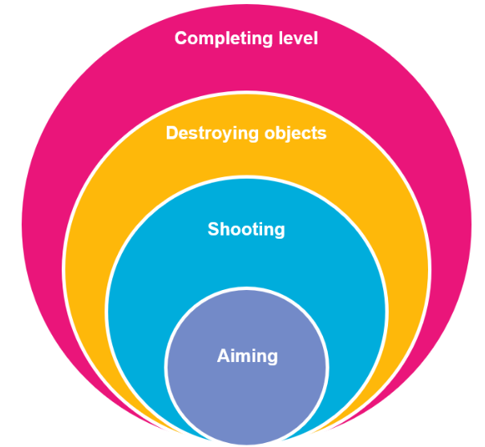

##### Core Mechanic

###### Aiming

The player aims their projectile using linear functions. By adjusting the values in the function, the trajectory of the projectile changes, adjusting to match the graph of the associated function. In addition, the player must consider the most optimal trajectory to destroy the intended targets, actively engaging with the function.

##### Secondary Mechanics

###### Shooting

When the player has determined where to aim, they fire the projectile. This actively engages the game world and allows the player to interact with it, but also displays the direct consequences of their aiming strategy. The projectile explodes on contact with the first object it hits, which gets destroyed, and other objects within the radius are affected by the force.

###### Destruction

Destruction is the measure of progress within the level; once the enemy is defeated, the player progresses. Using the above mechanics to determine how to aim, the projectile will then explode and cause a radius of destruction, which allows the player to destroy the enemy. The destruction is both a goal to complete the level, and a reward for making a correct assertation on the projectile trajectory.

###### Evaluation

After the player has cleared a level, a graph will fade into view to display the visual representation of the functions they put in to launch their projectiles. This allows for a definite connection between the gameplay and the learning goal, but also for the player to review their strategies and absorb knowledge based on their interaction with the subject matter. This knowledge can then be applied in later levels.

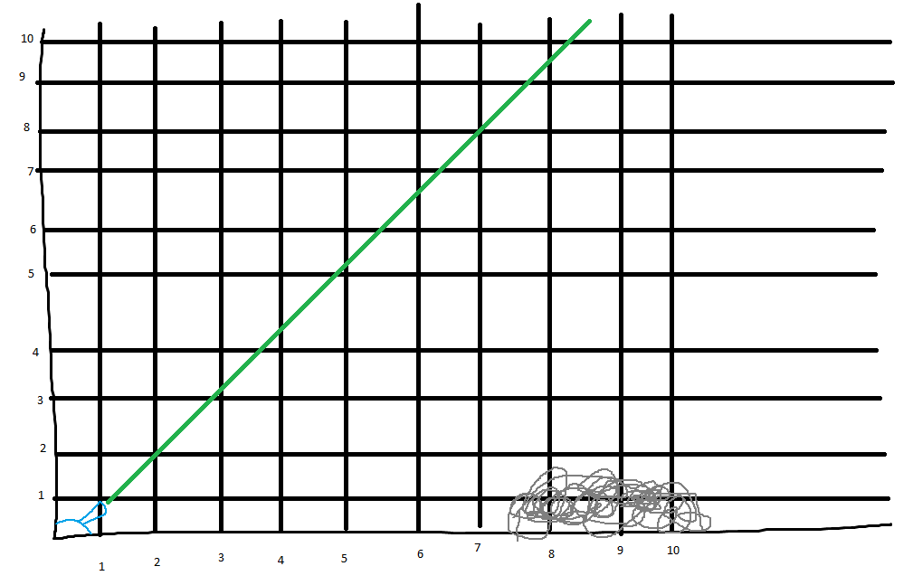

After putting in any input, the evaluation shows up and gives the player the option to return to the menu or proceed to the next level:

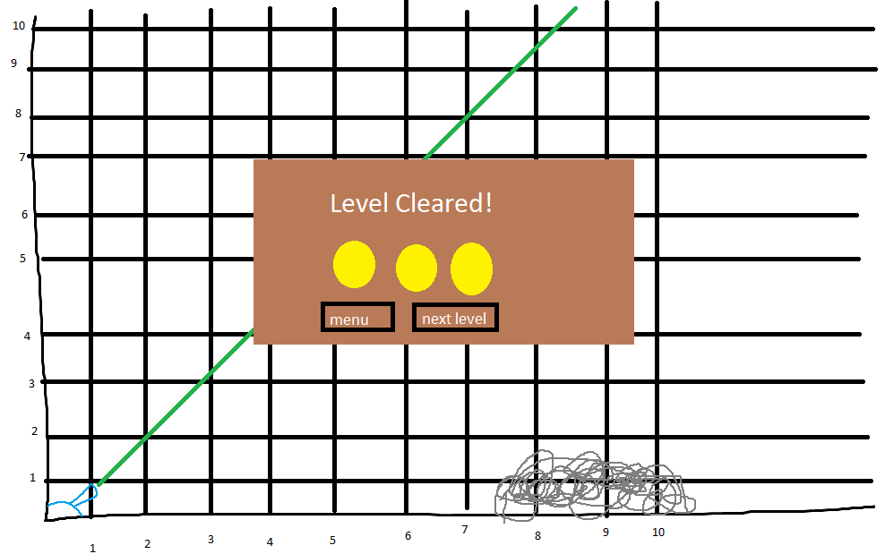

###### Level Progression

In order to progress throughout the game, the levels have to be cleared in accordance to predefined clearing conditions:

- All the enemies are taken out -> The level is cleared
- If the player is out of ammunition and there are still enemies remaining -> The level is failed
  If the level is failed, no bananas are awarded. In order to progress, at least one banana has to be awarded per level in order to advance.

###### Scoring

How well you completed a level will be represented in amount of bananas rewarded, from 3 (good) to 1 (acceptable).

- Each block that you destroy in the level will awards 100 points.
- Each defeated enemy awards 500 points.
- Each piece ammunition that has not been used awards another 500 points.

The amount of bananas - like a star system on some mobile games - rewarded will be based on the amount points the player scored.

For example: 2000p or more is 3 bananas, between 1500p and 2000p is 2 bananas and less than 1500p is 1 banana. The actual thresholds would have to be tested for.

#### Dynamics

Throughout the game, the player is challenged in a variety of levels. In those levels, a structure made out of different blocks, holding one or multiple raccoons (enemies), has to be destroyed using projectiles to reach the enemies and destroy *them*. The player adjusts the trajectory of the projectile by adjusting the values on a linear function. Hitting the structure in the right place will cause a collapse, allowing the raccoon to be reached - or for it to fall and be defeated through that avenue.

The player has to experiment which formula develops which trajectory that will do the most damage as ideally, the player solves the level in as few shots as possible. Learning what function creates what graph, but also what effect this has on the puzzle of destroying the level, teaches the skills to handle progressively more difficult levels. They refine their skill over time, handling levels with more efficiency and earning more rewards.

Each level earns rewards: getting back the bananas the raccoons have stolen. The more bananas the player earns, the more skill points they achieve, which can be spent on upgrades to make the game easier. Rather than simplifying the game as a whole, these upgrades allow for more efficient experimentation and skill refinement. For example, more ammo; the player has more room to destroy things in their own way.

Through these dynamics, two distinct aesthetics are facilitated.

#### Aesthetics

For this game, two aesthetics are prominent in design: Challenge and Discovery.

**Challenge** is found in the levels themselves; the player must learn and understand how to approach destroying the objects in the game to reach the enemy and clear the level as efficiently as possible. They are puzzles to solve that challenge the player's knowledge in order to advance.

**Discovery** comes from experimenting. Firing projectiles and observing how this affects the level, to learn new things and to better understand, allows the player to discover new tricks and more efficient ways of progressing.

#### Economy

Depending on their score per level, the player earns bananas as a currency, up to three per level. This is encouraging precision in shots and and understanding of the projectile trajectory and thus the learning material, rather than throwing things at the wall to see what sticks.

##### Resources

The player's primary resource is their ammunition. The player has three shots available per level to destroy the opposing objects; each cumulative shot decreases the player's score, failing the level if all shots of ammunition are used before the level is cleared.

##### Currencies

Upon clearing a level, the player is awarded bananas. They can use these bananas as currency to unlock harder stages of the game (see Progression System). In addition, for every 10 bananas earned, the player gains a skill point.

##### Consumables

The player gains a skill point once every 10 bananas, which is used to unlock one upgrade on the skill tree.

#### Progression

The player progresses through the game by refining their knowledge on linear functions to complete levels with more precision and forethought, allowing for more levels to be unlocked with the in-game currency of bananas. Their journey is quantified by the increasing difficulty of the level constructions, and their progressing understanding of how to break these down with more advanced linear functions.

#### Progression System

- The player will start with the easy stages, this section is unlocked right from the start.
- The player gathers bananas rewarded from the levels. Once a banana has been earned, that level can no longer reward it to the player's total.
- Intermediate stages section will be unlocked after gathering 20 bananas. This means that if the player is too skilled for the easy stages, they have the option to quickly move on to the intermediate stages.
- After gathering 40 bananas, the hard stages section will be unlocked.

##### Upgrades

- Every 10 bananas, the player can advance the skill tree.

Ideas for the power-ups:

- Increase in ammunition (making it possible to get higher scores because the player can keep more at the end of a level)
- Increase in explosion radius/power Upon impact
- Ammunition splits up into 2 more that cause smaller explosions left and right.

#### Loops

##### Game Loop

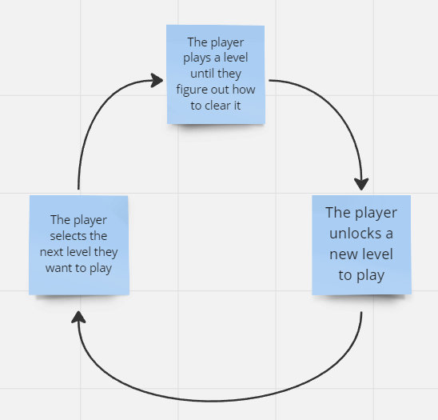

##### Feedback Loops

The player getting better at math from playing the game is offset by making the levels more difficult in this negative feedback loop.

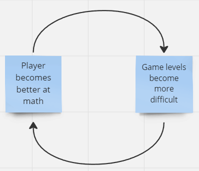

The upgrades make the game easier in a positive feedback loop.

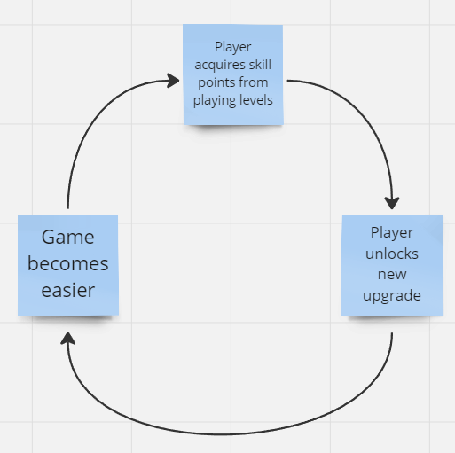

### Implementation

#### Target Platform

The target platform for this game will be mobile-web and desktop-web.

#### Controls

The game will entirely be controllable with touch/cursor.

#### User Interface

##### Main menu

- Title of the game
- [BUTTON] Play
- [BUTTON] Settings
- [BUTTON] Quit

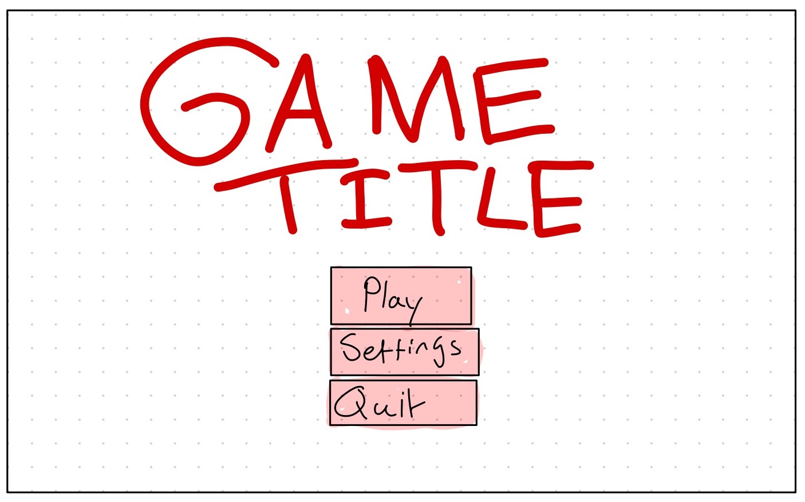

##### Level Selection

- [BUTTON] Clickable level nodes in a grid that bring you to the level in question
- [BUTTON] back to the main menu
- Amount of banana's gathered
- [BUTTON] Upgrade

##### In Level UI

- [BUTTON] Pause -> Brings up dialogue box with interactable buttons
  - [BUTTON] Resume
  - [BUTTON] Options
  - [BUTTON] Back to the level selection
- Current score
- Current available ammunition
- Current equation
- Visualisation for equation (line following the canon)
- [BUTTON] Increment the a value in 'y = ax + b' Up
- [BUTTON] Increment the a value in 'y = ax + b' Down
- [BUTTON] Fire/Shoot

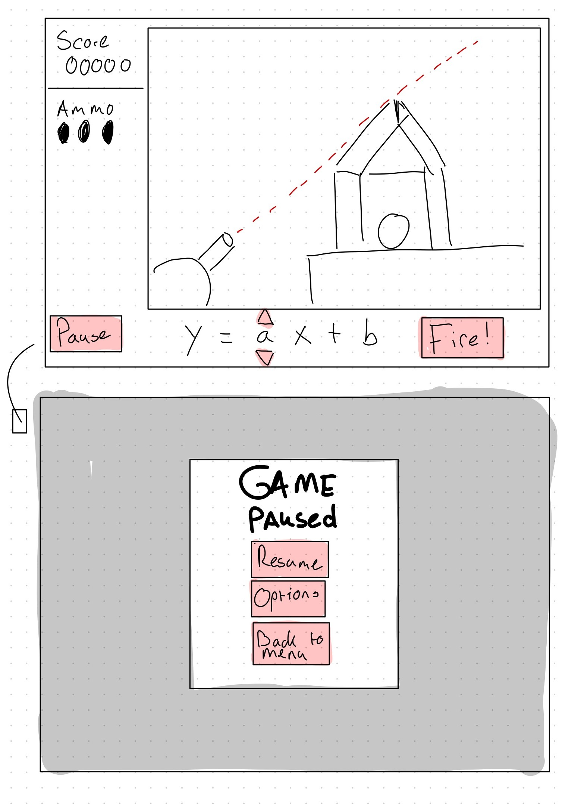

##### Level Clear UI

- Text indicating the level was cleared
- Amount of banana's reached
- [BUTTON] Retry
- [BUTTON] Go back to level select
- [BUTTON] Next Level (grayed out if not enough bananas)

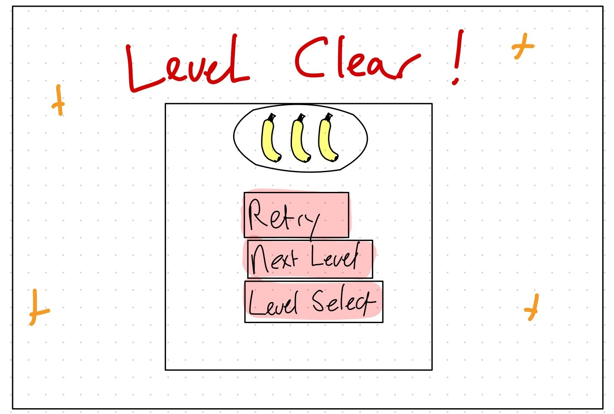

##### Level Failed UI

- Text indicating the level was failed
- 3 empty banana icons
- [BUTTON] Retry
- [BUTTON] Go back to level select

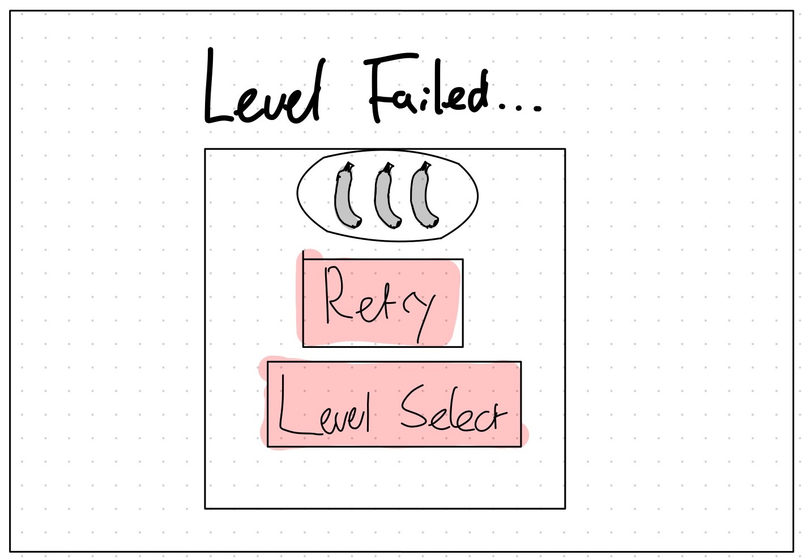

#### Camera Behaviour

The camera is stationary, focussed on both the cannon and the enemy structure, until the level is cleared at which point is zoomed out to fit the entire grid in the camera and shows the entire graph.

#### Game Objects

##### Cannon

Essentially the player. The canon moves based off the input from the player. Every increment the player makes to the *a* value in the *y = ax + b* equation moves the canon and the visualised line.

- Cannon (and by extension the equation) operates on a grid of 10 by 10.
- Increments happen in steps of 0.25.
- The cannon should only be able to shoot to the right, the barrel should never be pointing to the left.

##### Bombs

The ammunition for the cannon. The player starts the level with 3 ammunition.

- The shot bomb explode on impact (disable/destroy the bomb), expanding outwards forces to all destructible objects surrounding the impact.
- After the level is cleared, reward the player 500 points for every remaining ammunition.

##### Destructible Blocks

These are blocks used to create the structures within the levels.

- Destroyed on direct impact from bomb.
- Sustain damage from other objects that fall on top.
- Destroyed when taken enough damage.
- When destroyed, reward the player 100 points.

##### Connecting planks

Used to help hold up destructible blocks in order to create roofs and floors.

- Are attatchable to 2 blocks, one on the side of a wall, the other at the bottom of a roof/floor.
- Destroyed when one or both attached blocks are destroyed.

##### Indestructible Blocks

Used to create ground or intentionally indestructible walls and floors to make a level more challenging.

- Can't be destroyed
- Don't move (kinematic)

##### Racoons

- Destroyed on direct impact from bomb.
- Destroyed if they sustain enough damage from falling debris.
- When destroyed, reward the player 1000 points.

##### Example Level

To demonstrate more clearly what is meant by all the objects, look at this possible level design:

The dark grey block is scalable and kinematic, non-destructible. The white blocks are destructible and abide by the rules of gravity. The white blocks that form the roof are held up by the smaller planks. If the block marked by a star is destroyed, the smaller plank will also be destroyed, resulting in the roof block falling down rotating to the left because the right plank is still attached.

#### Polish

##### Screenshake

- When a bomb makes impact, shake the screen to convey a sense of power to the player.

##### Particles

- When shooting the cannon, make it so the cannon gives off smoke and fire particles.
- Have smoke particles follow the bomb when travelling to convey a sense of speed to the movement.

Describe the different polish elements in the game, e.g. particles, animations, etc.

#### Story

You are a monkey whom got their bananas stolen by raccoons and you're on a quest to get them back.

**Possible names:**

- Banana Blitz: A Monkey's Revenge
- Ape Avenger: The Great Banana Heist
- Monkey Mayhem: Raccoon Rumble
- Banana Quest: The Raccoon Raiders
- Revenge of the Apes: Raccoon Bananapalooza
- Ape Assault: The Great Banana Battle
- Bananageddon: Monkey vs. Raccoon
- The Great Banana Caper: A Monkey's Revenge
- Raccoon Rampage: Monkey Mayhem
- Bananapocalypse: Monkey Retribution

#### Sound

The sound should be weighty, to sell the player on the power fantasy of shooting bombs out of a cannon.

#### Art

Should be cartoony and colourful. Inviting the player to play. It also deters the play from thinking rationally about the game's premise, since it's so silly.

Examples would be:

`Angry Birds`

|  | 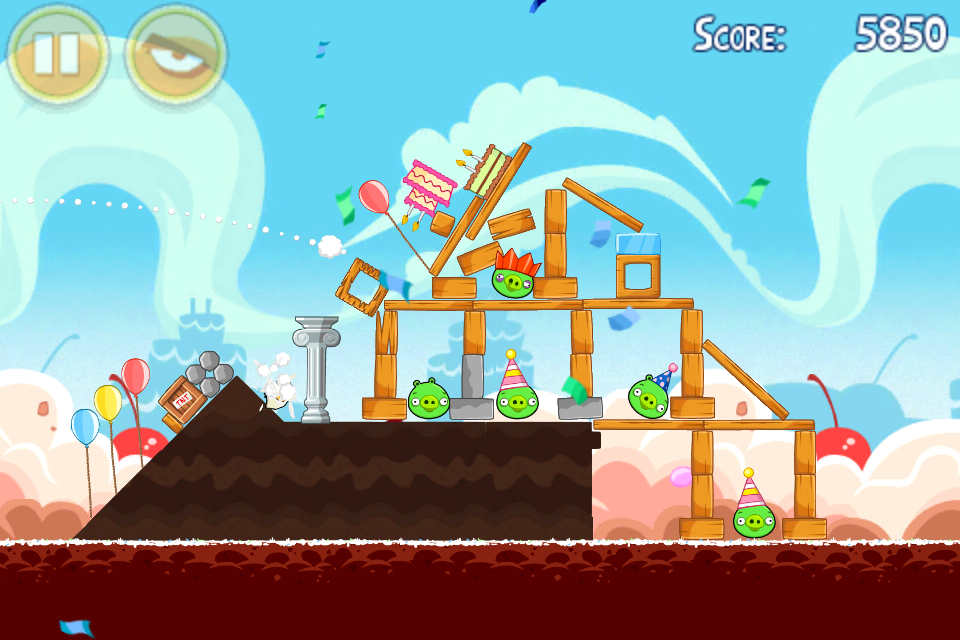 |  | 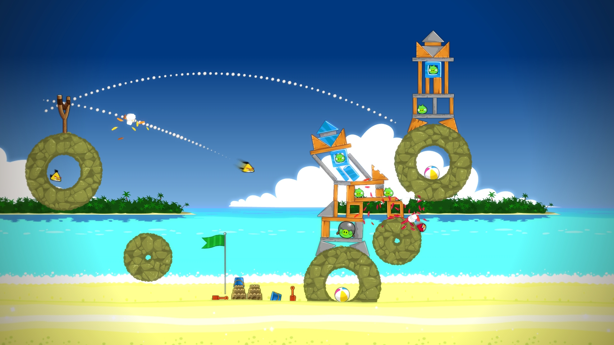 |
| --------------------------------------- | ----------------------------------------- | -------------------------------------- | --------------------------------------------- |

`Gold Miner`

| 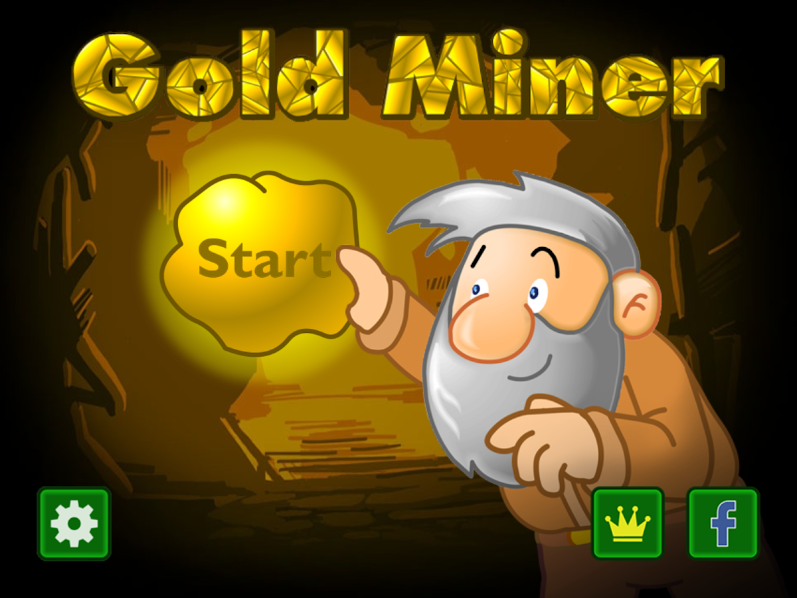 | 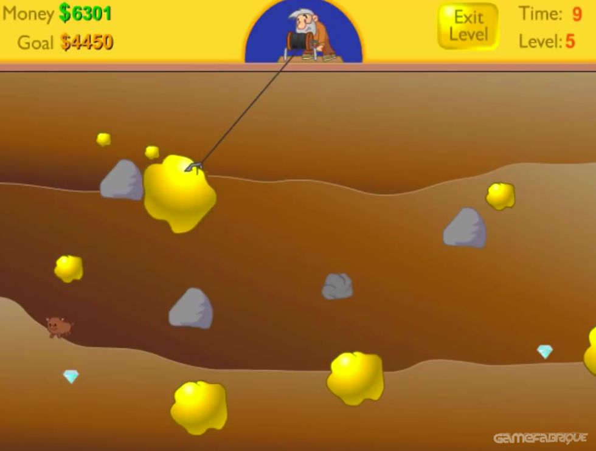 | 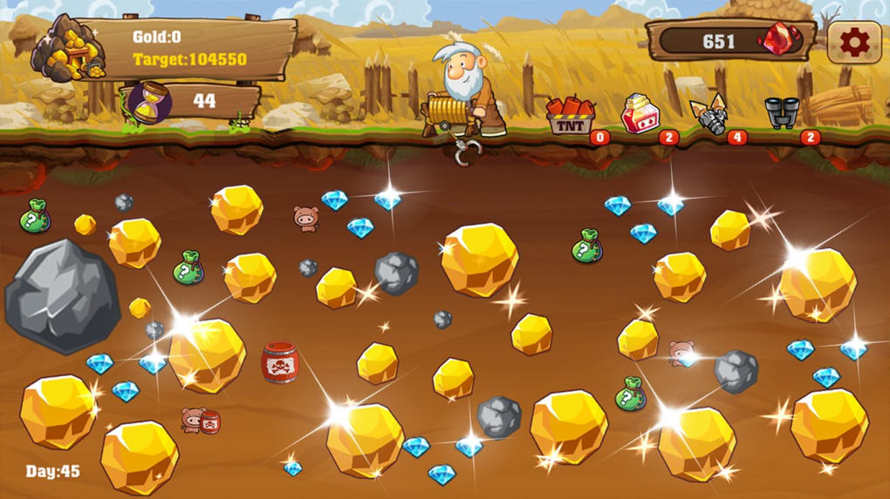 |
| -------------------------------------------- | --------------------------------------------- | ------------------------------------------- |

`Fleabag vs. Mutt`

| 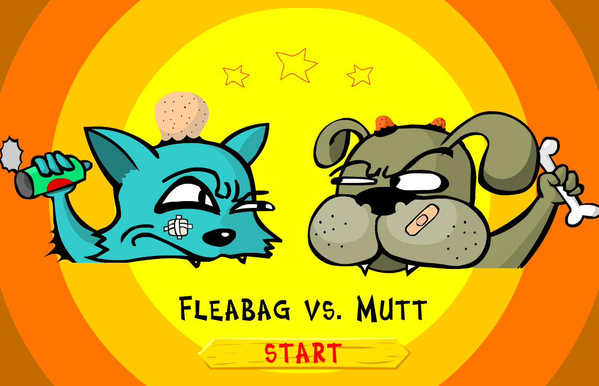 | 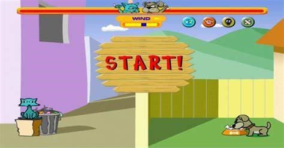 | 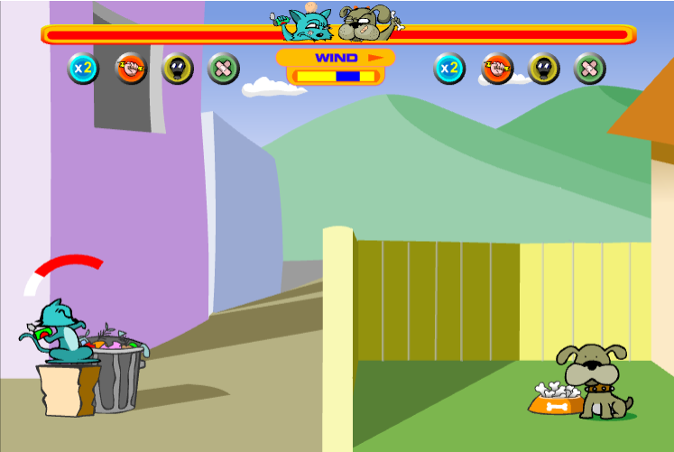 |
| ------------------------------------------- | ------------------------------------------- | ------------------------------------------- |

## Concept 2: Myth Digger

The player is someone who intends to find the supposed answer to the dying planet under the crust. Doing so will require the gathering of materials so they can craft tools necessary to dig further and be able to find the answers you're looking for. Building rails, processing ores, and using them in crafting allows you to progress through the game by digging deeper each time.
The game has a side view and the depths are dark. The light source is glowing gems that you can mine and use motes of to light up the path you're mining.

### Concept

#### Mission

1. Reach the dragon using your wit!
2. Reach the core using your wit!
3. Dig, process, dig further!
4. Unearth the secrets and treasures down below!
5. Construct a network of caves and train tracks!

#### Design Pillars

- `Exploration`: I want to explore the world below and find out its secrets.
- `Crafting`: I want to use what I have gathered to craft new tools so that I can explore more.
- `Experimentation`: I want to see what different resources can do for me.
- `Challenge`: I want to keep being pushed to try new things to continue.
- `Management `: I need to manage my resources in a logical way in order to advance.

#### Aesthetics

- Fantasy
- Challenge
- Discovery

### Design

#### Mechanics

##### Core Mechanics

###### Mining

The player mines down tunnels to gather resources and to progress further down the elevator shaft using the newfound materials. The player mines into sideways resource tunnels and glowstone nests, and downwards through the elevator shaft.

###### Track Building

The player can put down tracks so that they can transport the mined ores back to the surface. The tracks need to be placed along the obstacles within the tunnel, adjusted in their angle and height by changing values within a linear function.

##### Secondary Mechanics

###### Exploring

The player is incentivised to explore beneath the surface in hopes of finding the mystical dragon rumoured to be hiding in the core. They must find the ore tunnels by climbing up the elevator shaft and tapping the sides, until they encounter the right tunnel. Additionally, they need glow crystals to light their path in dark tunnels, found in separate pockets lined along the elevator shaft.

###### Processing

In order to use the newfound materials, they need to be processed. The player processes them at the refinery, by solving an equation given to them by their professors. Afterwards, the material can be used in crafting.

###### Crafting

To be able to advance through the tunnel, the materials must be used by the player to strengthen their tools to be able to dig deeper and slay tougher enemies. They do at their workbench, solving an equation to determine y- and x-intercepts so they know where to strike their hammer.

#### Dynamics

In Myth Digger, the player tries to reach the core to slay the world-eating dragon. In order to do so, they must gather resources to help break through the hard stone and create weapons to defeat enemies blocking their path. On the surface, they have their elevator to take them into the mines, and the warehouse. In the warehouse are the machines for processing and crafting, which can be interacted with independently.

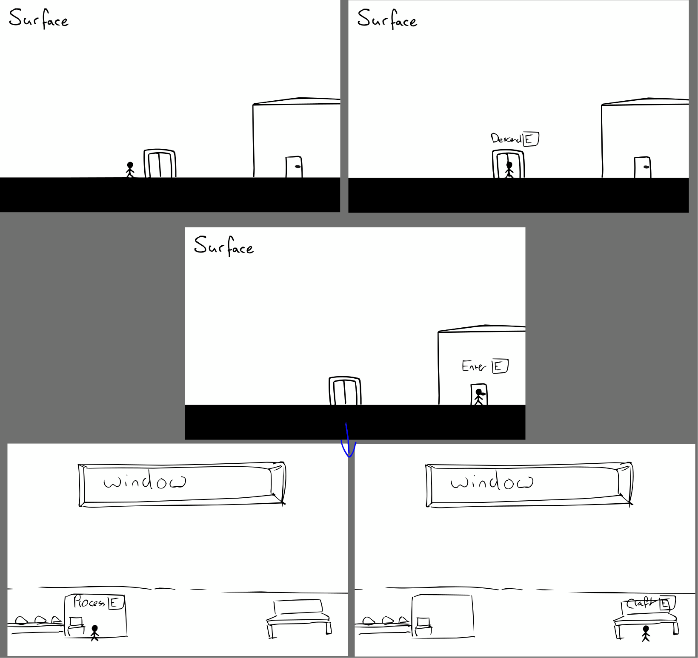

The player starts with an elevator shaft that has already been excavated. When headed down, they need to find the ore deposit tunnels. They tap around the walls, able to scale them on their own, until they break through into a tunnel. The most important tunnel - the ore tunnel - is littered with rock that cannot be broken or moved - the player can scale them to the other side where the ore vein sits, but transporting the material efficiently is another thing. However, some tunnels are also empty, leading to no ore deposit and pushing the player to search for tunnels with the rewards they need.

If they open a tunnel but still can climb higher, a ladder will appear after the tunnel is opened, allowing them to continue to scale the walls.

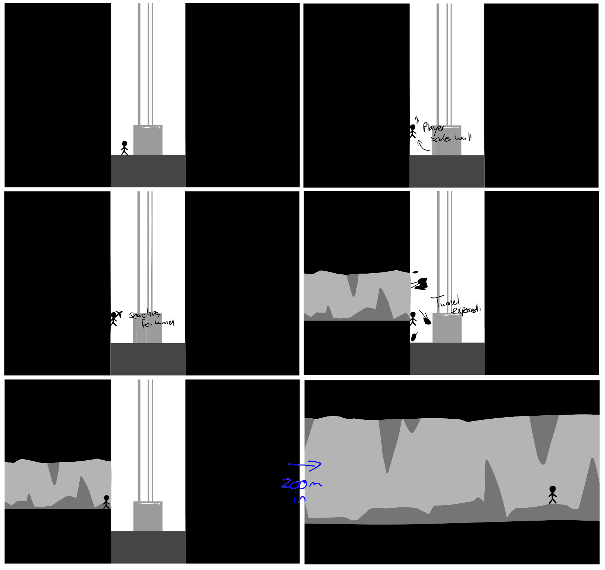

To move the materials, the player must build rail tracks. Players place pieces of rail track along the obstacles, adjusting their rotation and height based on a function they manipulate, challenging their knowledge and skill. Once they confirm the function and the track is in the right place, it will click into place with the previous piece and the player continues until they reach the elevator shaft. From there, the resources are mined automatically and transported topside.

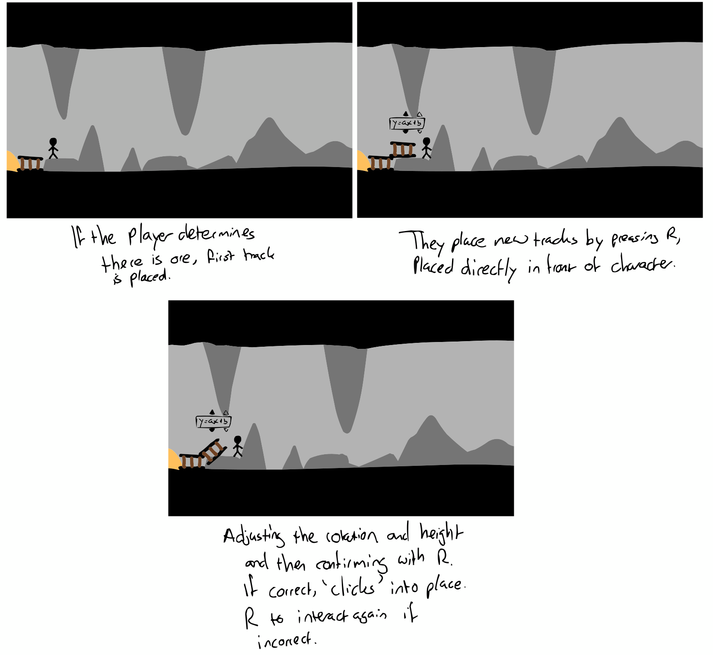

Eventually, the player cannot descend further down the shaft and there are no more ore tunnels to excavate. They need to return to the surface to process the resources they have gathered. Processing is done in a separate building on the surface, holding a refinery and a crafting table. In the refinery, the materials are processed.

The materials, infused with mana, make them unusable in their current state. However, with help of off-screen scientists, a data output for processed material can be predicted. The player then has to calibrate the output on the refinery console, placing the correct values in the table to represent the line for the data output. Once they press the button, a paper representing the graph they created with their table is printed, showing either the correct output line or an incorrect one. In the latter case, the player has to try again; if it is correct, the calibration has been completed and the resources are processed.

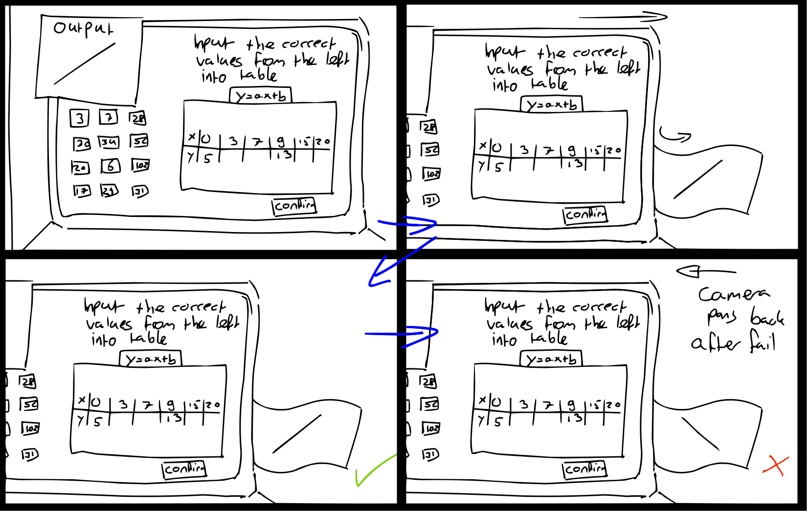

Processed materials can be used in crafting on the workbench. Using the output line from the processing, two more lines are given, as well as the corrosponding functions. The player has to calculate the x- and y-intercepts to determine where to hit the hammer for correct structural integrity. This has to be done for both their pickaxe to cut through the tougher rock, as well as their sword to defeat increasingly tougher enemies.

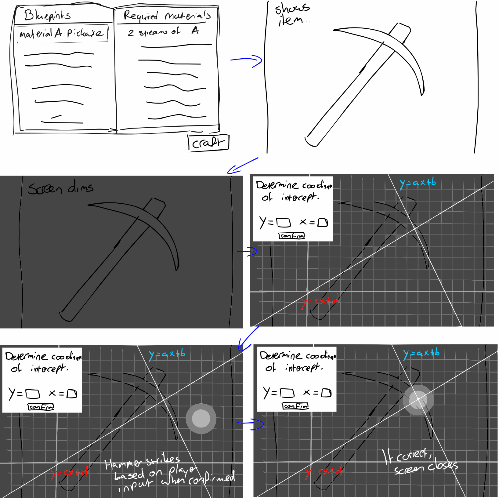

As the player descends down, the ore deposit tunnels carry increased challenge and danger. Not only are the obstacles in the way harder to navigate around, but some tunnels are so dark they need glow crystals for lighting which can be mined out of separate pockets also connected to the main elevator shaft. Enemies also begin to patrol this area, glowing with mana and getting increasingly more prehistoric looking as the player continues down. To help along the way, the player can find health tunnels to increase their own defense after battling a small 'boss monster' section.

Eventually, they breach the dragon's nest and attack. This is a full test of the player's skills in both the game and the math puzzles given to them. 

#### Math Didactics

##### Learning Goals

1. Playing with the fundamental characteristics of a linear function first individually and then in combination.
2. Applying the fundamental characteristics to transform one representation (verbal, graph, formula, table) into another in a playful way.
3. Solving quests, tasks and problems involving multiple representations of linear function (verbal, graph, formula, table).
4. Applying properties of linear functions to solve equations in a playful way.
5. Applying the appropriate function representation to solve a question or problem in the game.

##### Implementation

The learning goals are incorporated within the core mechanics of the game; the player uses linear functions to create the rail, transforms one representation to another, and solves intercepts. This is needed to progress, either by processing their materials or by crafting the necessary tools to advance. The difficulty of these challenges can be increased or decreased as needed, and scales throughout the level to continue teaching and testing the math skills.

#### Economy

##### Resources

Myth Digger has 3 primary resources:

- Health
- Glowstones
- Resources (referred to in this chapter as materials)

###### Health

Health is the player's life force and main resource to maintain in combat. The player starts with three hearts; when attacked by an enemy that amount of hearts is reduced. The player slowly generates health back over time (half a heart/??sec) or regains it completely when returning to the surface. When health is fully depleted, the player dies and hits a game over. They can return back to the game at their last checkpoint - the checkpoint is placed when they excavate down to the next depth, the 'next level'. 

The player has the opportunity to expand their total health by finding and clearing boss tunnels; empty tunnels with clusters of enemies trapping life-essence in a cage of mana. Once the enemies are defeated, the life-essence can be collected and expands the players health by one heart. 

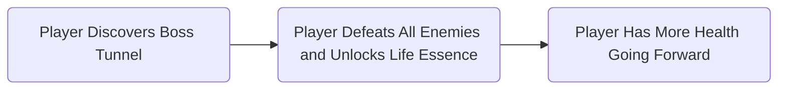
``` mermaid
flowchart LR
%% Nodes
A(Player Discovers Boss Tunnel)
B(Player Defeats All Enemies and Unlocks Life Essence)
C(Player Has More Health Going Forward)


A-->B-->C

```

###### Glowstones

The further the player goes, the darker the ore deposit tunnels become. To light their path, the player uses glowstones. Glowstones are obtained through glowstone pockets, found along the elevator shaft similar to ore tunnels. Glowstones are a finite resource, but can be picked back up once placed. Glowstones light an area of a radius of ??.

###### Materials

The main goal of the player is to reach the core of the tunnel by breaking through the rock that stands in their way. The rock progressively gets harder and the player needs more and more materials of increased strength to break through this rock. The player mines these materials in ore deposit tunnels and processes them for crafting. The materials are not a finite resource, constantly mined from the ore tunnels they are found in; however, for crafting, the influx of raw materials may need to be of a certain level before it can be utilized (eg. to upgrade to a pickaxe of material B, the player needs to have 2 ore deposit tunnels open and connected that harvest material B).

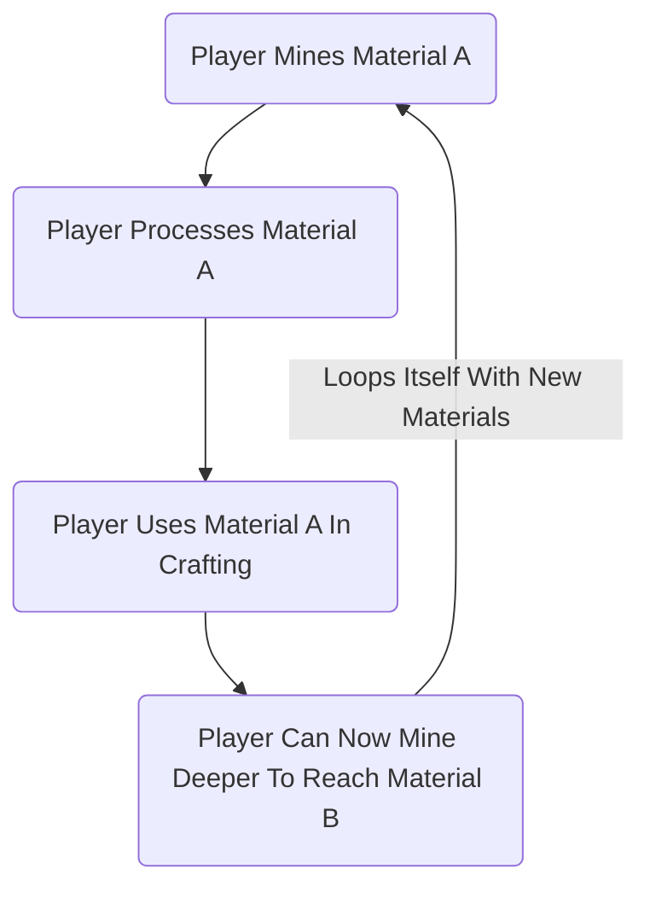
```mermaid
flowchart TD
%% Nodes
A(Player Mines Material A)
B(Player Processes Material A)
C(Player Uses Material A In Crafting)
D(Player Can Now Mine Deeper To Reach Material B)


A-->B-->C-->D-->|Loops Itself With New Materials|A

```

What these materials are, and what order they present themselves to the player, will have to be determined later; for the sake of the prototype, using letter designations will suffice. **Add to this for finalized document!** 

#### Progression

###### Opening

1. [CUTSCENE] Player is climbing and attempting to mine in the shaft, finds a tunnel. Walks into the tunnel. Camera exponentially pans down to the dark center of the planet. Dragon roar ensues (You don't see the dragon, its presence is implied by the roar). Camera pans back up to the player. [CUTSCENE END] 

2. The player now starts in the tunnel. UI element appears detailing the player to walk to the left so that they encounter the ore at the end of the tunnel and don't try to walk back to the shaft.

3. Once the player is at the end of the tunnel, a UI element pops up 'Press R to place tracks'
After placing the first one another instruction will pop up: 'Once you complete the rail, the ore will be transported topside.'

> (We assume the player will walk to the elevator and take it topside, since there are no other interactibles currently)

4. Once the player arrives topside an NPC will initiate dialogue. The dialogue details that the player's current equipment isn't strong enough to dig deeper. But since they just brought some ore topside, the player should check out the warehouse.

5. UI element pops up signaling the direction in which the warehouse is. Once the player enters the warehouse, the first interacible is the processor and the second is the crafting.

6. If the player opens the crafting minigame first, UI warns them that they need to process the ore first.

7. Once the player has done the processing and has crafted the new equipment, the NPC initiates dialogue again. Detailing that the player should go back down to the shaft to see how far they can dig now.

###### General Progression

As the game progresses, the world becomes more complex. The ore tunnels become more and more cluttered with obstacles, needing more refined use of the rail tracks in order to transport the neccesary materials. Enemies increase in number and strength, as well as having their movement patterns changed or speed increased. Tunnels become darker and require better use of glowstones to light them. The resources they gather become more and more complex in nature, requiring more knowledge to process and use in crafting - for example, processing no longer provides the direct formula and the player has to determine this based on the numbers they're given in the table, or having to draw the lines based on functions for the intersection point before calculating what that point will be. This scales the math difficulty, but leaves a lot of room for how it can be scaled.
The player grows in their skill to overcome these increasing difficulties, inching ever closer to the resolution of the story.

Visually, the 'levels' in the game change as they go deeper, becoming more saturated in color and unnatural in shape to reflect the increase of mana as the player descends deeper. Every layer has its own color scheme and ore types to collect, giving them distinction from one another and make the player really feel like they are travelling deeper and deeper into uncharted territory and unfamiliarity.

To indicate how much progress the player is making in a more practical way, every time they dig down to the next level, the camera will pan to the dragon (But it's obfuscated by the dark) and hear it roar and then have the camera pan up again. The camera will have less distance to travel the closer the player gets to the dragon, subtly hinting that the player is closing in on it.

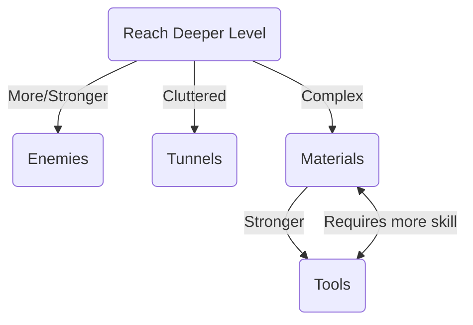
```mermaid
flowchart TD
%% Nodes
A(Reach Deeper Level)
B(Enemies)
C(Tunnels)
D(Materials)
E(Tools)

A -->|More/Stronger|B
A -->|Cluttered|C
A -->|Complex|D
D -->|Stronger|E
D <-->|Requires more skill|E

```

#### Loops

##### Game Loop

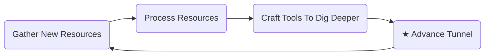
```mermaid
flowchart LR
%% Nodes
A(Gather New Resources)
B(Process Resources)
C(Craft Tools To Dig Deeper)
D(★ Advance Tunnel)

A --> B --> C --> D --> A

```

##### Feedback Loops

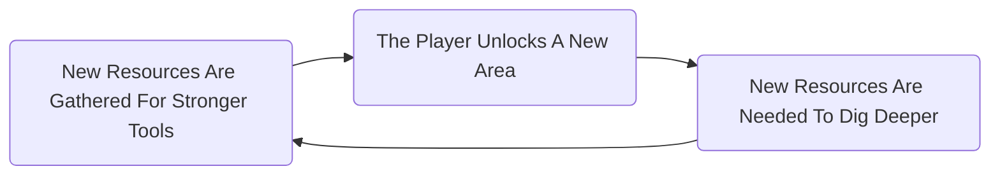
```mermaid
flowchart LR
%% Nodes
A(New Resources Are Gathered For Stronger Tools)
B(The Player Unlocks A New Area)
C(New Resources Are Needed To Dig Deeper)

A --> B --> C --> A
```

When the player unlocks a new area, that means they get access to new resources. They'll need those to dig deeper to the next area. In order to do that they can use the new resources to craft stronger tools.

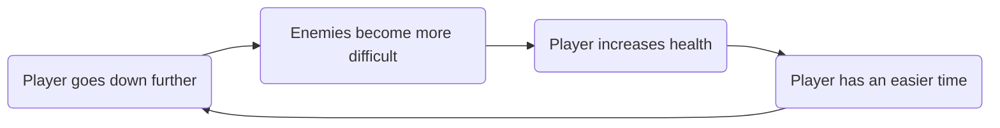
```mermaid
flowchart LR
%% Nodes
A(Player goes down further)
B(Enemies become more difficult)
C(Player increases health)
D(Player has an easier time)

A --> B --> C --> D --> A
```

When the player goes down further, the enemies become more difficult. The player can also increase their health pool if they can find the boss room and defeat the challenge. Increasing the health will give them an easier time fighting enemies without dying.

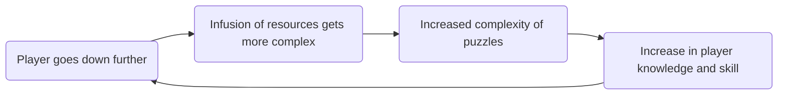
```mermaid
flowchart LR
%% Nodes
A(Player goes down further)
B(Infusion of resources gets more complex)
C(Increased complexity of puzzles)
D(Increase in player knowledge and skill)

A --> B --> C --> D --> A
```

When the player goes down further, the infusion of resources gets more complex which results in the puzzles getting more difficult. However, the player also gains more knowledge which allows them to complete the puzzles and progress further down.

### Implementation

#### Target Platform

The target platform for this game will be mobile-web and desktop-web.

#### Camera

The camera will follow the player. If the player enters a cave, the camera will zoom in to fit the bounds of the cave in view. We do this so there is more visual clarity for the challenges imposed on the player within the caves.

#### Controls

- WASD for movement (W is jumping)
- E for mining
- F for lights
- Spacebar for slash (weapon)
- R for rail
- Escape for pause

#### User Interface

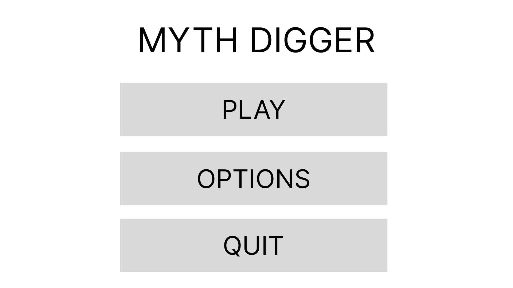

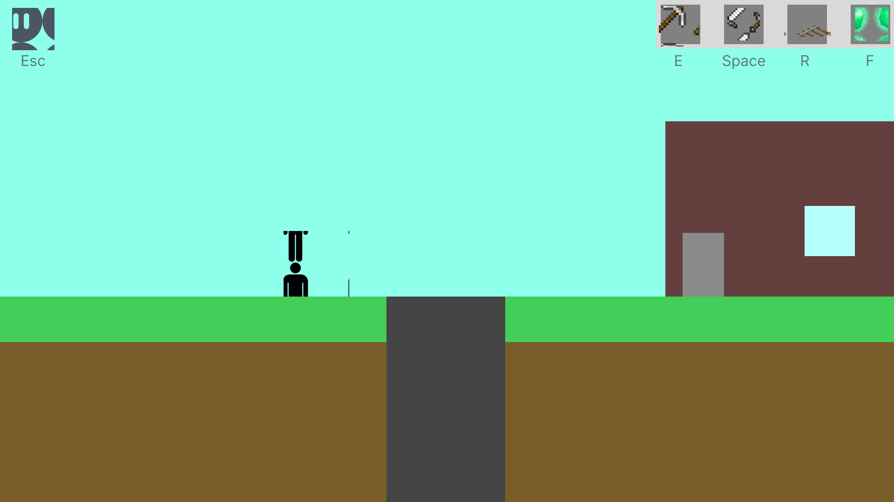

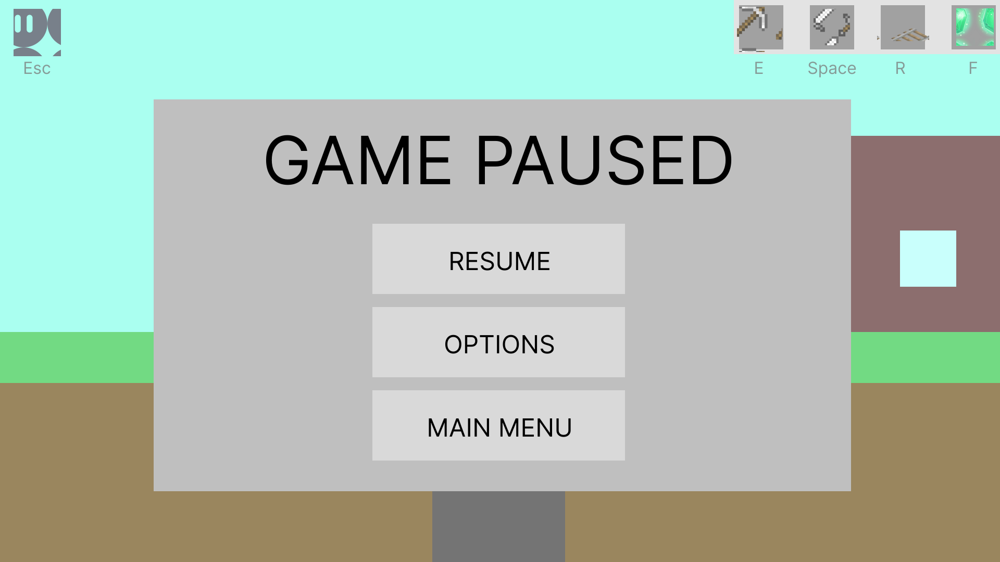

#### Game Objects

Describe the different game objects in the game, their purpose and how they interact with the player.

##### Elevator
The elevator is the main entrance and exit point for the player and for the materials they find. The material transport is passive once the track has been built, but the player can interact with the elevator to transport themselves back to the surface and down to the mine. When the player is close enough to interact, a prompt will appear on their screen.

##### Tunnels
The player can encounter three different kinds of tunnels:

- **An ore tunnel**, where the player has to build railtracks to transport the ore from the vein to the elevator shaft. As the player finds ore at the end of the tunnel, the first track is automatically placed. When the tracks are completed, a railcart appears that drives back and forth to transport ore. The player does not interact with this, and all ore is transported automatically.
- **An empty tunnel**, where there is no ore. 
- **A glowstone pocket**, where glowstones can be mined.
- **A boss tunnel**, where the player has to defeat a horde of enemies to unlock the trapped life essence and increase their health.

All tunnels can be of varying depth. Tunnels can be covered in darkness, and have to be lit up by glowstones. 

##### Machines

The machines can be interacted with to open respective puzzles for processing and crafting. When the player is close enough to interact, a prompt will appear on their screen.

##### Glowstones

Glowstones can be mined. Once mined, they'll be added to your glowstone total. The player can place glowstones on the wall by pressing 'F'. This will light up the area surrounding it, making it easier for the player to spot points of interest. Pressing 'F' Whilst standing next to a placed glowstone, the player retrieves the glowstone and gets added back to their glowstone total.

##### Enemies

Enemies can move vertically within tunnels. If there's a slope that's too steep or a wall, they can't move over it. If an enemy gets hit by they player's swing, they take one damage and get knocked back a small distance. Once the enemy's health is depleted, they are killed.

If the enemy makes direct contact with the player, the player loses one HP.

#### Polish

- Animations are straightforward motions; enough to show the life of the character, but not too complex. 
- Tunnels being exposed causes the screen to shake and rocks to fly outward of where the tunnel opens, showing dust until it clears and displays the correct tunnel. 
- The processing machine topside has a steady flow of objects on a conveyor belt leading into it to show the materials being moved.
- Entering and exiting the elevator to go topside or hit the area below is a simple fade to black in a circle:

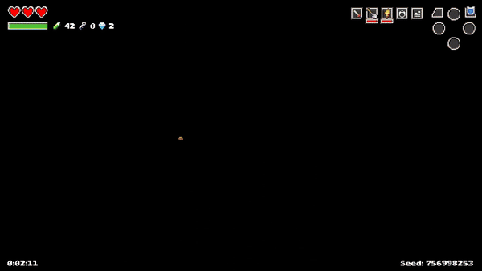
- Each new layer of rock that is exposed has a gradually more saturated color scheme. The visual design of these areas become more jagged and unnatural in shape to reflect the increase of mana, but also to distinct every layer from one another and visualize progression.

#### Story

The world is at an end. The mana that fuels the world is slowly being depleted. There are rumours and beliefs that the answer lies deep underground - but whether these are hopeful grasps at saving the world or meaningless superstitions, no one seems to know. You want to believe, though.

You have been appointed by an unknown benefactor to burrow your way to the core of the Earth to find this possible answer. But the rock gets harder the deeper you go, and you need newer and stronger materials to break through. You prepare for the possible danger and learn to utilize your newfound tools, digging deeper and deeper, until you uncover the answer.

The answer, as it turns out, is a dragon who has been eating the mana away, slowly draining the world of its life. The final test of this burrowing adventure is to slay it, and allow the world to heal and continue to prosper.

#### Sound

##### Music

Chiptune-like sound library that gradually increases in complexity; starting off with a basic, mellow tune composed of only a handful of instruments, that climbs to multiple instruments. This is to reflect the increased complexity of the world below, the infusion of mana within the resources, enemies and even the ground the player walks on, as they descend further down.

##### Effects

Sound effects aim for a satisfying confirmation of actions; placing a railtrack correctly results in a *clang* sound that the player recognizes instantly and feels rewarded by. Picking up objects has a similar feel to the sound, a joyful [pling](https://youtu.be/l2nFoftimzY?si=qpaoKqLd0KpdBZDL&t=120) to indicate the player has found something that is good and helps them progress. 

The general theme of the sound should be aimed around simplicity - not too many layers to the sound, matching the game's visual direction.

#### Art

With this game, the art design aims at simplicity to be able to be run on any platform in webGL - the graphic requirements should be low, with simple animations and ideally a pixel art style. Visual effects should be aimed at making things clear to the player and convey what it means; for example, a tunnel wall crumbling when the player hits it with their pickaxe.

Below are examples of a visual style this game should attempt to achieve. 

## Concept 3: Mushroom of Bloom

### Concept

#### Mission

**Let's defend our empire, and unleash our hellfire!**:fire:

#### Design Pillars

- `Instant Feedback`: I can see the result of the attacks instantly.
- `Chaos`: It is chaotic and unpredictable I don't know what will happen next.
- `Variety`: I want to have a variety of options etc.
- `Anticipation`: I want to feel excitement and fear for when the challenge pops up?(i.e. Am I going to make it?)

#### Aesthetics

- Sensation 
- Challenge
- Expression 
- Submission 

### Design

#### Mechanics

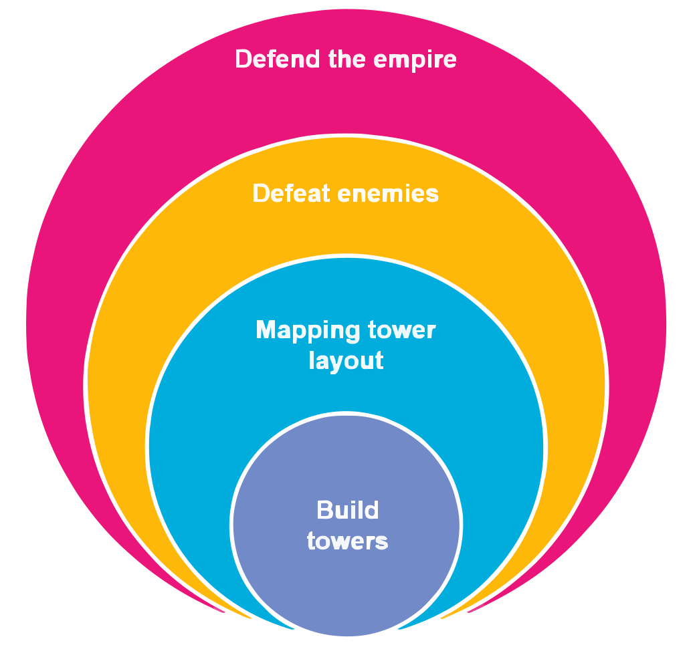

##### Core Mechanic

`Build towers`: A variety of towers can be build, using different trajectories, bullets etc.

##### Secondary Mechanics

- **Mapping out the towers**
  - Place towers strategically.
- **Defeating enemies**
- **Gathering the resources**
- **Shooting**
  - *Defining coordinates*
    - Write down on which coordinates a destructive object will be dropped by a tower
  - *Choosing the matching function (card-style)*
    - Choose a function which the tower will then use as a trajectory
  - *Altering a function* 
    - Using graph lines adjust a function to determine a trajectory for a destructive object
  - *Writing a new function* 
    - Using graph lines create a function to shoot a destructive object

#### Dynamics

##### Sensation 

- **Visuals and animations**: Use decent and stylized graphics and animations.
- **Immersive sound effects and music**: Implement dynamically changing sound effects and music.
- **Feedback**: Incorporate feedback, i.e. when towers are placed, upgraded, enemies are destroyed etc..

##### Challenge

- **Limited resources**: Limit the amount of resources to increase difficulty.
- **Increasing difficulty**: Implement a progressive difficulty curve where each level and/or wave becomes more challenging.
- **Varied enemy types**: Introduce varying enemies, i.e. more health, different type of bloom disease etc..
- **Boss enemies**: Introduce powerful boss enemies at the end of certain waves or levels.
- **Complex maps** : Design maps with varied terrains and/or obstacles that affect tower placement and/or enemy movement.
- **Time constraints** : Add a time-based challenge mode.

##### Expression  

- **Customize player character**: Provide options for players to customize their character, i.e. different mushroom hats, colours etc..
- **Player-created levels**: Implement a level editor where players can create and share their own maps/challenges.
- **Upgrade and modify towers**: Include a system for upgrading towers, i.e. tower elements, more damaging firepower etc.. 

##### Submission 

- **Progressive levels**: Implement progressively challenging levels that gradually introduce new towers, enemies and bosses.
- **Daily/Weekly challenges**: Introduce daily or weekly challenges and rewards to keep players coming back.
- **Idle mechanics**: Implement idle game mechanics where progress can be made even when the player is not actively playing.

#### Math Didactics

##### Learning Goals

1. Playing with the fundamental characteristics of a linear function ~~first individually and then~~ in combination. `
2. *Applying the fundamental characteristics to transform one representation (verbal, graph, formula, table) into another in a playful way.* 
3. Solving quests, tasks and problems involving multiple representations of linear function (graph, formula).
4. Applying properties of linear functions to solve equations in a playful way.
5. Applying the appropriate function representation to solve a question or problem in the game.

##### Implementation

1. Playing with the fundamental characteristics of a linear function ~~first individually and then~~ in combination. 

> Shooting, by altering the *A* and *B* values of the formula the trajectory of the destructive object (i.e. a tornado) can be defined.

2. *Applying the fundamental characteristics to transform one representation (verbal, graph, formula, table) into another in a playful way.*

> Shooting, by choosing a matching card with a formula displayed on it to aim the trajectory of the destructive object. 

> Shooting , when the player wants to place a tower, the moment it snaps to the pathway, a table pops up which you have to complete in order to calculate where the bullet is going to land. place the tower definitely.

3. Solving quests, tasks and problems involving multiple representations of linear function (graph, formula).

> Shooting, whilst altering the *A* and *B* values of the formula graph lines are shown for more clarity.

> Shooting, whilst altering the coordinates the player can see where the bullet is going to land.

4. Applying properties of linear functions to solve equations in a playful way.

> Shooting, using cards the player can choose the best trajectory for the bullets of the tower.

5. Applying the appropriate function representation to solve a question or problem in the game. 

> Shooting, by performing any of the shooting types appropriately multiple enemies will be defeated.

> Placing the towers, the player has to think about what tower (function type) would fit best on each location.

#### Economy

##### Resources

- `Health`: To survive in-game (i.e. the home base). 
- `Towers`: To defeat the enemies.
- `Bullets`: To defeat special/certain type enemies.

> Purple = Resources

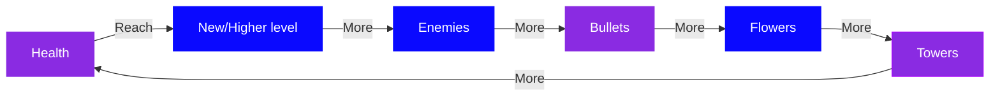
```mermaid
flowchart LR
%% Nodes
A[Health]
C[Flowers]
D[Towers]
F[Bullets]
E[New/Higher level]
G[Enemies]

%% Edge connections between nodes
    D --More--> A
    A --Reach--> E
    E --More--> G
    G --More--> F
    F --More--> C
    C --More--> D

%% Individual node styling. Try the visual editor toolbar for easier styling!
    %% Blue nodes
    %%style A color:#FFFFFF, fill:#0A09FF, stroke:#447CFF
    style E color:#FFFFFF, fill:#0A09FF, stroke:#0A09FF
    style G color:#FFFFFF, fill:#0A09FF, stroke:#0A09FF
    style C color:#FFFFFF, fill:#0A09FF, stroke:#0A09FF
  
    %% Purple nodes
    style A color:#FFFFFF, fill:#8A2BE2, stroke:#8A2BE2
    style D color:#FFFFFF, fill:#8A2BE2, stroke:#AA00FF
    style F color:#FFFFFF, fill:#8A2BE2, stroke:#8A2BE2
```

##### Currencies

- `Flowers`: Bloomers drop flowers when defeated.

> Purple = Currencies

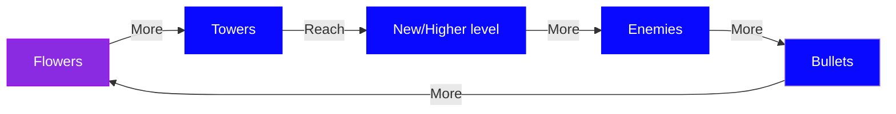
```mermaid
flowchart LR
%% Nodes
C[Flowers]
D[Towers]
F[Bullets]
E[New/Higher level]
G[Enemies]

%% Edge connections between nodes
    D --Reach--> E
    E --More--> G
    G --More--> F
    F --More--> C
    C --More--> D

%% Individual node styling. Try the visual editor toolbar for easier styling!
    %% Blue nodes
    %%style A color:#FFFFFF, fill:#0A09FF, stroke:#447CFF
    style E color:#FFFFFF, fill:#0A09FF, stroke:#0A09FF
    style G color:#FFFFFF, fill:#0A09FF, stroke:#0A09FF
    style D color:#FFFFFF, fill:#0A09FF, stroke:#0A09FF
    style F color:#FFFFFF, fill:#0A09FF, stroke:##0A09FF
  
    %% Purple nodes
    style C color:#FFFFFF, fill:#8A2BE2, stroke:#AA00FF
```

#### Progression

**Tutorial level**: For the first level we imagine a predefined layout of two towers. One is the bullet tower and the other one is a bomb tower (explained more in depth below). This is to make the introduction to the game as easy as possible. The enemies will come from the bottom left. This level serves as a example on how a full game level could look like.

> Dark red = shooting tower (card-style)

> Lime green = bomb tower (coordinates)

*Tutorial Level without HUD*

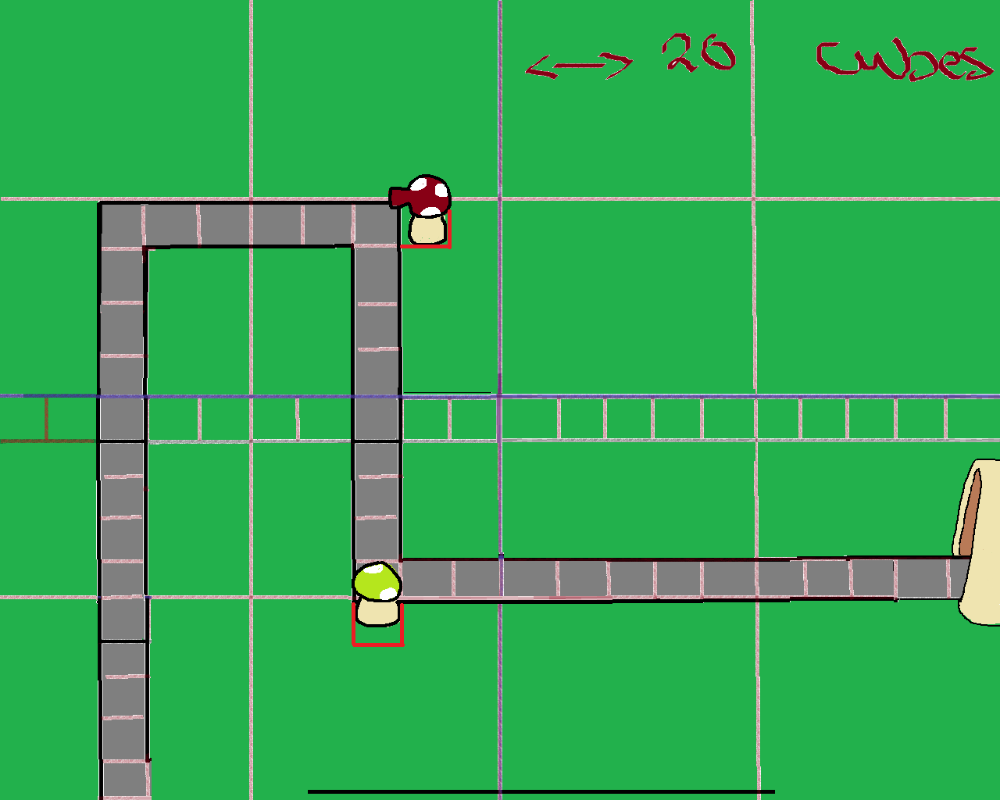

**Normal level**: In this Level the players can place the towers they unlocked / bought alongside the path to their liking / stratagem. For further levels different towers can be used to defeat the enemies and different input types for the functions which makes the progression and difficulty more nuanced. In this Level we have a more complex path and the players can place the two towers freely in along the path. The enemies will come from the left side and move along the path to the right side. This level design consist solely of the path. On the right end of the path will be the arch to the entrance of the kingdom which we did not add here. The tutorial Level can be used as a reference on how the level looks like in the end.

**Level editor**: The game can be expanded by creating a level editor. In this level editor teachers will be able to create the pathway and therefore implement the functions they'd like to see. 

*Normal Level without HUD*

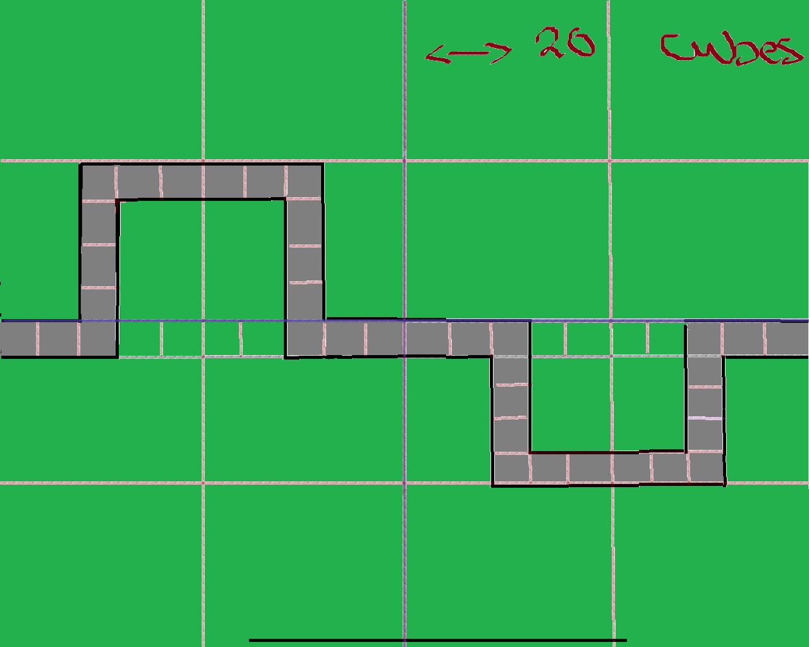

Below the increase in difficulty will be described for each subject.

##### Tower

- **Implementing tower updates** 

  - New types of bullets, i.e. herbicides/pesticides etc.

  - Differing elements, i.e. different types of herbicides/pesticides etc.
  
- **Implementing linear equations in a different fashion i.e.**

  - *Defining coordinates*
  
    - Write down on which coordinates a destructive object will be dropped by a tower
  - *Choosing the matching function (card-style)*

    - Choose a function which the tower will then use as a trajectory

  - *Altering a function* 
  
    - Using graph lines adjust a function to determine a trajectory for a destructive object

  - *Writing a new function* 

    - Using graph lines create a function to shoot a destructive object
    
- **Implementing new towers**

  - Build new/unlocked towers
  
  - Include research for new tower types 
  
##### Enemies

- **Implementing new/different enemy types**

  - Differing stats, i.e. more health, destructive power etc.

  - Differing elements , i.e. different bloom disease etc.

- **Implementing new/different boss types** 

  - Differing stats, i.e. more health, destructive power etc.
  
  - Differing elements, i.e. different bloom disease etc.

> Blue = Starting event

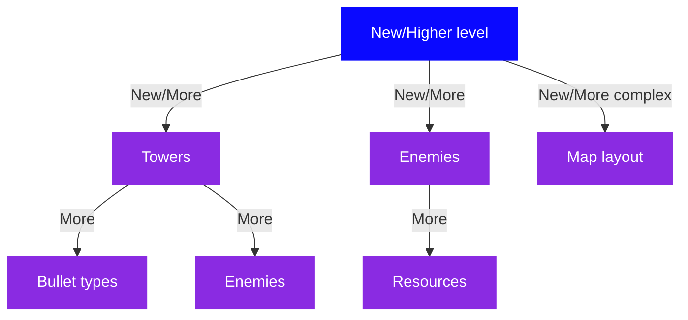
```mermaid
flowchart TD
%% Nodes
A[Towers]
B[Enemies]
D[Resources]
F[Bullet types]
E[New/Higher level]
G[Enemies]
H[Map layout]

%% Edge connections between nodes
    E -- New/More complex --> H

    E -- New/More--> A
    A -- More --> F
    A -- More --> B

    E -- New/More --> G
    G -- More --> D
  

%% Individual node styling. Try the visual editor toolbar for easier styling!
    %% Blue nodes
    %%style A color:#FFFFFF, fill:#0A09FF, stroke:#447CFF
    style E color:#FFFFFF, fill:#0A09FF, stroke:#0A09FF

  
    %% Purple nodes
    style A color:#FFFFFF, fill:#8A2BE2, stroke:#8A2BE2
    style B color:#FFFFFF, fill:#8A2BE2, stroke:#8A2BE2
    style D color:#FFFFFF, fill:#8A2BE2, stroke:#8A2BE2  
    style F color:#FFFFFF, fill:#8A2BE2, stroke:#8A2BE2
    style G color:#FFFFFF, fill:#8A2BE2, stroke:#8A2BE2
    style H color:#FFFFFF, fill:#8A2BE2, stroke:#8A2BE2

    %% Green nodes
    %% style F color:#FFFFFF, fill:#28E27D, stroke:#58FF39
```

#### Loops

Below the game loops and feedback loops are described.

##### Game Loops

- **Failed wave**: Restart the level
- **Failed level**: Restart the level

A failed wave is when all of your towers have been infected by the bloomer disease. The kingdoms health is the health from all placed towers combined. If they are all infected the kingdom is rendered defenceless and therefore defeated. 

###### Short-term

*Wave progression*

> Blue = Start

> Purple = Product

> Pink = Action

> Light Blue = Events

> Green = End

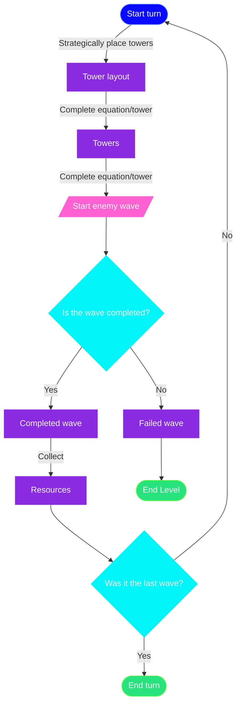
```mermaid
flowchart TD
%% Nodes
A([Start turn])
B[Tower layout]
E[Towers]
G[/Start enemy wave/]
I{Is the wave completed?}
C[Completed wave]
H[Failed wave]
J([End turn])
K{Was it the last wave?}
L[Resources]
M([End Level])

%% Edge connections between nodes
    
    A -- Strategically place towers --> B
    B -- Complete equation/tower --> E
    E -- Complete equation/tower --> G
    G --> I
    I -- Yes --> C
    I -- No --> H
    H --> M
    C -- Collect --> L  
    L --> K
    K -- No --> A
    K -- Yes --> J
  

%% Individual node styling. Try the visual editor toolbar for easier styling!
    %% Blue nodes
    style A color:#FFFFFF, fill:#0A09FF, stroke:#447CFF
  
    %% Purple nodes
    style B color:#FFFFFF, fill:#8A2BE2, stroke:#8A2BE2
    style C color:#FFFFFF, fill:#8A2BE2, stroke:#8A2BE2  
    style E color:#FFFFFF, fill:#8A2BE2, stroke:#8A2BE2  
    style H color:#FFFFFF, fill:#8A2BE2, stroke:#8A2BE2  
    style L color:#FFFFFF, fill:#8A2BE2, stroke:#8A2BE2  

    %% Pink nodes  
    style G color:#FFFFFF, fill:#FF61D2, stroke:#FF61D2

    %% Light blue nodes
    style I color:#FFFFFF, fill:#01F4F8, stroke:#01F4F8
    style K color:#FFFFFF, fill:#01F4F8, stroke:#01F4F8

    %% Green nodes
    style J color:#FFFFFF, fill:#28E27D, stroke:#58FF39
    style M color:#FFFFFF, fill:#28E27D, stroke:#58FF39
```

###### Medium-term

*Level progression*

> Blue = Start

> Purple = Product

> Pink = Action

> Light Blue = Events

> Green = End

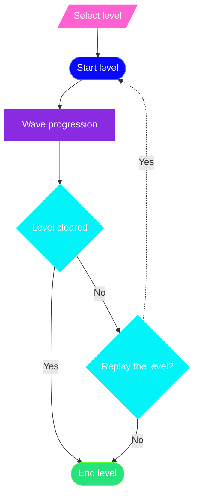
```mermaid
flowchart TD
%% Nodes
F[/Select level/]
A([Start level])
B[Wave progression]
C{Level cleared}
D{Replay the level?}
J([End level])


%% Edge connections between nodes
    F --> A
    A --> B
    D -.->|Yes| A
    D -- No --> J
    B --> C
    C -- Yes --> J
    C -- No --> D
  

%% Individual node styling. Try the visual editor toolbar for easier styling!
    %% Blue nodes
    style A color:#FFFFFF, fill:#0A09FF, stroke:#447CFF
  
    %% Purple nodes
    style B color:#FFFFFF, fill:#8A2BE2, stroke:#8A2BE2

    %% Pink nodes  
    style F color:#FFFFFF, fill:#FF61D2, stroke:#FF61D2

    %% Light blue nodes
    style C color:#FFFFFF, fill:#01F4F8, stroke:#01F4F8
    style D color:#FFFFFF, fill:#01F4F8, stroke:#01F4F8

    %% Green nodes
    style J color:#FFFFFF, fill:#28E27D, stroke:#58FF39
```

###### Long-term

*World progression*

> Blue = Start

> Purple = Product

> Pink = Action

> Light Blue = Events

> Green = End

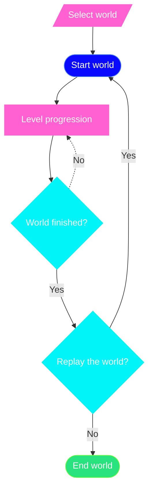
```mermaid
flowchart TD
%% Nodes
E[/Select world/]
G([Start world])
F[Level progression]
D{World finished?}
H{Replay the world?}
J([End world])


%% Edge connections between nodes
    E --> G
    G --> F
    F --> D
    D -- Yes --> H
    D -.->|No| F
    H -- Yes --> G
    H -- No --> J

%% Individual node styling. Try the visual editor toolbar for easier styling!
    %% Blue nodes
    style G color:#FFFFFF, fill:#0A09FF, stroke:#447CFF
  
    %% Purple nodes

    %% Pink nodes  
    style E color:#FFFFFF, fill:#FF61D2, stroke:#FF61D2
    style F color:#FFFFFF, fill:#FF61D2, stroke:#FF61D2

    %% Light blue nodes
    style D color:#FFFFFF, fill:#01F4F8, stroke:#01F4F8
    style H color:#FFFFFF, fill:#01F4F8, stroke:#01F4F8

    %% Green nodes
    style J color:#FFFFFF, fill:#28E27D, stroke:#58FF39
```

##### Feedback Loops

###### Positive

**Difficulty**

The loop starts-off with the enemy wave. Clearing the wave will allow the player to gain more resources. These resources can then be used to build more towers making it easier to defend in the next wave.

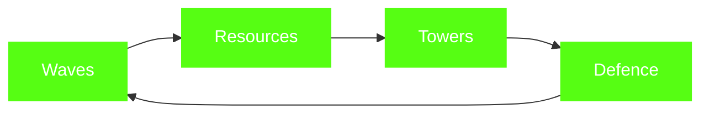
```mermaid
flowchart LR
%% Nodes
A[Waves]
B[Resources]
C[Towers]
D[Defence]

%% Edge connections between nodes
    A --> B
    B --> C
    C --> D
    D --> A

%% Individual node styling. Try the visual editor toolbar for easier styling!
    %% Green nodes
    style A color:#FFFFFF, fill:#56FE13, stroke:#56FE13
    style B color:#FFFFFF, fill:#56FE13, stroke:#56FE13
    style C color:#FFFFFF, fill:#56FE13, stroke:#56FE13    
    style D color:#FFFFFF, fill:#56FE13, stroke:#56FE13    

```

**Flowers**

During the wave enemies will be defeated, who will drop flowers. 
Flowers can be used to buy more towers, which in turn will allow more enemies to be defeated.

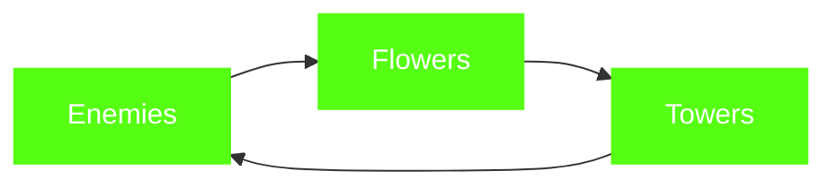
```mermaid
flowchart LR
%% Nodes
A[Enemies]
B[Flowers]
C[Towers]

%% Edge connections between nodes
    A --> B
    B --> C
    C --> A    

%% Individual node styling. Try the visual editor toolbar for easier styling!
    %% Green nodes
    style A color:#FFFFFF, fill:#56FE13, stroke:#56FE13
    style B color:#FFFFFF, fill:#56FE13, stroke:#56FE13
    style C color:#FFFFFF, fill:#56FE13, stroke:#56FE13    
```

**Towers**

Upgrading towers leads to stronger towers, which results in more enemies being defeated. 
This results in more flowers being dropped meaning more towers can be upgraded and/or build.

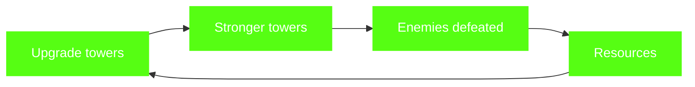
```mermaid
flowchart LR
%% Nodes
A[Upgrade towers]
B[Stronger towers]
C[Enemies defeated]
D[Resources]

%% Edge connections between nodes
    A --> B
    B --> C
    C --> D  
    D --> A    

%% Individual node styling. Try the visual editor toolbar for easier styling!
    %% Green nodes
    style A color:#FFFFFF, fill:#56FE13, stroke:#56FE13
    style B color:#FFFFFF, fill:#56FE13, stroke:#56FE13
    style C color:#FFFFFF, fill:#56FE13, stroke:#56FE13     
    style D color:#FFFFFF, fill:#56FE13, stroke:#56FE13   
```

**Combos**

A combo can be started once five enemies have died within two seconds of each other. 
This will activate a combo bonus, these can differ per level, i.e. one level could have a defence boost, another one an attack boost etc.
These temporary boosts will reinforce the overall defence.
This results in more opportunities for combos, allowing more enemies to be defeated.

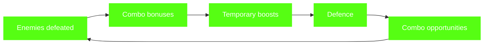
```mermaid
flowchart LR
%% Nodes
A[Enemies defeated]
B[Combo bonuses]
C[Temporary boosts]
D[Defence]
E[Combo opportunities]

%% Edge connections between nodes
    A --> B
    B --> C
    C --> D  
    D --> E   
    E --> A    

%% Individual node styling. Try the visual editor toolbar for easier styling!
    %% Green nodes
    style A color:#FFFFFF, fill:#56FE13, stroke:#56FE13
    style B color:#FFFFFF, fill:#56FE13, stroke:#56FE13
    style C color:#FFFFFF, fill:#56FE13, stroke:#56FE13     
    style D color:#FFFFFF, fill:#56FE13, stroke:#56FE13   
    style E color:#FFFFFF, fill:#56FE13, stroke:#56FE13     
```

###### Negative

**Defence**

Stronger enemies give a more difficult challenge.
By improving their stratagem and placing or repairing more towers the player can improve their defence to ward of these enemies.
This in turn will allow the player to defend their castle.

> Stronger enemies do not drop more flowers.

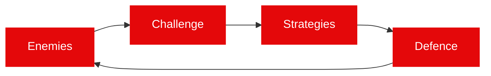
```mermaid
flowchart LR
%% Nodes
B[Enemies]
C[Challenge]
D[Strategies]
E[Defence]

%% Edge connections between nodes
    B --> C
    C --> D  
    D --> E   
    E --> B   

%% Individual node styling. Try the visual editor toolbar for easier styling!
    %% Red nodes
    style B color:#FFFFFF, fill:#E4080A, stroke:#E4080A
    style C color:#FFFFFF, fill:#E4080A, stroke:#E4080A     
    style D color:#FFFFFF, fill:#E4080A, stroke:#E4080A   
    style E color:#FFFFFF, fill:#E4080A, stroke:#E4080A     
```

**Upgrades**

Upgrading and/or building towers will decrease the player's resources.
Stronger and/or more towers will be able to defend against more/stronger enemy waves, which require a better defence.

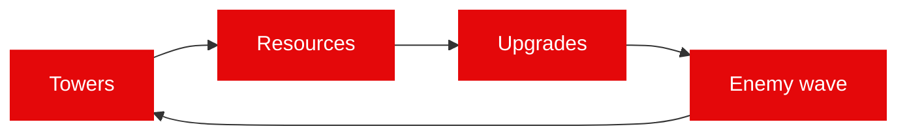
```mermaid
flowchart LR
%% Nodes
A[Towers]
B[Resources]
C[Upgrades]
D[Enemy wave]

%% Edge connections between nodes
    A --> B
    B --> C
    C --> D  
    D --> A

%% Individual node styling. Try the visual editor toolbar for easier styling!
    %% Red nodes
    style A color:#FFFFFF, fill:#E4080A, stroke:#E4080A
    style B color:#FFFFFF, fill:#E4080A, stroke:#E4080A
    style C color:#FFFFFF, fill:#E4080A, stroke:#E4080A     
    style D color:#FFFFFF, fill:#E4080A, stroke:#E4080A   
```

**Purification**

Infected towers require resources to purify. This will impact the amount of resources the player has to upgrade towers.
In turn this will affect the defence of the player, who will need to use their resources wisely.
Purifying their towers might lead to being able to upgrade less towers.
However upgrading their towers will limit the amount of purifications the player can perform on their infected towers.

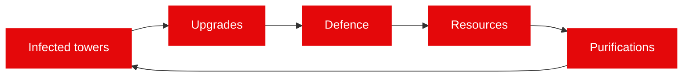
```mermaid
flowchart LR
%% Nodes
A[Infected towers]
B[Upgrades]
C[Defence]
D[Resources]
E[Upgrades]
E[Purifications]

%% Edge connections between nodes
    A --> B
    B --> C
    C --> D  
    D --> E
    E --> A

%% Individual node styling. Try the visual editor toolbar for easier styling!
    %% Red nodes
    style A color:#FFFFFF, fill:#E4080A, stroke:#E4080A
    style B color:#FFFFFF, fill:#E4080A, stroke:#E4080A
    style C color:#FFFFFF, fill:#E4080A, stroke:#E4080A     
    style D color:#FFFFFF, fill:#E4080A, stroke:#E4080A     
    style E color:#FFFFFF, fill:#E4080A, stroke:#E4080A   
```

### Implementation

#### Target Platform

The target platform for this game will be desktop-web (and mobile-web).

#### Camera

The camera is static. The view is top down and is tilted backwards just a bit.

Examples

|                          |  |
| -------------------------------------------------------------------------------------------------------------------------------- | --------------------------------------------------------------------------------------------------------------------------------------------------- |
| Bloons TD 6                                                                                                                      | Overcooked!                                                                                                                                         |
|  |                                 |
| Pokémon Ruby                                                                                                                     | Little Witch in the woods                                                                                                                           |

#### Controls

The player uses the mouse to click and/or select.
To write the function, the player uses the keyboard.

-  Drag and drop the towers to place them.

-  Drag the trajectory of the Function, 

    - See: *HUD layout -> Adjust Function idea (Intermediate), Idea 2.*

#### User Interface

##### Main menu

- Title of Game
- [Button] Play
- [Button] Settings 
- [Button] Quit

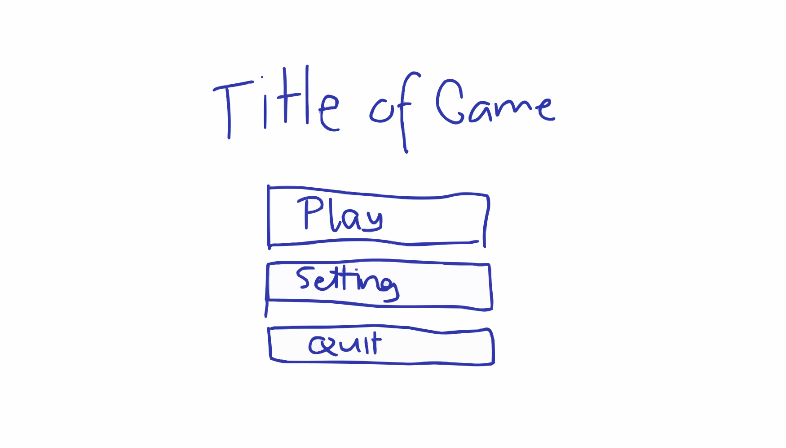

##### Settings 

- Settings
- [Button] Volume
- [Button] Textsize 
- [Button] Back to Start

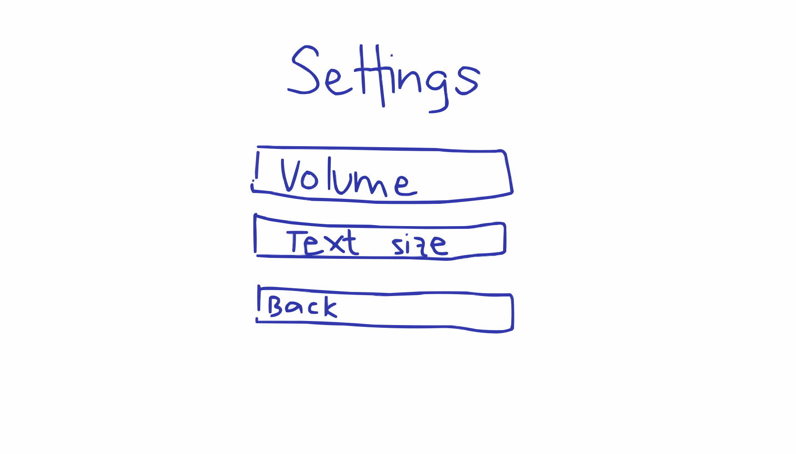

##### Level Selection

The player can choose from different levels which differ from each other in the way the player interacts with the function. Level one is the card level, where you choose a card matching the given function, level two is adjusting the function and level 3 can be writing the function. These levels can be adjusted and leave a lot of room to add more levels with different input systems like tables etc.

- Level Selection
- [Button] Level 1
-  *[Button] Level 2*
-  *[Button] Level 3*
- [Button] Back to Start

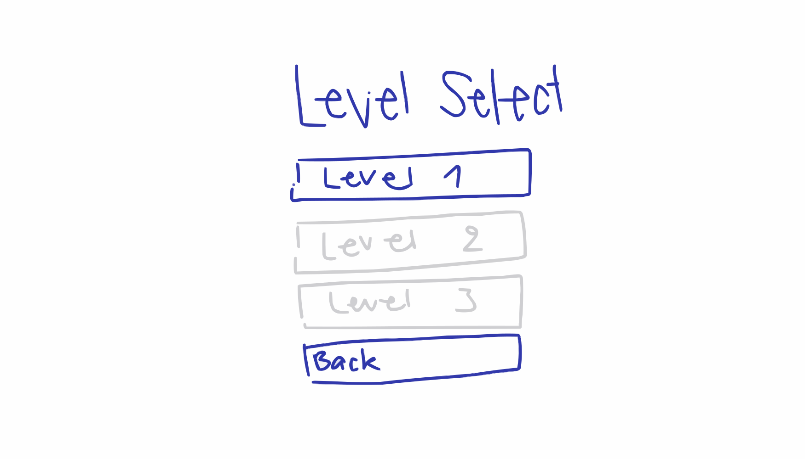

##### Pause Menu

- Pause
- [Button] Resume
- [Button] Restart
- [Button] Back to Start

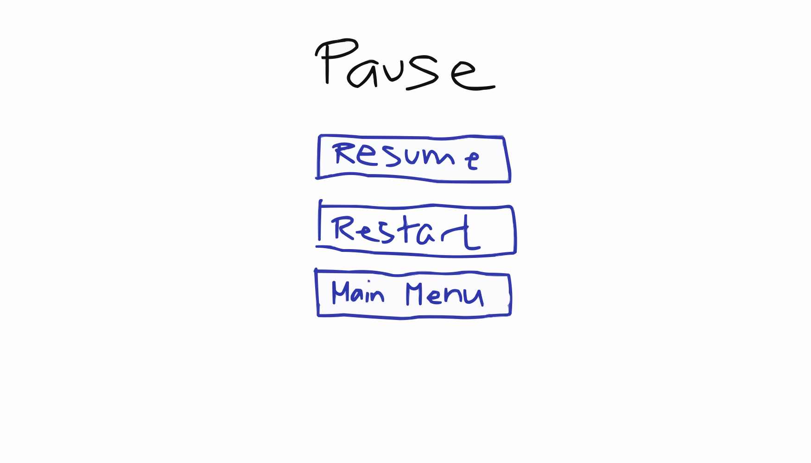

##### HUD

- Health
- Flowers (Collectable)
- [Button] Start / Pause
- Towers
    - Selection of available towers and the cost
- Function (The function is always visible when the tower is active. The muzzle moves under the function, the function is hovering)
- Global grid of coordinate system.

- The screen is tiled with these measurements: 
    - Width = 20 tiles
    - Height = however many tiles fit

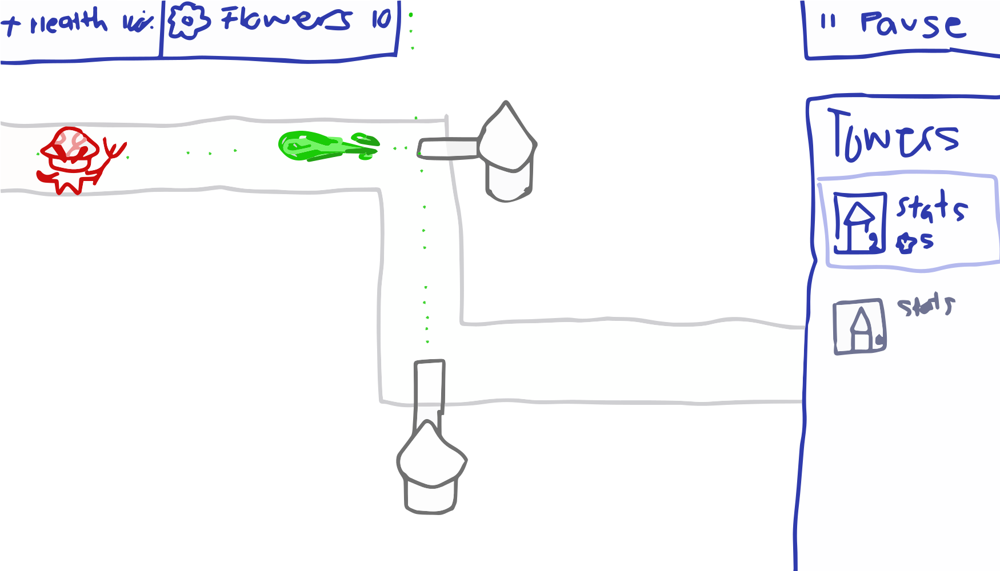

###### Cards Idea (Easy)

Function is missing one variable and player can choose from a selection of cards. 

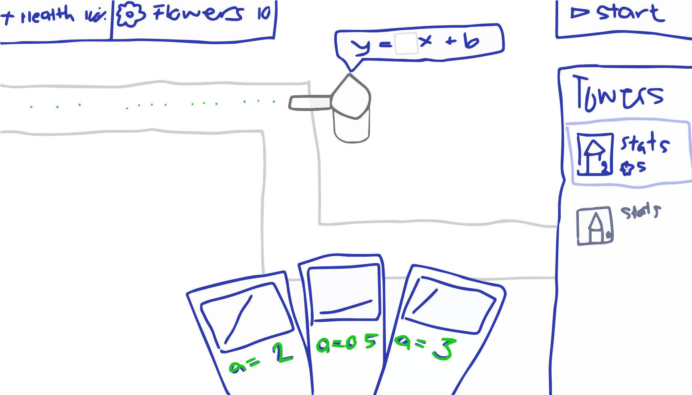

###### Coordinates Idea (Easy / Medium)

Tower drops a bomb / missile on defined coordinates. 

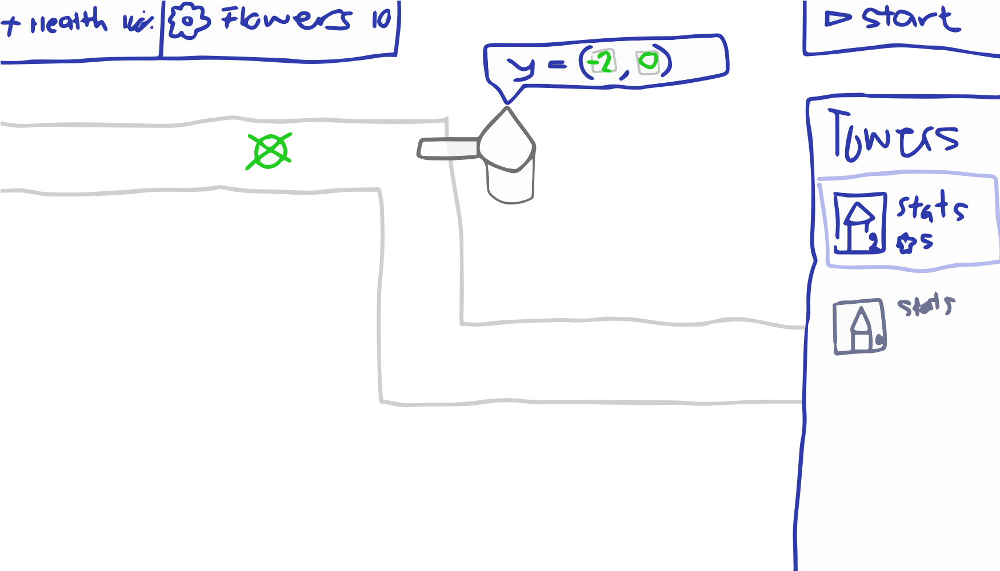

###### Adjust Function Idea (Intermediate)

Function can be altered / adjusted with an interaction. 

###### Idea 1

Function can be altered with arrows that in- or decrease the value of a variable. 

###### Idea 2

Function can be altered by dragging the handler on the displayed function. 

###### Write Function Idea (Hard)

Function needs to be written by the player. 

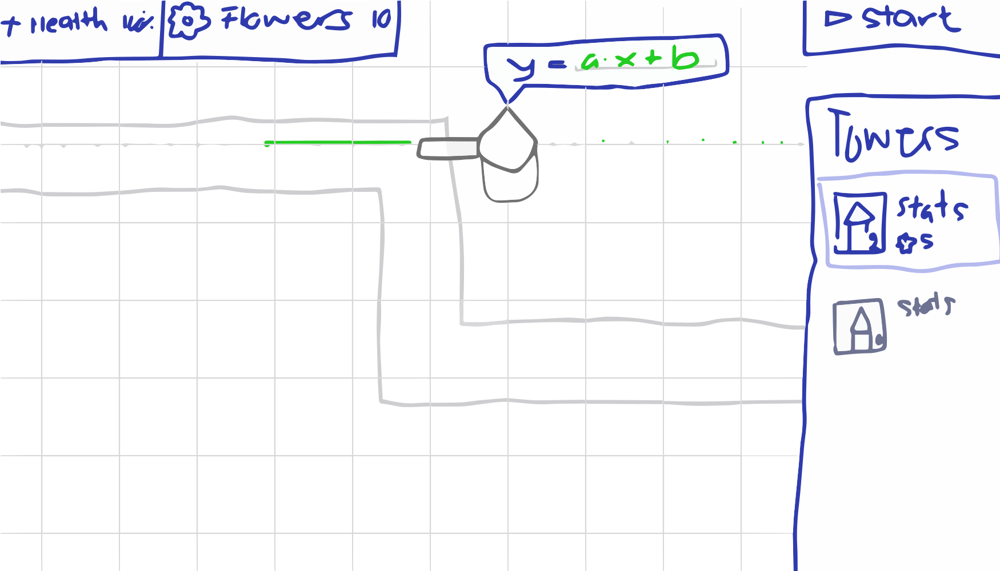

#### Game Objects

The screen 

- `Flowers`: Automatically collected by the player when a enemy dies. They can be used to buy towers.
    - The player starts the game with already 100 flowers in his possession.
- `Towers`: Strategically placed by the player before each wave starts, to defeat enemies. The towers snap automatically to the path on the screen where the enemies will walk along. Just like the grid system in the Sims, a tower will be unable to be placed and appears red unless it is close to the path. When the tower gets placed near the path it will turn green and be automatically placed upon the the right position in the grid. When a tower is placed by the player on the grid, it has to be placed along the path and the `b-value` will automatically be added to the function according to where the tower was placed. This results in the player only needing to change the `a-value`. If a tower is infected it is essentially destroyed and rendered useless. After the wave is won, the player can choose to upgrade his towers, place new ones or purify the infected towers and putting them back in action with flowers. If they have enough flowers, they may also upgrade the newly purified tower. If the player choses not to purify a tower, it will occupy the tile it stands on and cannot be removed. Only purified towers can be removed.

    - Bomb (coordination) tower: *(Input are coordinates)*
        - Price: 75
        - Damage: 30
        - Fire rate: 4 sec.
        - Health: 420
        - Range Tower: 10 tiles straight to the left/up/right/bottom.
        - Range of Bomb: 2 Tiles x 2 Tiles

    - Drops (/ bullets, Card-style) tower: *(Input is function)*
        - Price: 50
        - Damage: 10
        - Fire rate: 0.5 sec
        - Health: 360 damage points to be destroyed
        - Tower Range: 8 tiles straight to the left/up/right/bottom.
        - Bullet Range: First enemy it hits

    - Final castle: (defenceless)
        - Price: none
        - Damage: none
        - Fire rate: none
        - Health: 100 damage points to be destroyed
        - Tower Range: none
        - Bullet Range: none

- `Enemies`: Attack the towers and infect them with the bloomer disease. When defeated by the player / the towers and bullets they drop flowers.
    - The very first wave will have 5 enemies type 1, 2 enemies of type 2.
    - Enemies will crowd below towers to attack, the limit of how many enemies a tower can handle will be calculated by: ⌈Number of enemies ÷ Number of towers⌉. It is always rounded up

    - Due to the size of the game just 2 enemy types have to implemented.
        - type 1:
            - Damage: 20 
            - Health: 50 damage points to be killed
            - Attack speed: 1 sec.
            - Drop: 10 Flowers

        - type 2:
            - Damage: 60 
            - Health: 30 damage points to be killed
            - Attack speed: 3 sec.
            - Drop: 30 Flower

- `Bullets`: Used to defeat special/certain type enemies. One type of 

```mermaid
flowchart LR
%% Nodes
A[Player]
C[Flowers]
D[Towers]
E[Bullets]
G[Enemies]

%% Edge connections between nodes
    A -- Picks up --> C
    C -- Used to build --> D
    C -- Used to buy --> E
    E -- Used as ammo --> D
    D -- Used to defeat --> G
    G -- Drops --> C

%% Individual node styling. Try the visual editor toolbar for easier styling!
    %% Blue nodes
    style A color:#FFFFFF, fill:#0A09FF, stroke:#447CFF
  
    %% Purple nodes
    style C color:#FFFFFF, fill:#8A2BE2, stroke:#AA00FF
    style D color:#FFFFFF, fill:#8A2BE2, stroke:#8A2BE2
    style E color:#FFFFFF, fill:#8A2BE2, stroke:#8A2BE2
    style G color:#FFFFFF, fill:#8A2BE2, stroke:#8A2BE2
```

#### Polish 
- **Particles**

    - When damaged, whenever an object hits another object
    
    - On pickup, whenever a flower gets picked up

    - On placement, whenever a tower is placed on the map
    
- **Animations for**

    - enemies (walking, attacking, dying)

    - bullets (being shot, exploding)

    - tower (placement, moving of the muzzle, being attacked, being infected)

- **Ambient lighting**

    - Use coloured lighting to emphasize emotions, i.e. blue for sad, red for angry, yellow for happiness etc.

- **Personification**

    - For the player to feel immersed and personified in the game the character of the royal strategist is added at the bottom right corner under the tower selection. He reacts to the input from the player for example looks at a map, points to the place where the tower is placed, looks at the battle field while the wave is incoming etc.

| 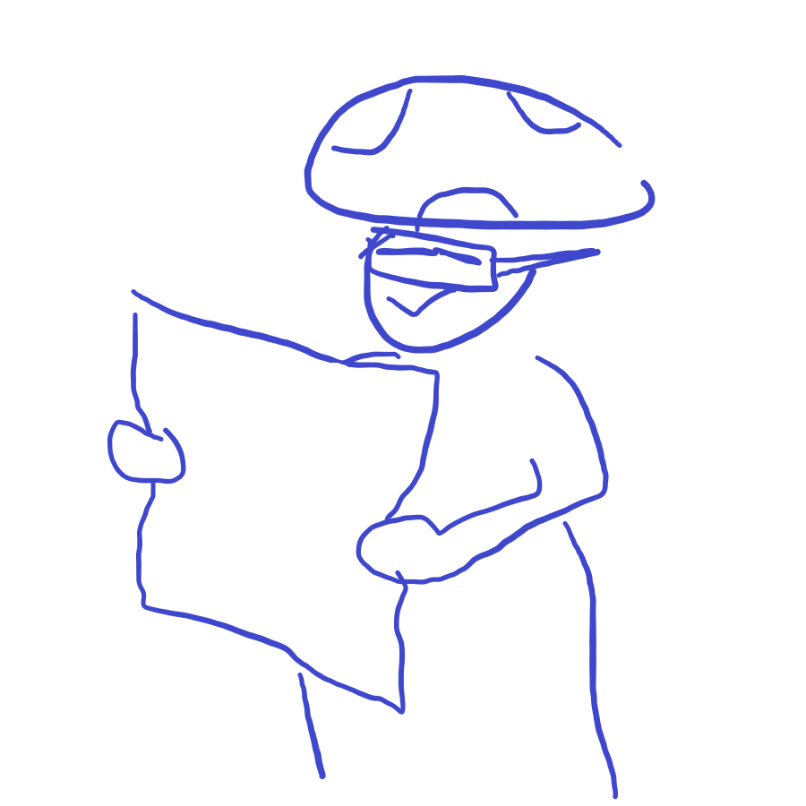 | 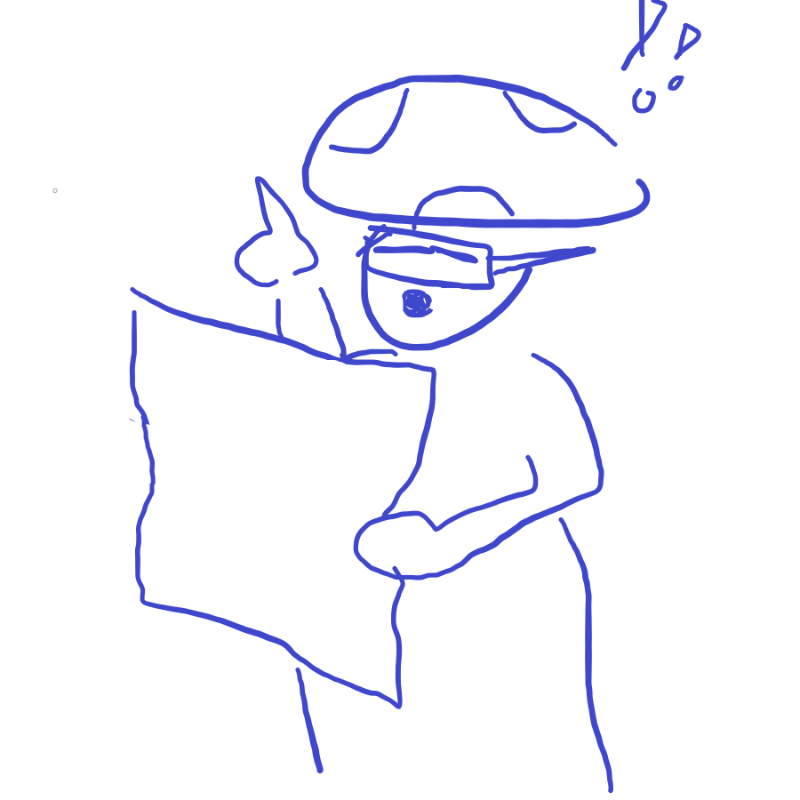 |
| -------------------------------------------------- | --------------------------------------------------------- |

#### Story 

In recent times a plague has been spreading across the land of mushrooms.
The awful disease of BLOOM has spread amongst you kin.
Friends, family and even royalty has been struck by this disaster.
During the fight against this disease it has become apparent,
that whoever has been struck will change into... into.... A BLOOMER!!!
After much deliberation the king and queen have decided the time to take action is here. 
Your time has come to take up the mantle of royal strategist and defend the kingdom!

#### Sound 

**Menu and Story**: The sound should be cute and light, a simple but memorable soundtrack that fits the light-hearted theme of the game.

**Level**: For the level we have two soundtracks that are similar.

- *Battle phase*, in the battle phase we imagine a soundtrack that is intense but still light-hearted and cute.

- *Strategic phase*, during the placing of the towers the music is a bit more calm-hearted, but still similar to the battle phase.

**Game objects sound effects**:

- *Enemy*, skreetching for dying, attack sound, hurt sound.

- *Flower*, a light pling sound for when a flower is picked up

- *Tower*, boom for when a cannon is shot, a thump sound when the tower is placed, and a breaking sound when the tower breaks.

- *Bullet*, depending on the type of bullet different sounds could be used for example a swish sound for a tornado, or a deep humming for bees etc.

#### Art 

As can be seen below the artstyle is cartoon style, clean lines, cute characters and the view from top down.
The colours are bright, vibrant and happy.

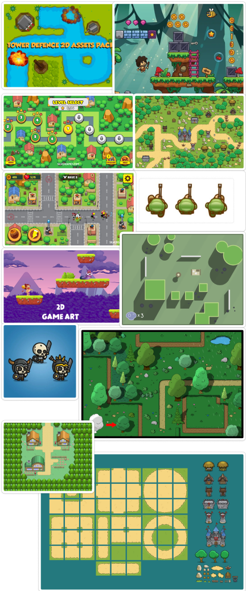

Inpsiration for the mushroom kingdom style can be found below.

## Concept 4: Kaiju Killer

### Concept

You are in control of a giant robot to slam down the kaiju invasion threatening to plunge the world into chaos! The robot - ROBB-E -had to be built quickly, so its capabilities are limited; using limited amounts of punches per turn you have to work your way through waves and waves of enemies by hitting them on their weak points. You can do so by adjusting the arc of the punches, taking them out before they get too close - and your poor robot gets hurt.

#### Mission

1. Aim and wallop!
2. Whack and punch to victory!

#### Design Pillars

**Destruction:** I want to destroy the monstrous opponents to win.

**Excitement:** I feel thrilled at seeing my robot succeed in big, flashy ways.

**Calculation:** I can consider my moves carefully to make sure I make no mistake.

#### Aesthetics

- Sensation
- Fantasy
- Challenge
- Expression

### Design

#### Mechanics

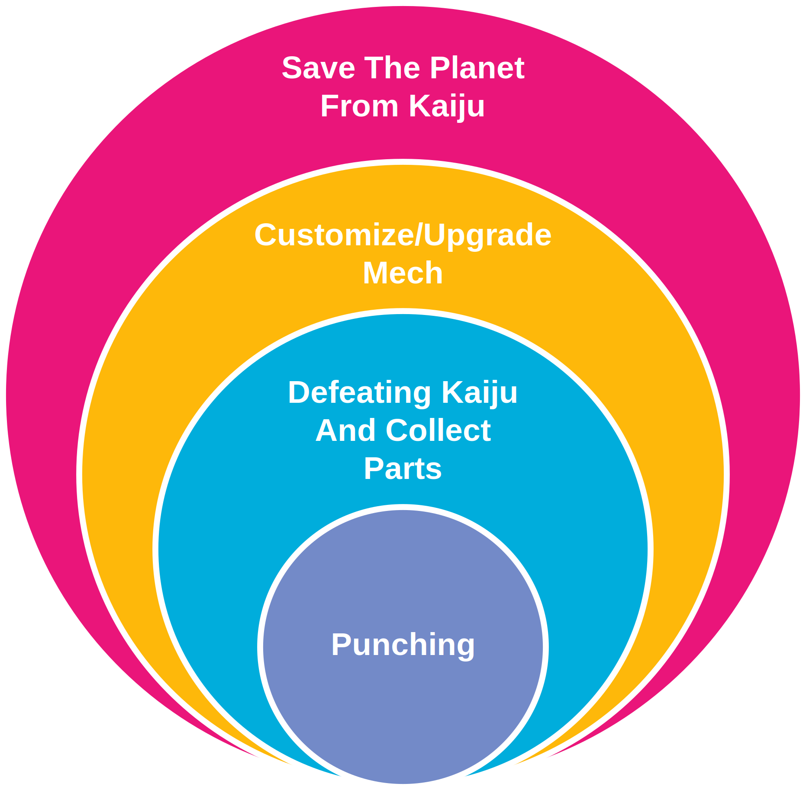

##### Core Mechanics

###### Punching

The player can punch. The trajectory of the punch is decided by the input of the user through linear functions.  How these functions are presented varies on the kind of wave the player has to face; most waves are simple drawings of lines, while there are more challenging representations down the line. 

##### Secondary Mechanics

###### Defeating Kaiju

By punching kaiju, the player can defeat oncoming kaiju. Kaiju have weak spots that need to be hit so the beast takes damage; every turn that passes where not all weak spots are taken out, the kaiju moves closer. 

###### Collect Parts

Kaiju sometimes drop parts usable for the player's mech. By punching at the location where the part dropped, the player can pick it up and then use it to customize the mech. After some time, the parts disappear when not interacted with. The player can customize their mech after each wave passes.

#### Dynamics

In the game, the player fights waves of kaiju with their large mech, ROBB-E. ROBB-E can fire its fists in an arc as a punch, hitting the kaiju on their weak spots to defeat them. The fists only have enough fuel to complete two arcs to start, which can be improved later on. 

Each wave is structured like turn-based combat. One wave exists out of kaiju approaching for 3 turns; in those three turns, the player has to align their punches to hit the weak spots vizualised on the kaiju. The turns are not timed; the player has as much time as they need to align their fist.  Taking fewer turns per wave grands a higher overal score and increases the potential for part drops.

For common kaiju, the player calculate the arc by adjusting a linear function. The graph of this function is shown as a preview for the player to visualize their line. Once they have confirmed this line, this is set in stone - they cannot return to realign their arc. Fists only connect with weak points, or sail past and hit the edge of the screen. When all the arcs are set, the fist launches and hits the kaiju.

In order to actually get the player to engage with the mathematics behind these mechanics, they are interacting with this very directly. The functions are not adjusted by gradually increasing the values by pressing a button; they have to enter these values themselves. Only when a value has been entered does the line preview change.

The interaction with the function changes based on difficulty, such as removing the line preview altogether and instead presenting them with various value options of which only 1 is correct. 

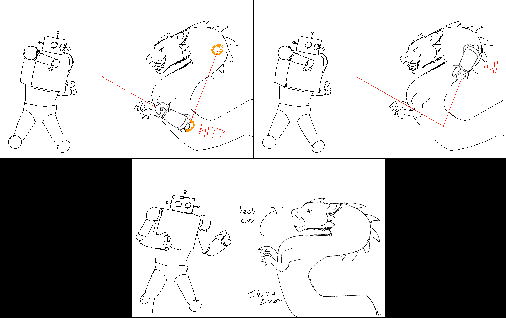

If the targets are missed and the kaiju lives, the first turn ends and the kaiju moves closer one step. Every wave has 4 states; 3 approach states and one hit state. Every approach state moves the kaiju closer until it makes contact with the mech, upon which it loses a portion of health and the kaiju 'escapes', and is removed from the screen.

Every so often, a huge kaiju will appear as the sole opponent in a wave. This 'boss kaiju' requires different methods of calibrating punches such as filling in a table with values, or calculating specific intercepts for a double-whack. These kaiju require more effort to take down, needing multiple punches on different weak points to defeat it. When hit successfully, the kaiju will not approach; on errors, it will move up one state. 
 
The purpose behind these special kaiju is to introduce new math mechanics and give the player some room to practice these and try them out for the final challenge of that section.
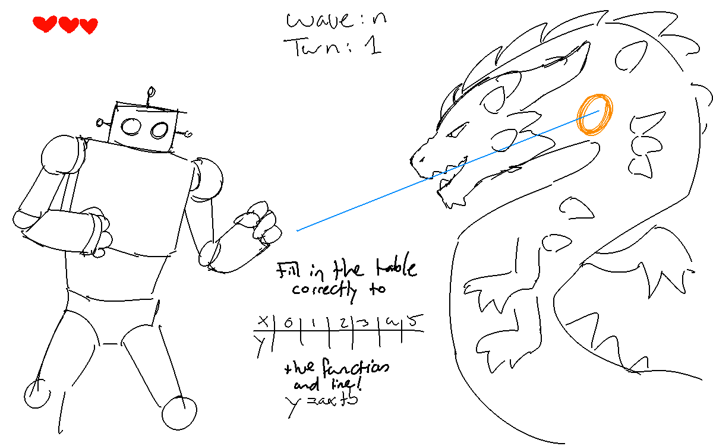

The section boss, the massive kaiju, appears at the end of all waves of that section. This creature requires the player to bundle all their skills in various aiming challenges that combine the basic kaiju and the huge kaiju posed to take it down. Afterwards, the player completes the section and moves to the next one.

At the very end of the run, te player encounters the world-shattering Kaiju. This final boss poses the final challenge, combining all skills taught per section into one massive final fight. Mechanically, all boss kaiju work the same in terms of state changes, but the length of these fights are increased.

Each section unlocks a new body part for modification; the right arm, the head, and the body. Each part has a different attribute that modifies the playstyle of the player. During the waves, some basic kaiju drop a mod part that the player can then pick up with one of their punches; this is then added to their inventory for that run. The section boss always awards an upgrade - the player gets a choice out of three modifications, and they can pick one they enjoy.

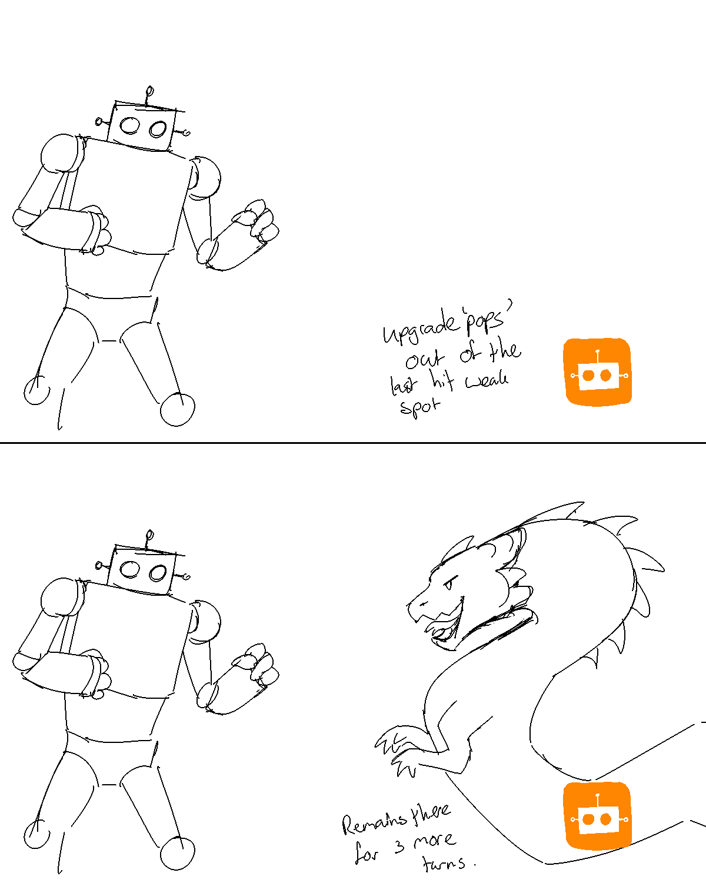

Modifications are not necessarily upgrades; they are playstyle changers. They change one aspect of the mech for the better, but come with a drawback that forces the player to change how they approach their playstyle. For example, one modification could be that the player has fewer punches per round, but significantly buffed health. 
Not interacting with modifications does not pose a lose condition, nor does interacting with certain modifications grant a guaranteed win condition. They are gameplay modifiers, making certain areas easier and others more difficult to play into a player's preferred playstyle.

At the very end of that run, the player can select a modification out of a choice of 3 that they have picked up to add to their main inventory. In later runs, they can then apply that modification right off the get-go to change their playstyle per run.

A key element about Kaiju Killer is that the order, difficulty, and presentation of these kaiju and their corrosponding mechanisms to defeat them can be interchanged by a controller - in this case, the teacher. Mech parts can be individually enabled and disabled to allow for a more playful environment, or one more focused on practicing the math only. They can adapt the game's course, such as the length of the waves or the amount of huge kaiju, or swap around the mechanisms to shift focus on a specific skillset, or let it play out as described above for a more overarching game flow. 

#### Math Didactics

##### Learning Goals

1. Playing with the fundamental characteristics of a linear function first individually and then in combination.
2. Applying the fundamental characteristics to transform one representation (verbal, graph, formula, table) into another in a playful way.
3. Solving quests, tasks and problems involving multiple representations of linear function (verbal, graph, formula, table).
4. Applying properties of linear functions to solve equations in a playful way.
5. Applying the appropriate function representation to solve a question or problem in the game.

##### Implementation

The game's core mechanics are structured around functions; all turns require the player to solve some sort of question regarding linear functions in order to make the mech attack. Basic kaiju teach the player linear functions in the most basic form, while every boss introduces a new method of solving the equation and thus defeating the enemy in a new way. The player is routinely tested on their new skills, while reinforcing knowledge of previously gained skills. 

The way these functions are interacted with gradually increases in difficulty during a run or depending on a difficulty setting made by the player or by the teacher. While many aspects of the game are determined in advance, there is a desire to allow the teachers to adjust how the game is interacted with to allow better fit within the curriculum or the teacher's style of teaching these particular subjects and skillsets. 

In addition, Kaiju Killer does allow for expansion into different concepts such as quadratic equations, though the game will always be focused around graphs and visualizing due to the nature of the mechanics.

#### Economy

##### Resources

Kaiju Killer has the following resources:

- Health
- Parts

###### Health

The player has health that will deplete when Kaiju come into direct contact. The standard rate of health depletion on basic kaiju is one heart per hit.

###### Parts

The player collects parts that they can use to customize/upgrade their mech. Each part will have a rarity and effect, that bolsters one attribute but makes another weaker to adjust the playstyle. The parts are applied to 4 different areas of the mech, which are unlocked by completing each section:

- Head

    - Mostly focused on utility, this might give the player more options for deciding the punch trajectory.

- Left Arm

    - Focused on offense, this is used to take out the kaiju. 

- Right Arm

    - Focused on offense, this is used to take out the kaiju. 

- Body

    - Focused on defense, the stance of the mech is important for survivability.

##### Currencies

Kaiju Killer does not have currencies.

##### Consumables

Kaiju Killer does not have consumables.

####  Progression

The game is based on a roguelike structure: play a run, gain modifiers, finish a run, play a new run with new modifiers. The starting difficulty does increase slightly per run achieved, but can be adjusted manually if this increase is too much for the player.

The game is divided into 4 sections:

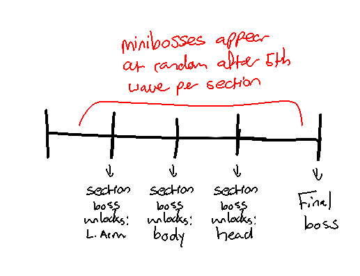

Each section is composed of several waves of kaiju, interrupted by huge kaiju, or minibosses. These minibosses require a special method of punching, pushing the player to approach the linear function from a new angle such as aiming by filling out a table rather than adjusting the function directly. These bosses require more effort to defeat, but do allow the player time to uncover these new mechanics and practice them accordingly.

At the end of every section stands a section boss that once again forces the player to grapple with these new mechanics while also testing their abilities on the mechanics practices on the basic kaiju. Once this section boss is defeated, a new part of the mech unlocks for modifications and the player progresses to the next section.

The following section plays out similarly to the one before, but with a new miniboss - and a new math mechanic. The section boss is tougher than the one before, requiring all previous mechanics to be applied to defeat it.

This loop continues until the end of the fourth section, where the player has to defeat the world-shattering kaiju. This kaiju requires all previously applied mechanics to be used multiple times with different functions in order to be defeated. Once the player has managed to take down this kaiju, they are taken to the main menu where they are given their rewards, and they can start another run with different modifiers. If enabled, the runs gradually increase in difficulty depending on how many succesful ones the player has to their name.

#####  Difficulty Levels

Difficulty levels can be set manually and gradually increases as the player completes more successful runs. Some proposals for difficulty increase on regular kaiju are:

**Easy**

The player has to fill in the values of the function by hand. The preview trajectory is shown.

**Medium**

The preview trajectory is not shown. The player gets to choose out of 3 options of filled in equations. One of them will always be correct.

**Hard**

The preview trajectory is not shown. The player has to fill in the values of the function by hand.

#### Loops

##### Game Loop

```mermaid
flowchart LR
%% Nodes
A(Fight kaiju)
B(Collect parts)
C(Defeat final boss/lose run)
D(Choose part to take with you)
E(Start run with collected part)
A --> B --> C --> D --> E --> A

```

##### Feedback Loops

```mermaid
flowchart LR
%% Nodes
A(Player familiarizes themselves with input method)
B(New input method introduced)

A --> B --> A
```

The player needs to familirize themselves with the current input method. Huge kaiju will introduce new input methods that will eventually come back in boss battles. This is to make sure the game doesn't become too monotonous.

```mermaid
flowchart LR
%% Nodes
A(Defeating kaiju)
B(Collecting new parts)
C(Customizing mech)

A --> B --> C --> A
```

Defeating kaiju will sometimes reward the player with new parts, which the player can use to customize their mech. Customizing their mech (if done correctly) will make it easier to defeat kaiju.

```mermaid
flowchart LR
%% Nodes
A(Defeating kaiju)
B(Picking up parts)

A --> B --> A
```

When a part drops, the player has to make a decision whether or not to use one of the punch's arcs to pick up the part. This will make it harder to defeat the current kaiju in that moment. But collecting parts will make fighting kaiju easier in the future.

```mermaid
flowchart LR
%% Nodes
A(Missing weakpoints)
B(Kaiju moves closer)
C(Player experiences pressure to perform)

A --> B --> C --> A
```

If the player misses one or more weakpoints, the kaiju will move closer to the player the following turn. The threat of taking damage from the kaiju will pressure the player. Some players might not be able to perform well under pressure, making the player more likely to miss weakpoints.

### Implementation

#### Target Platform

The target platform for this game will be mobile-web and desktop-web.

#### Camera

The camera will be a side view of the mech and oncoming kaiju. Then a weak spot is hit, the camera can shake to show the impact, though not too intensely to not be too repetitive.

#### Controls

The mouse can be used to navigate the menus and in game UI. The keyboard should be active to facilitate input from the player when deciding functions. On mobile devices, touch input and on-screen keyboards will facilitate this.

#### User Interface

##### Opening and Main Menu

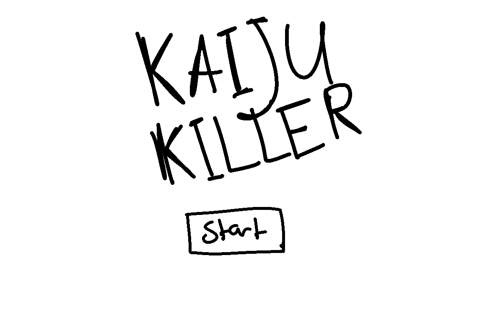

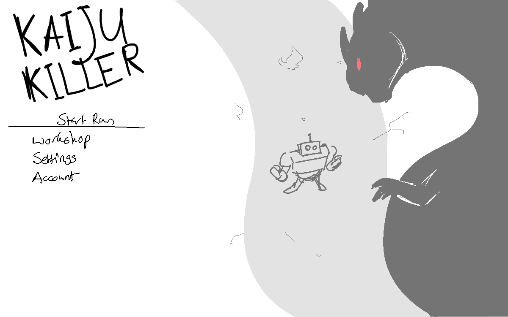

Menu is styled after Tekken 7 and 8 - games with customization before 'running' the game without a larger area for customization and run specifications (like Hades) - art on the side to be visually pleasing, while keeping the rest of the menu simple. Highlighted menu buttons are pushed outward and underlined so signify they're selected.

#####  Workshop

From the main menu, the player can both access run-modifying parts and visual parts to change around. On the modifiers, the player selects the component they want to change, and then the associated parts appear for them to select. Selected parts are highlighted with an outline and by being larger than the rest.

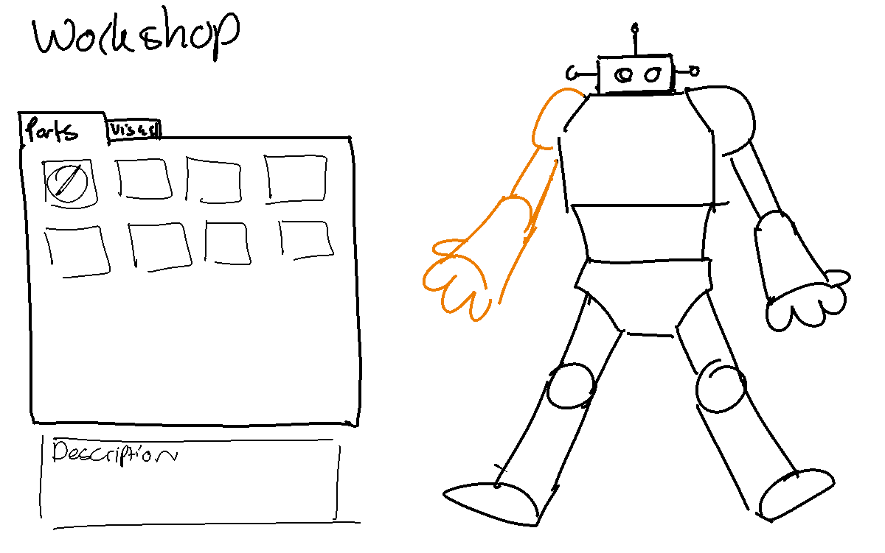

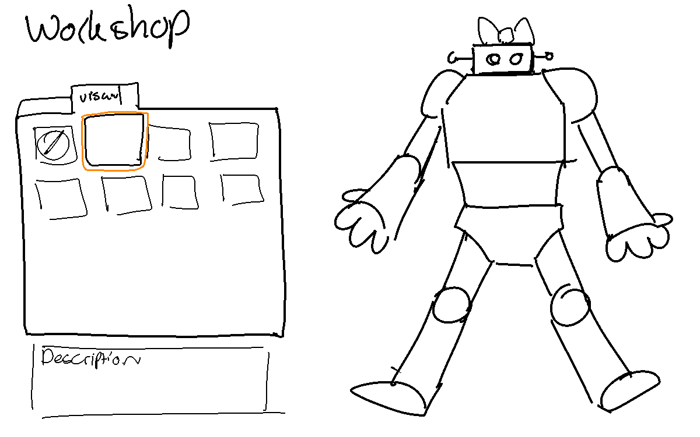

Within a run, the aesthetic modifiers are not enabled for modification.

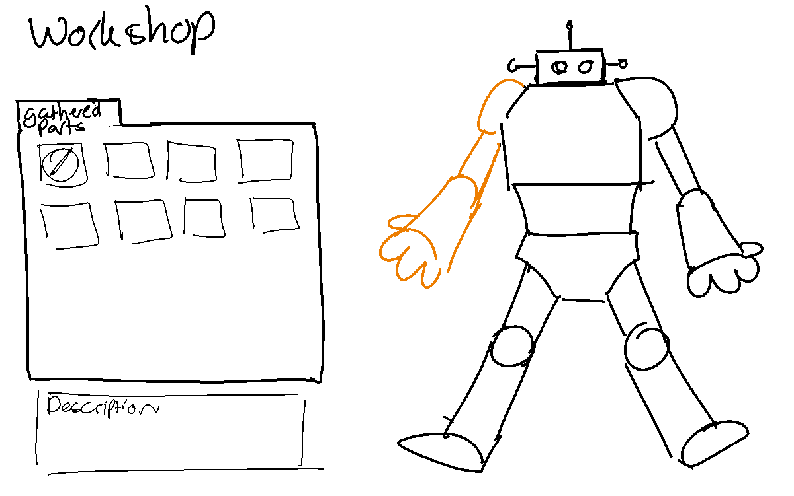

##### HUD and Pause

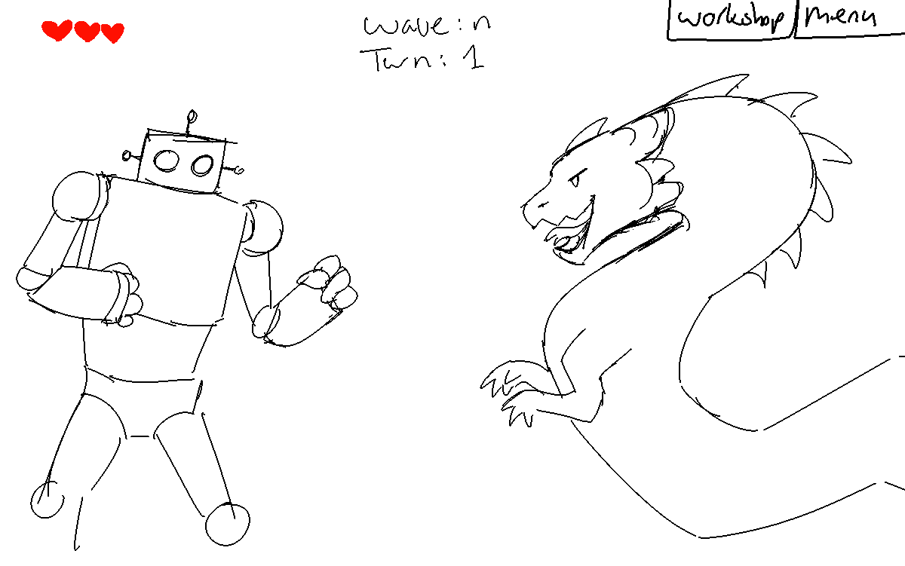

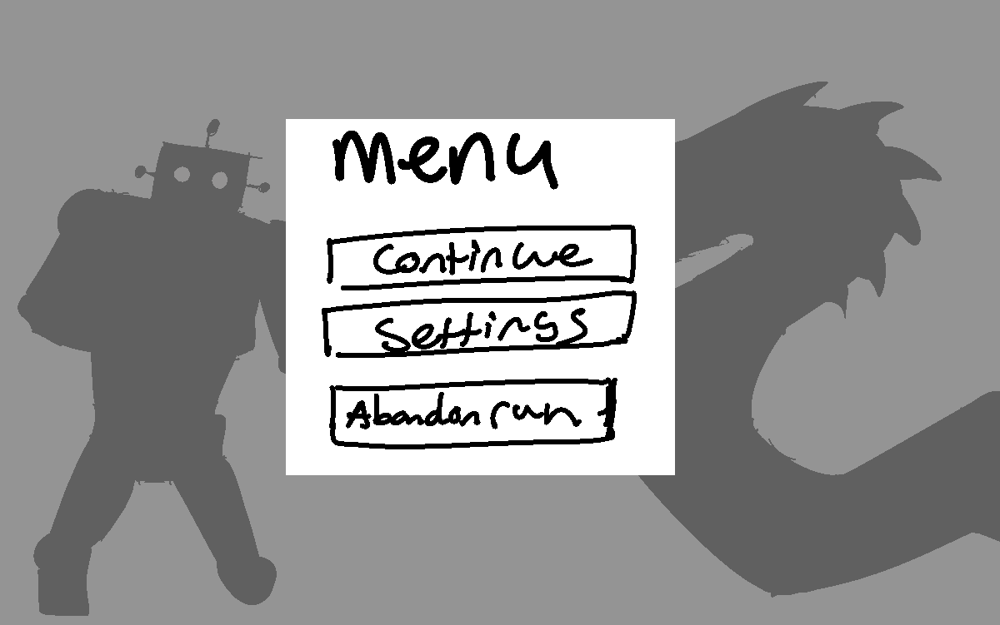

#### Game Objects

##### Mech: ROBB-E

ROBB-E (pronounced like Robbie) is the mech that the player controls and as such the 'player character'. The player uses this robot to punch the incoming kaiju and must maintain the mech's health in order to not fail the run.  The mech can be customized using parts that change their playstyle, but also aesthetically, allowing the player some self-expression in visuals.

ROBB-E has four areas that can be improved upon with parts: its arms, its head, and its body.

##### Kaiju

The Kaiju are the monsters invading the earth that the player has to stop. The kaiju come in four types, each requiring a different method to defeat them:

- The Basic Kaiju: Kaiju that populate most of the waves in the game. To adjust the trajectory of the punch for these kaiju, the player has to adjust a function until it has the correct graph to hit the kaiju on its weak spots.

-  The Huge Kaiju: section minibosses that appear once or twice per section before that section's boss. This boss introduces a new math mechanic that the player then actively practices on this boss, as it requires multiple hits on different weak spots that appear after the previous ones are hit to be taken down.

-  The Section Boss Kaiju: these larger bosses are meant as a final challenge for the player for that specific section, forcing them to use the mechanics they have learnt so far from previous section minibosses as well as the current section's miniboss to further sharpen their skills. Similarly to the Huge Kaiju, it takes multiple hits on different weak spots to take down.

-  World-Shattering Kaiju: the final boss. This beast combines all mechanics in varying order and on multiple occasions to be taken down, and completes the current run when defeated.

Kaiju come in a several different shapes and angles, allowing for the weak spots to be placed with more variety across their bodies.

#####  Parts

Parts are used to adjust areas of the mech in order to bolster some aspects of its power, but diminish others. This alters the player's playstyle, playing into their strengths as individuals or what they prefer to use in a game like this.

#### Story

You are in control of a giant robot to slam down the kaiju invasion threatening to plunge the world into chaos! The robot - ROBB-E -had to be built quickly, so its capabilities are limited; using limited amounts of punches per turn you have to work your way through waves and waves of enemies by hitting them on their weak points. You can do so by adjusting the arc of the punches, taking them out before they get too close - and your poor robot gets hurt. Unfortunately, the waves of kaiju never seem to fully go away, constantly overtaken by a new alpha, so your work is never truly done...

#### Sound

Describe the sound design of the game, what feelings should the player have when hearing the sounds?

#### Art

- Art style should focus on simple shapes with soft edges, e.g rounded corners on cubes.

- Lineless vector for the visuals allow for quick changes on resolution without compromising on quality.

- Keeping the general style somewhat goofy, especially in the designs of the kaiju and mech, tone down on the somewhat serious narrative and keeps the game more entertaining.

- Animations should be puppet-style animations over frame-by-frame. 

- Colors on the mech should start with pastel and allow for more saturated colors over time, as long as they are light and bright. Darker tones only in combination with lighter shades.

- Colors on the kaiju must be dark, saturated, and contrasting with each other.

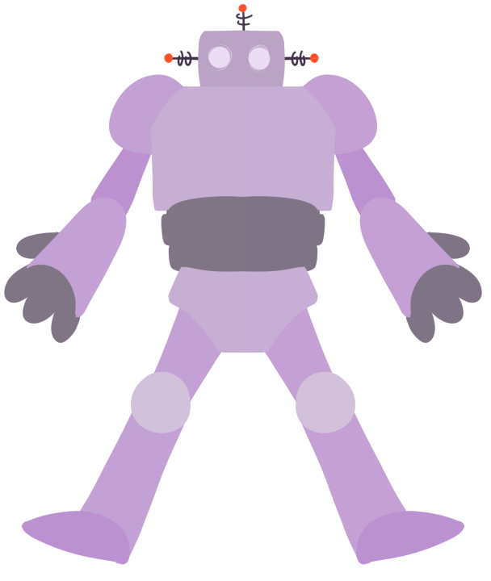

## Concept 5: Architect of Goo

### Concept

#### Mission

Lost and alone, find your way and come home ❤️

#### Design Pillars

`Creativity`: I want to be challenged to think of a new solution / course of action. 

`Variety`: I want to have a diversity of options etc. 

`Discovery`: I want to satiate my curiosity and discover new possibilities (by trial and error) 

#### Aesthetics

Challenge
  > We want our player to be challenged by the gameplay and the math aspect. The player should use his grey brain cells to solve the equations and by extension the levels

Discovery
  > We want our player to use his curiosity and creativity to discover different possibilities to solve the level and to advance through the game by trial and error

### Design

#### Mechanics

##### Core Mechanics

Building bridges
 
> The player builds bridges between platforms with linear equations, after defining the function the player can move along on his newly designed bridge. Depending on what type of gem/ability has been selected a different kind of movement will be used (i.e. slime your way up, walking, swinging etc.).

##### Secondary Mechanics

Pick up gems

> While crossing the bridge the player can pick up gems which give him special abilities. In designated areas he can equip the most suitable gem before he defines a function which allows the player to create new types of bridges for example he can use a gem to burn through a obstacle, to walk on water or to climb up a vertical function.

#### Dynamics

Challenge
  > We want our player to be challenged by the gameplay and the math aspect. The player should use his grey brain cells to solve the equations and by extension the levels

  - Building bridges
    - New/Multiple types of bridges
  > In the game multiple types of gems can be found which give the player a unique ability. During the game the player is challenged to select the right type of ability by looking at and analysing the layout and materials of the platforms. 

  - Solving mathematical problems (equations)
  > Each gem has a different way of introducing lineair equations. Switching between altering the *A* value of the formula, calculating coordinates and intercepts, the player has to give the right answer in order to successfully build the appropriate bridge. By introducing new mathematical problems and increasing their difficulty the player gets challenged.

  - Solving the puzzles
  > Each stage of the level presents itself with different kind of problems / puzzles to be solved. They all vary in how the player needs to solve them, some of them can be solved right away with the help of a specific gem, others need some preparation like the usage of a specific gem to alter the layout of the level in order to then apply the matching gem and in extension the matching function.

Discovery
  > We want our player to use his curiosity and creativity to discover different possibilities to solve the level and to advance through the game by trial and error

  - Exploration of new areas
  > We want our players to discover new areas inside of the level. The player can interact with caged friends in the level which them give them keys which he in turn can use to open magic doors. Those magic doors lead to new areas where the player encounters harder challenges he can solve to collect coins. These are not needed to complete the level but support the design pillar of discovery.

  - New/Multiple types of gems
  > The player uses gems to solve different math equations. He can collect them throughout the level and apply them. On his journey he encounters varying types of gems which all support different ways to interact with the math-aspect/functions in the game.
  
  - Different kinds of puzzles
  > Due to the fact the player has multiple different ways to solve a math question with different gems, the puzzles also vary in challenge and appliance. The player can encounter obstacles, different bridges he needs to build or repair, and places where he cannot build any bridges. He needs to be creative to solve various kinds of puzzles, which support the design pillar discovery.

#### Math Didactics

##### Learning Goals

1. Playing with the fundamental characteristics of a linear function ~~first~~ individually ~~and then in combination.~~
2. Applying the fundamental characteristics to transform one representation (graph, formula, table) into another in a playful way.
3. Solving quests, tasks and problems involving multiple representations of linear function (graph, formula).
4. Applying properties of linear functions to solve equations in a playful way.
5. Applying the appropriate function representation to solve a question or problem in the game.

##### Implementation

1. Using the different gem types: 
    - Acid Gem: uses an adjustable function like in the first Concept (Angry Equations)
2. Different types of representations
  - Using the different gem types: 
    - Vlimes Gem: uses tables to connects two broken points of a bridge back together
    - Acid Gem: uses an adjustable function like in the first Concept (Angry Equations)
    - Sticky Gem: uses coordinates to calibrate where the player has to shoot
    - Goo Cannon Gem: uses intercepts to calculate where the function has to end up
3. Building bridges
  - To progress through the Level the player has to build bridges using linear functions. He can use different gems which all have different abilities and different ways of creating, writing or adjusting a function.
4. Solving puzzles in a playful way: 
  - the player progresses through the level using linear functions to build bridges. He is a little slime trying to get home <3. Along the way the player encounters different challenges, can free friends, explore additional content, collect coins etc.
5. Applying the appropriate function: 
  - Once the player gets to a new challenge, it is up to him to decide what gem he is going to use to solve the puzzle. He has to think for himself and come up with a solution to the problem at hand.

#### Economy

##### Resources

- `Sliamond in the rough` : Unlocks all the gem abilities. 

```mermaid
flowchart LR
%% Nodes

G[Progress level]
C[Sliamond in the rough]
E[Choose ability]

%% Edge connections between nodes
    E --> G
    G --> C
    C --> E

%% Individual node styling. Try the visual editor toolbar for easier styling!
    %% Blue nodes

    %%style A color:#FFFFFF, fill:#0A09FF, stroke:#447CFF
    style E color:#FFFFFF, fill:#0A09FF, stroke:#0A09FF
    style G color:#FFFFFF, fill:#0A09FF, stroke:#0A09FF

    %% Purple nodes
    style C color:#FFFFFF, fill:#8A2BE2, stroke:#AA00FF

```

##### Collectables

- `Coins`: Collect coins to complete the level to 100%.
- `Friends`: Friends can be freed and their signature style can be copied and used to customize the main character

##### Consumables

- `Gems` : To use different abilities. 
In the final game, the Gems are consumables. They can be collected throughout the level and can only be used once.

```mermaid
flowchart LR
%% Nodes

G[Progress level]
C[New gem]
E[New ability]

%% Edge connections between nodes
    E --> G
    G --> C
    C --> E

%% Individual node styling. Try the visual editor toolbar for easier styling!
    %% Blue nodes

    %%style A color:#FFFFFF, fill:#0A09FF, stroke:#447CFF
    style E color:#FFFFFF, fill:#0A09FF, stroke:#0A09FF
    style G color:#FFFFFF, fill:#0A09FF, stroke:#0A09FF

    %% Purple nodes
    style C color:#FFFFFF, fill:#8A2BE2, stroke:#AA00FF

```

- `Keys` : Keys can be used to open magic doors throughout the level.

```mermaid
flowchart LR
%% Nodes

G[Progress level]
C[Key]
D[Magic door]
E[New area]

%% Edge connections between nodes
    E --> G
    G --> C
    C --> D
    D --> E

%% Individual node styling. Try the visual editor toolbar for easier styling!
    %% Blue nodes

    %%style A color:#FFFFFF, fill:#0A09FF, stroke:#447CFF
    style E color:#FFFFFF, fill:#0A09FF, stroke:#0A09FF
    style G color:#FFFFFF, fill:#0A09FF, stroke:#0A09FF
    style D color:#FFFFFF, fill:#0A09FF, stroke:#0A09FF

    %% Purple nodes
    style C color:#FFFFFF, fill:#8A2BE2, stroke:#AA00FF
```

#### Progression

**Prototype level**: For the prototype we imagine one level with three stages in total, in between the stages two checkpoints can be found along the way. Throughout the level the player can pick up gems which get added to his inventory, each gem has infinite use and will not disappear from their inventory. When the player enters a calculation zone he has to choose the according gem. Followed by this the player has to write and/or solve the accompanying equation. Along the road the player has to select the right gem/function to build the appropriate bridges to reach the next stage or complete the level.

> *Prototype level*

> *Insert sketches of the tutorial level (per stage)*

**Normal level**: During the game the player has to pick-up the different gems. Whilst trying to progress in the game the player has to decide which ability is best suited to progress in the game. Once a gem has been used to change the slime's ability, and appearance it will disappear from the inventory and re-spawn at it's original location. Each level consists of at least two stages with one checkpoint. In higher levels, and more difficult worlds the levels can progress both horizontally and vertically allowing for more variety in level design.
- *Sliamond in the rough*: Once a player gets stuck in a stage, i.e. dies three times in one stage, the *Sliamond in the rough* will be able to be used by the player.

**Level editor**: The game can be expanded by creating a level editor. In this level editor teachers will be able to create the pathway and therefore implement the functions they'd like to see. 

**Procedural level generator**: By adding the right limitations a procedural level generator can be added to this game allowing for easy game content expansion.

##### Gems

- **Acid**: By adjusting the *A* value in the equation the player can aim the acid blob.

  - *Difficulty increase*: The player has to fill out the complete equation instead of altering it. On top of that besides just lineair equations, quadratic functions can be used as well.
    
- **Goo**: By calculating the intercept of two lineair equations the player can aim where the goo will be shoot at. The goo will automatically be connected from the place the player is standing to the calculated coordinate.

  - *Difficulty increase*: The player has to calculate multiple intercepts before a multiple segment bridge can be build.

- **Sticky**: The player can read the coordinate from the visible grid.

  - *Difficulty increase*: Calculate the coordinate by using the given function.
     
- **Vlimes**: By using the given table the player has to calculate the coordinates of the desired edges.

  - *Difficulty increase*: Instead of just lineair equations, quadratic functions can be used as well.
    
  - **Sliamond in the rough**: This gem inherits all of the gems mentioned above: Acid, Goo, Sticky and Vlimes.

    - *Difficulty increase*: The *Sliamond in the rough* gem inherits all difficulty increases as well.

#### Loops

##### Game Loop

- **Failed stage**: Restart the stage

Each level will have been divided into multiple stages, each stage has a save-/checkpoint at its start. Once the player walks into a trap and/or abyss they will have failed the stage and restart it.

- **Failed level**: Restart the level

- **Completed level**: Reach the end of the level

 Find and save your friends from the dungeon. This will unlock extra game content such as rewards, skins, and abilities.

###### Short-term

*Stage progression*

> Blue = Start

> Purple = Product

> Pink = Action

> Light Blue = Events

> Green = End

```mermaid
flowchart TD
%% Nodes
A([Start stage])
B[Gem]
E[Ability]
G[/Build bridge/]
N{Was the math completed successfully?}
O[No bridge build]
F[/Progress in stage/]
I{Is the stage completed?}
C[Completed stage]
H[Failed stage]
J([End level])
K{Was it the last stage?}
L[Collectibles]
P([Restart stage])
Q{Does the player want to restart?}

%% Edge connections between nodes
    
    A -- Pick up --> B
    B -- Choose --> E
    E --> N
    N -- Yes --> G
    N -- No --> O
    O -.-> N
    G --> F
    F -- Collect --> L
    L --> I
    I -- Yes --> C
    I -- No --> H
    H --> Q
    Q -- No --> J
    Q -- Yes --> P
    C --> K
    K -- No --> A
    K -- Yes --> J
  

%% Individual node styling. Try the visual editor toolbar for easier styling!
    %% Blue nodes
    style A color:#FFFFFF, fill:#0A09FF, stroke:#447CFF
  
    %% Purple nodes
    style B color:#FFFFFF, fill:#8A2BE2, stroke:#8A2BE2
    style C color:#FFFFFF, fill:#8A2BE2, stroke:#8A2BE2  
    style E color:#FFFFFF, fill:#8A2BE2, stroke:#8A2BE2  
    style H color:#FFFFFF, fill:#8A2BE2, stroke:#8A2BE2  
    style L color:#FFFFFF, fill:#8A2BE2, stroke:#8A2BE2  
    style O color:#FFFFFF, fill:#8A2BE2, stroke:#8A2BE2  

    %% Pink nodes  
    style G color:#FFFFFF, fill:#FF61D2, stroke:#FF61D2
    style F color:#FFFFFF, fill:#FF61D2, stroke:#FF61D2

    %% Light blue nodes
    style I color:#FFFFFF, fill:#01F4F8, stroke:#01F4F8
    style K color:#FFFFFF, fill:#01F4F8, stroke:#01F4F8
    style N color:#FFFFFF, fill:#01F4F8, stroke:#01F4F8
    style Q color:#FFFFFF, fill:#01F4F8, stroke:#01F4F8

    %% Green nodes
    style J color:#FFFFFF, fill:#28E27D, stroke:#58FF39
    style P color:#FFFFFF, fill:#28E27D, stroke:#58FF39
```

###### Medium-term

*Level progression*

> Blue = Start

> Purple = Product

> Pink = Action

> Light Blue = Events

> Green = End

```mermaid
flowchart TD
%% Nodes
F[/Select level/]
A([Start level])
B[Stage progression]
C{Level cleared}
D{Replay the level?}
J([End level])


%% Edge connections between nodes
    F --> A
    A --> B
    D -.->|Yes| A
    D -- No --> J
    B --> C
    C -- Yes --> J
    C -- No --> D
  

%% Individual node styling. Try the visual editor toolbar for easier styling!
    %% Blue nodes
    style A color:#FFFFFF, fill:#0A09FF, stroke:#447CFF
  
    %% Purple nodes
    style B color:#FFFFFF, fill:#8A2BE2, stroke:#8A2BE2

    %% Pink nodes  
    style F color:#FFFFFF, fill:#FF61D2, stroke:#FF61D2

    %% Light blue nodes
    style C color:#FFFFFF, fill:#01F4F8, stroke:#01F4F8
    style D color:#FFFFFF, fill:#01F4F8, stroke:#01F4F8

    %% Green nodes
    style J color:#FFFFFF, fill:#28E27D, stroke:#58FF39
```

###### Long-term

*World progression*

> Blue = Start

> Purple = Product

> Pink = Action

> Light Blue = Events

> Green = End

```mermaid
flowchart TD
%% Nodes
E[/Select world/]
G([Start world])
F[Level progression]
D{World finished?}
H{Replay the world?}
J([End world])


%% Edge connections between nodes
    E --> G
    G --> F
    F --> D
    D -- Yes --> H
    D -.->|No| F
    H -- Yes --> G
    H -- No --> J

%% Individual node styling. Try the visual editor toolbar for easier styling!
    %% Blue nodes
    style G color:#FFFFFF, fill:#0A09FF, stroke:#447CFF
  
    %% Purple nodes    
    style F color:#FFFFFF, fill:#8A2BE2, stroke:#8A2BE2

    %% Pink nodes  
    style E color:#FFFFFF, fill:#FF61D2, stroke:#FF61D2

    %% Light blue nodes
    style D color:#FFFFFF, fill:#01F4F8, stroke:#01F4F8
    style H color:#FFFFFF, fill:#01F4F8, stroke:#01F4F8

    %% Green nodes
    style J color:#FFFFFF, fill:#28E27D, stroke:#58FF39
```

##### Feedback Loops

###### Positive

**_Sliamond in the rough_**

The loop starts-off with collecting the *Sliamond in the rough*. This gem will allow the player to use all abilities. By using the *Sliamond in the rough* the player no longer has to collect other gems for that level. The *Sliamond in the rough* allows the player to select a different ability in each calculation zone to build the right bridge. This in turn allows the player to progress in the level easier.

```mermaid
flowchart LR
%% Nodes
B[Choose ability]
C[Build bridge]

%% Edge connections between nodes
    B --> C
    C --> B

%% Individual node styling. Try the visual editor toolbar for easier styling!
    %% Green nodes
    style B color:#FFFFFF, fill:#56FE13, stroke:#56FE13
    style C color:#FFFFFF, fill:#56FE13, stroke:#56FE13    
```

**Checkpoints**

The loop starts off with reaching a checkpoint. This checkpoint saves the player's progress at a certain point in the level. By using the checkpoint, the player no longer has to start from the beginning of the level if they die. The checkpoint allows the player to resume their progress from that point, making it easier to continue and eventually complete the level.

```mermaid
flowchart LR
%% Nodes
A[Reach checkpoint]
B[Save progress]
C[Resume from checkpoint]

%% Edge connections between nodes
    A --> B
    B --> C
    C --> A

%% Individual node styling
    style A color:#FFFFFF, fill:#56FE13, stroke:#56FE13
    style B color:#FFFFFF, fill:#56FE13, stroke:#56FE13
    style C color:#FFFFFF, fill:#56FE13, stroke:#56FE13 
```

###### Negative

**Gems**

 The loop starts off with collecting gems. These gems allow the player to transform into a slime with a unique ability. Each gem is a one-time-use item, so the player must collect them to build bridges and progress through the level. Each gem is associated with a different type of math equation, increasing the game's difficulty and balancing the use of the gem abilities.

```mermaid
flowchart LR
%% Nodes
A[Collect gem]
B[Use gem and gain ability]
C[Lose previous gem and ability]
D[Solve math equation]
E[Progress in level]

%% Edge connections between nodes
    A --> B
    B --> C
    C --> D
    D --> E
    E --> A

%% Individual node styling. Try the visual editor toolbar for easier styling!
    %% Green nodes
    style A color:#FFFFFF, fill:#E4080A, stroke:#E4080A
    style B color:#FFFFFF, fill:#E4080A, stroke:#E4080A
    style C color:#FFFFFF, fill:#E4080A, stroke:#E4080A  
    style D color:#FFFFFF, fill:#E4080A, stroke:#E4080A  
    style E color:#FFFFFF, fill:#E4080A, stroke:#E4080A  
```

**Platform layout**

 The platform layout dictates what type of bridge should be build. In the game different kinds of platforms, pillars and obstacles can be found, each one made of a specific material. The layout can change from stage to stage, or level to level. By paying attention to the platform material and/or layout the decision on what type of bridge has to be build is made a lot easier. This balances the game as the layout of stages, and levels gets progressively more difficult.

```mermaid
flowchart LR
%% Nodes
A[Analyse platform layout]
B[Identify material]
C[Select appropriate ability]
D[Build bridge]
E[Progress through level]

%% Edge connections between nodes
    A --> B
    B --> C
    C --> D
    D --> E
    E --> A

%% Individual node styling
    style A color:#FFFFFF, fill:#E4080A, stroke:#E4080A
    style B color:#FFFFFF, fill:#E4080A, stroke:#E4080A
    style C color:#FFFFFF, fill:#E4080A, stroke:#E4080A
    style D color:#FFFFFF, fill:#E4080A, stroke:#E4080A
    style E color:#FFFFFF, fill:#E4080A, stroke:#E4080A
```

### Implementation

#### Target Platform

The target platform for this game will be desktop-web (and mobile-web).

#### Camera

The camera moves sideways and the player starts at the utmost left of the screen. After leaving the left side and reaching the middle of the screen the camera wil follow the player around for the rest of the level. (Mario like)

 Once a level is big, transition points have to be added. A transition point is for example the black screen you get in games when opening a door (type of loading screen).

#### Controls

To control the character movement the player uses the keyboard.
- a/left-arrow: move left
- d/right-arrow: move right
- w/up-arrow: climb up vertical bridges
- s/down-arrow: climb down vertical bridges
- space: small jump / jump off
- keyboard: define function

#### User Interface

Describe the different interfaces like the main menu, settings, HUD, etc.

##### Main menu

- Title of Game
- [Button] Play
- [Button] Settings 
- [Button] Quit

##### Settings 

- Settings
- [Button] Audio
- [Button] Textsize 
- [Button] Back

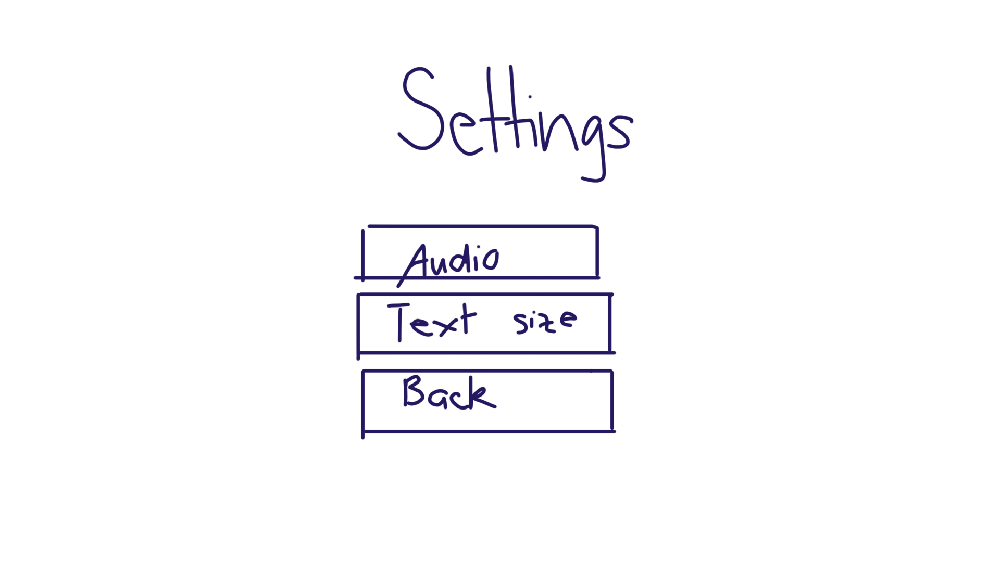

##### World Selection

The player can choose from different worlds (Mario like) and in each world there are multiple Levels.

- World Selection
- [Button] World 1
-  *[Button] World 2*
-  *[Button] World 3*
-  *[Button] World 4*
- [Button] Back

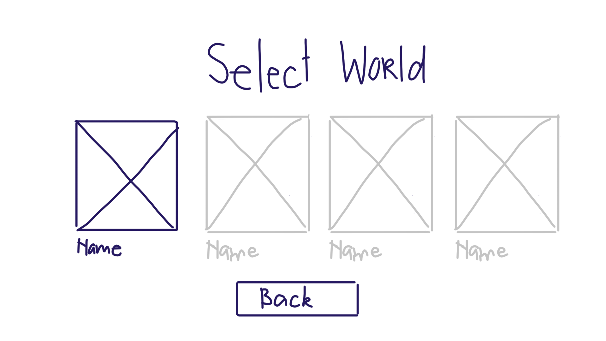

##### Level Selection

The player can choose from different levels. Each level is split up in 3 parts, each part needs to be completed for the player to get to the next checkpoint and in extension to complete the level. 

- World Selection
- [Button] Level 1
-  *[Button] Level 2*
-  *[Button] Level 3*
-  *[Button] Level 4*
- [Button] Back

##### Pause Menu

- Pause
- [Button] Resume
- [Button] Restart from checkpoint
- [Button] Restart level
- [Button] Main menu

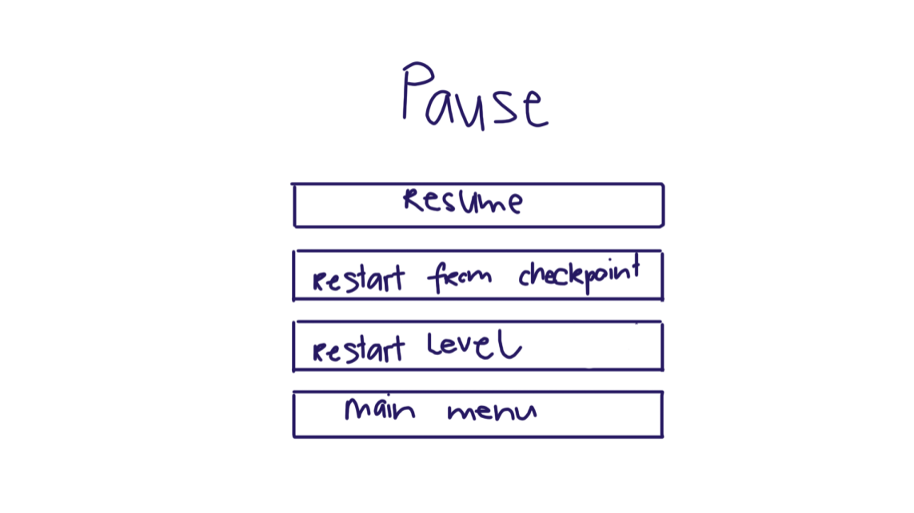

##### HUD

The HUD consists of a sidebar which is divided into two sections:
  - Functions: the player can edit here tables, write functions, calculate intercepts etc. This part of the HUD will be grayed-out if the player is not in the calculation zone.
  - Inventory: this is where all the gems gets stored.

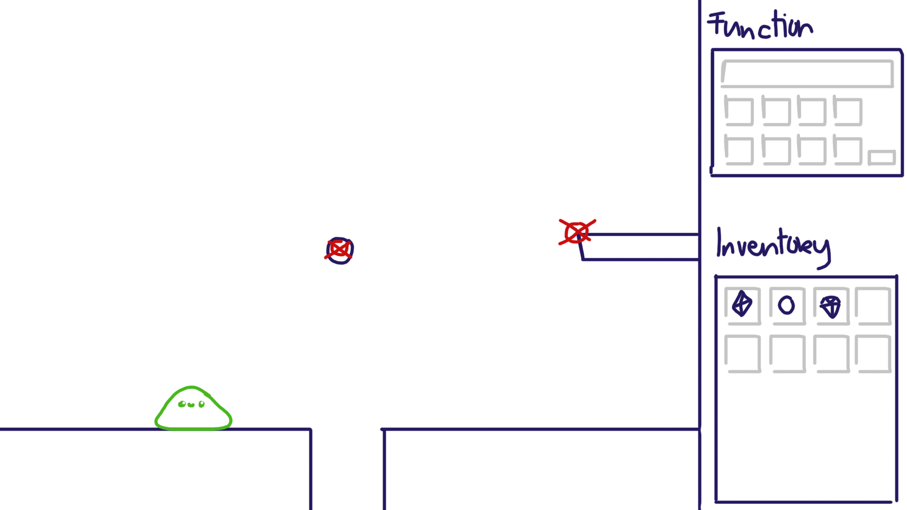

#### Game Objects

Describe the different game objects in the game, their purpose and how they interact with the player.

`Calculation zone`: A special zone in which the calculation will be shown and the player has the ability to create the function. For the demo level the player has the ability to equip gems unlimited and everywhere, this includes the calculation zone.

`Gems`: Gems are objects that the player can pick up during the game. In the prototype the player can use the  gems unlimited times. In the real game, the player can only use the gem once and then has to collect a new one. These gems are scattered throughout the level and are added to the inventory where the player can equip them when he steps into a magic circle.
  - *Acid*: Acid can be used to burn through obstacles and walls like wood or slate. It cannot be used to build bridges, but only to destroy objects in the path of the player. Not every wall can be destroyed though, solid stone walls for example cannot. 
    - Math problem: 

    |  By adjusting the *A* value in the equation the player can aim the acid blob. The origin of the equation is at the connection point of the platform the player is standing on. If a description of the math problem is needed this will be shown in the 'Function' area as well.  |      |
    | --- | --- |

    - Limitations: the player can only use acid on specific surfaces

      - Destroyable surfaces: Wood, slate

    - Future updates : More surfaces to destroy

    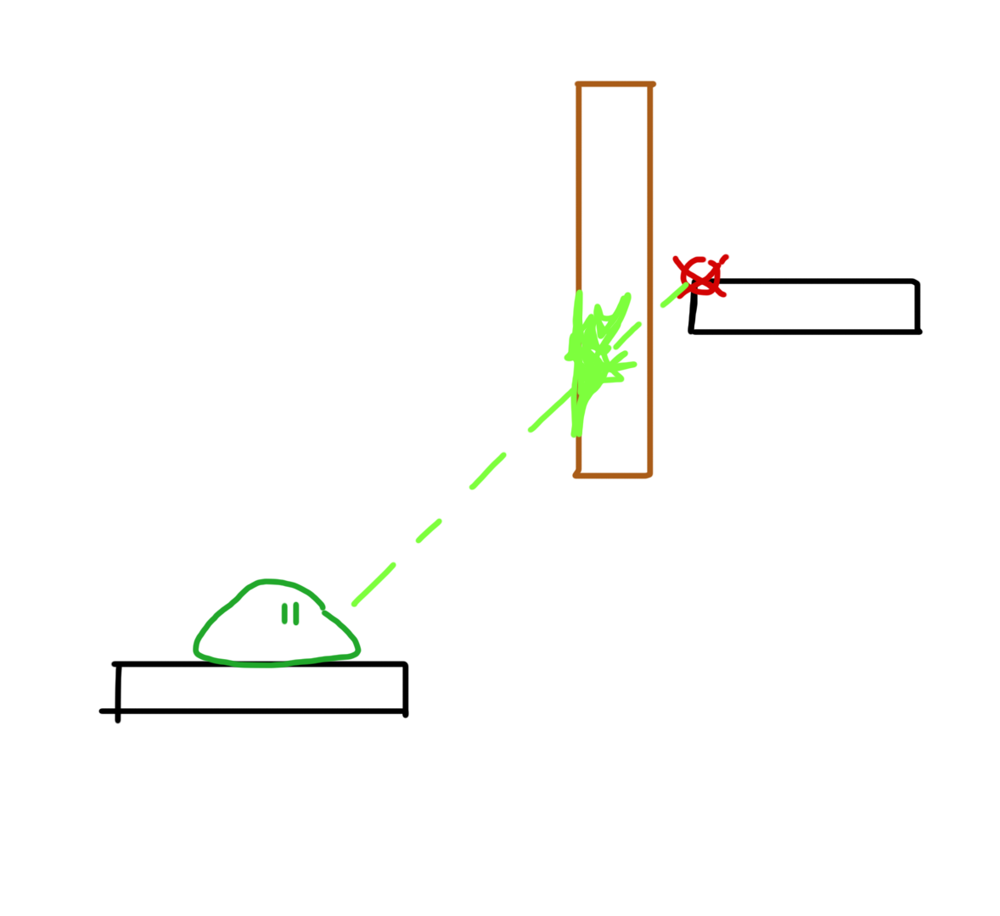

  - *Goo*: The goo cannon can be used to build bridges, by walking into the "calculation zone". The bridges built from goo cannons can go vertical and the player can climb upwards / vertical. The bridge is static and cannot be used for swinging. To use the cannon the player has to calculate the intercept between two functions. The player has to actively walk  / climb on the built bridge with the keyboard.

    - Math problem: 

    |  By calculating the intercept of two lineair equations the player can aim where the goo will be shoot at. The goo will automatically be connected from the place the player is standing to the calculated coordinate. If a description of the math problem is needed this will be shown in the 'Function' area as well.   |  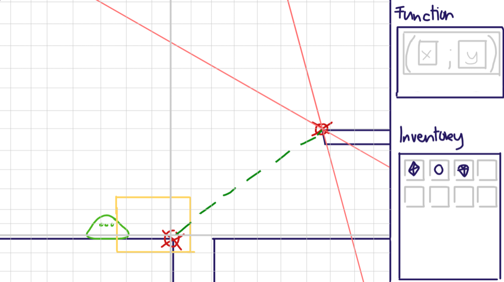   |
    | --- | --- |

    - Limitations: The goo-cannon can only be used on platforms in a specific area and has a certain range.

    - Future updates : In future upgrades for the goo cannon, the player can connect multiple single connection points to extend the range of the bridge. The player has to shoot a single connection point and then from there shoot the final platform, because the bridge has not been built yet and will only be built when the last bridge / function is connected to the platform.

  

  - *Sticky*: With the sticky gem the player can calculate / read coordinate to shoot sticky goo and swing from one point to another. (Like spiderman) The player automatically swings as soon as the connection has been created and has to actively jump off using the space bar.

    - Math problem: 
    
    |  The player can read the coordinates from the visible grid. If a description of the math problem is needed this will be shown in the 'Function' area as well.   |  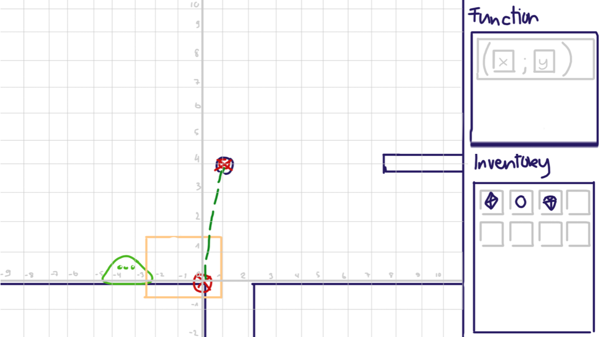   |
    | --- | --- |

    - Limitations: The range of this sticky goo is limited and it can only be used on round single pillars which stick out of the wall.

     - Future updates : As a future update, the range will be extended.
     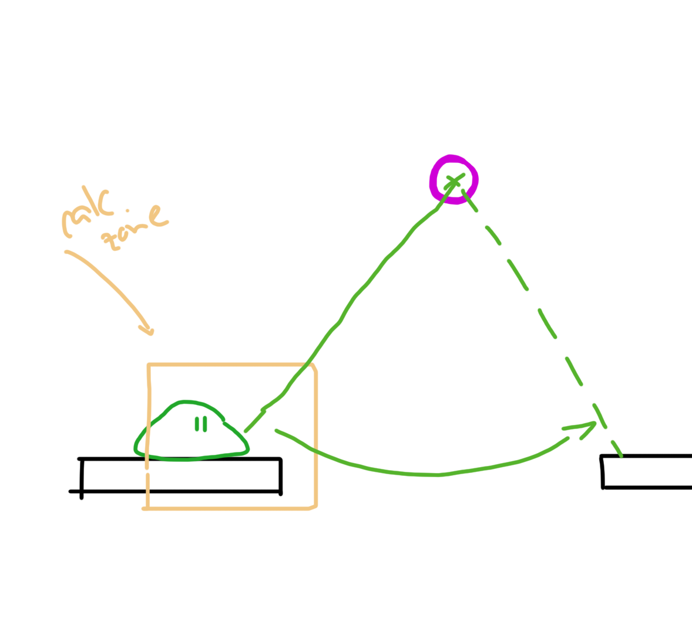

  - *Vlimes*: Can be used to repair broken bridges. The player can write two sets of coordinates to connect them (starting point of the bridge and end point) or a table to calculate the connection. From both the end and the starting point, slimey vines will grow, connect and repair the bridge for the player to walk on.

    - Math problem: 
    
    |  By using the given table the player has to calculate the coordinates of the desired edges. If a description of the math problem is needed this will be shown in the 'Function' area as well.   |  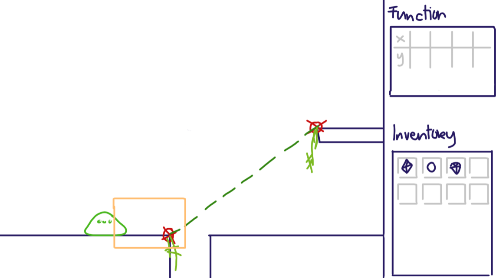   |
    | --- | --- |
    - Limitations: The vlimes gem can only be used on broken bridges and not to create completely new ones.
    - Future updates : In the future, when the player gets introduced to more types of functions like quadratic or exponentional ones, this type of gem can be used to build bridges that resemble the curve.

    | 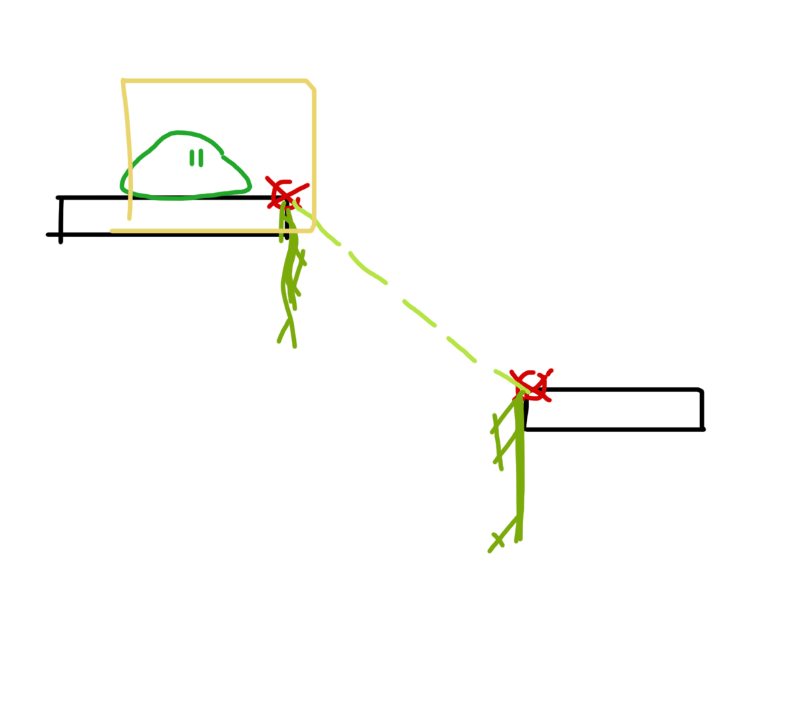 | 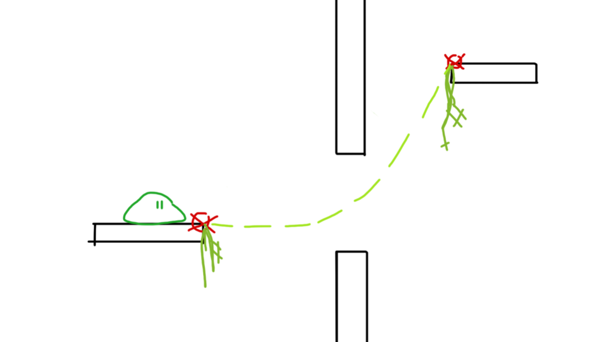 |
    | ---------------------------------------- | --- |

  - *Sliamond in the rough*: This gem combines all of the mentioned gems from above into one: Acid, Goo, Sticky and Vlimes. It inherits all of the abilities the player gets from each gem. It appears when the player dies 3 times in a row and cannot complete the level / stage. It disappears at the end of the level and is not permanent in the inventory. The sliamond in the rough is of unlimited use within each level; in the demo level but also in the finished game. 

    - How to use: 
    
    | The 'Sliamond in the rough' automatically selects the right ability for the player when they walk into a calculation zone. Other gems will be grayed-out and unusable once the 'Sliamond in the rough' has been activated.    |    |
    | --- | --- |

    - Limitations: Sliamond gem inherits all of the limitations of the gems.

    - Future updates : Sliamond gem also inherits all of the expansions for the future from each gem. 

`Platforms`: To progress through the level the player has to get from platform to platform. The player can stand and walk on these platforms. The platforms have connection points which serve as the targets for the functions, when the player creates a function it automatically snaps to the connection point if it is in a certain "acceptance"-range.

`Pillars`: Pillars are round objects that stick out from the wall. They can be used by the player to swing from one point to another. He can do that by equipping the sticky gem and use the pillar as an anchor point.

`Obstacles`: Obstacles consist mainly of walls made of different materials. Some of them can be destroyed with the acid gem, others are solid and indestructible.

  - Solid Walls (Stone) 
    - cannot be destroyed
  - Slate
    - can be destroyed
  - Wood
    - can be destroyed
  - Gravel
    - can be destroyed

`Single connection points` : Single connection Points are the extension to the goo cannon. The goo cannon can be used to connect two connection points from platforms but is limited in range. With this extension, the goo cannon can be used to connect multiple points together and create longer bridges. The player has to write all the multiple functions in one go until he reaches the final platform. The player cannot stand or walk on these connection points or the bridge as long as they are not connected to the main platform.

`Magic circle` : In the final game, the player has not the ability to equip all the gems all the time and unlimited. The gems are consumables and are of single use. If he wants to use a specific gem again, he needs to collect it first. The player can also not equip them everywhere he wants to, he has to stand in a magic circle. These magic circles appear before every puzzle in the final game. For the demo level, the player can equip all the gems everywhere and is not limited to only the magic circle. 

`Checkpoints`: Each level is split up into stages, between each stage there is a checkpoint. If the player dies, he can infinitely re-spawn from the newest unlocked checkpoint.

`Friends` : Friends are little slimes that are caged. You can find them throughout the level and free them. Once you freed them, the player can copy their style and customize their own character.

`Coins` : The player can collect one Coin in each stage of the level, so three stages means three Coins per level. there is a coin that the player can reach by solving more difficult equations.

`Magic doors` : The player can unlock magic doors which then lead him to an additional stage of the level. There he could find a caged friend or a coin.

`Keys` : Keys can be picked up in order to unlock magic doors. The keys could be more integrated into the game such as complete this picture using bridges.

#### Polish 

- **Particles**

    - When death, whenever the player walks into traps and/or the abyss

    - On pickup, whenever a gem gets picked up

    - On selecting a new gem, both in the inventory and the player

    - On completion, whenever a bridge is completed

    - Shooting acid, whenever platforms, obstacles etc. get destroyed by acid

- **Animations for**

    - bridges (shooting, growing vines)

- **Ambient lighting**

    - Use coloured lighting to emphasize emotions, i.e. blue for sad, red for angry, yellow for happiness etc.

- **Hover/Selection emphasis**
    - Different colour, when something is selected in the inventory 

    - Different colour, when a table/part of the function can be edited

#### Story 

*you're a unique slime with capabilities to copy abilities from gems.*
*Due to your unique skill an evil alchemist has taken you from your home.*
*Once you had awoken you realised you've been taken to their dungeon.*
*Dreaming of meeting your friends and family again, you've taken the challenge to try and escape the dungeon.*

> Once upon a time a sweet child 'o slime was born in the magical woods.
> Live was a breeze and the child enjoyed everyday, as he should.
> The child was beloved by all and soon found a slimey village it could call its home.
> Soon he went on a journey, and made new friends as he may roam.
> As time went on, tragedy struck.
> The child got taken, as he was out of luck.
> A special slime he was, known as *the copycat*.
> Locked away there he sat.
> How to escape, he pondered.
> And as the door broke he wondered,
> Time to leave, run fast and far,
> As he will reach back home, as bright as a star.

#### Sound 

**Menu and Story**: The sound should be cute and light, a simple but memorable soundtrack that fits the light-hearted theme of the game.

**World**: Each world has a soundtrack that is specific to that area. The levels and stages inherit that sound. The soundtrack should be upbeat and happy. 

**Game objects sound effects**:

- *Player (slime)*, wet and slimy sounds.

- *Gems*, little pling for when you pick them up, a magical glitter sound when you equip them and a specific sound for each gem when you apply them.

	- Acid: kind of burning sound when the acid hits a obstacle, a shooting sound when deployed

	- Sticky: sticky and slimy type of sound when it latches on to the pillar, a shooting sound when deployed

	- Goo Cannon: sticky and slimy type of sound when it fires to the connection point, a shooting sound when deployed

	- Vlimes: a earthy, planty kind of sound when the vines connect to each other, a shooting sound when deployed

	- Sliamond in the rough: a magical light sound when used and a shooting sound when deployed

- *Coins and Keys*, a light pling when picked up

- *Friends*, a sad type of calling when in the cage, a happy pling when released and a slime sound

#### Art 

The art style is cute, clean and the view is sideways. The colours are vibrant and happy. and cute <3 ^^ :heart: (*/ω＼*)

| .png) |  | .png)  | .png)  | .png)  |
| ----------------------------------------------------------------------- | --------------------------------------------------------------------------- | ------------------------------------------------------------------- | ------------------------------------------------------------------------- | ----------------------------------------------------------------------------- |

## Concept 6: Slope Swing

### Concept

Golf with friends but with equations.

#### Mission

Within one or two sentences describe in abstract terms what (action, feeling, gameplay) the game should achieve, the core of the game.

1. Graph out the competion

#### Design Pillars

Choose words that fit the emotional core of the game and describe them as if you are currently experiencing them during gameplay.

- `Multiplayer`: I want to play with my peers to have fun with others. [Socializer]
- `Competition`: I want to be the best. [Killer]
- `Exploration`: I want to see what the courses have to offer. [Explorer]
- `Challenge`: I want to look for challenges to overcome. [Achiever]

#### Aesthetics

The types of fun we want to achieve with our design.

- Challenge
> The game needs to provide a challenge to the students. They need the option of competing with each other.
- Fellowship
> The game needs to connect the students in the classroom. A feeling of comradery or chaos should be present.
- Discovery
> The game needs to let players discover. For those who want to explore deeper than the surface.

### Design

#### Mechanics

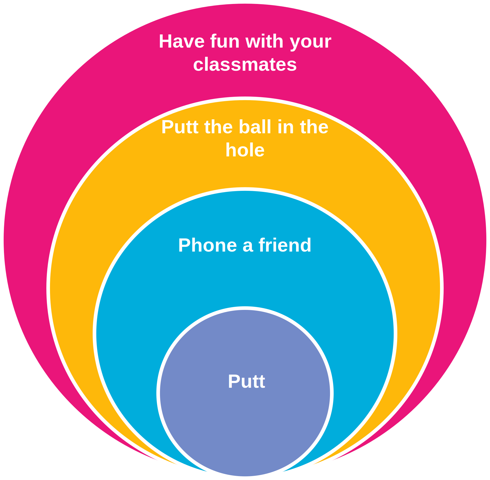

##### Core Mechanics

###### Putt

You can putt your ball using a linear equation. The only variable that can be changed is the 'a' value. This is because changing the 'b' value would have to move the ball up and down. The strength of the putt will be decided by a power bar that alternates between minimum and maximum power.

##### Secondary Mechanics

###### Phone a friend

When the player stuck in a rut, they can phone a friend. This will show a pop up for the people who've already cleared the course. The 'friend' can then input a putt for the player. Upon submission, the player themselves has to choose to excecute the putt or decide on a different trajectory.

###### Secret hole

A hole that is hidden in every course that is an alternate way to finish the course. Players need to explore to find this one.

#### Dynamics

The game operates on a lobby system. The host (teacher) displays on a big screen and players can join the lobby by entering a code. The host can start the game whenever they deem there are enough players in the lobby. Once the game starts, players are all placed in the starting position and the camera moves from the hole to the starting position to indicate to all the players where they need to go.

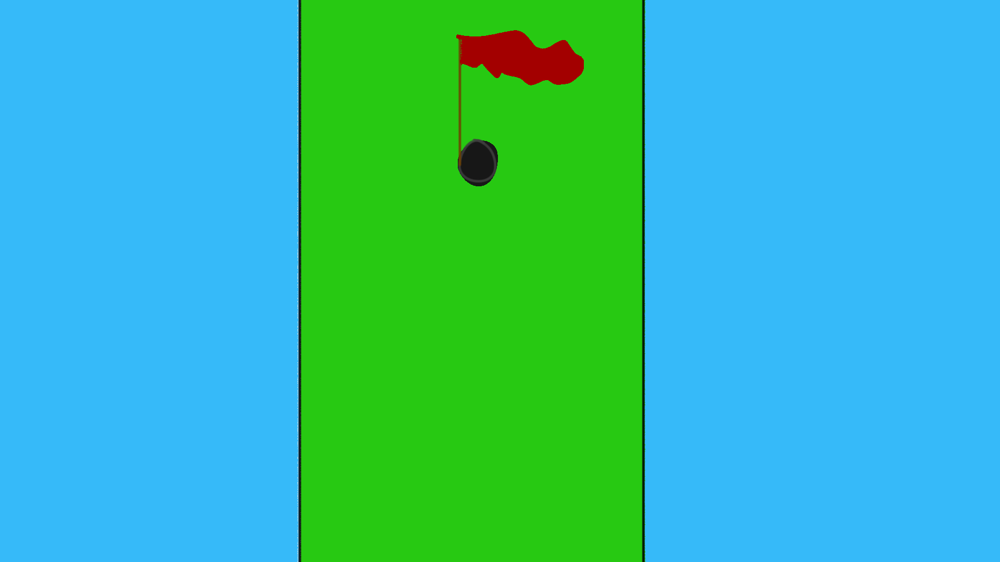

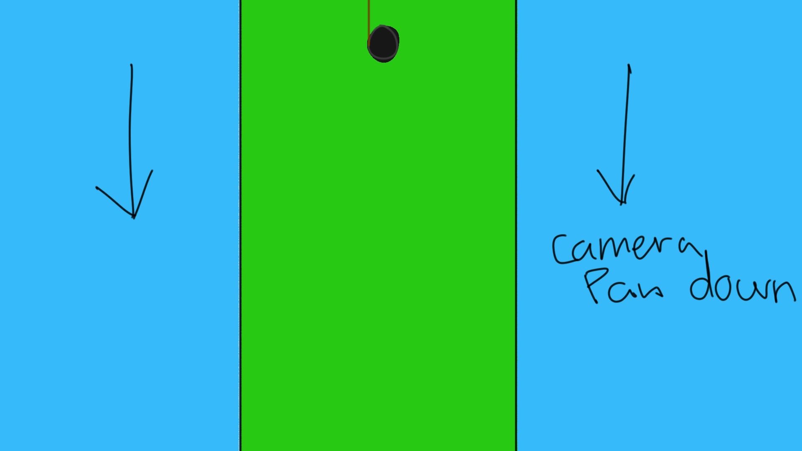

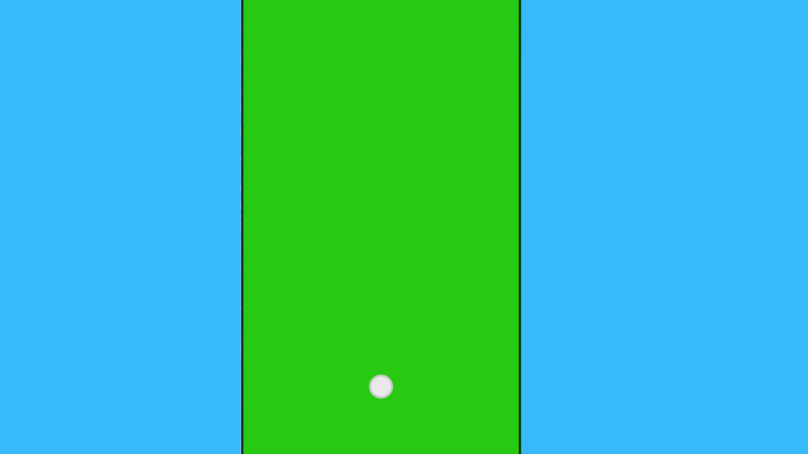

The host will not participate, instead their game will display the entire course, the hole (not the secret one) and the location of all the players. The players all have a zoomed in (static) view of their own ball. They all have a differently coloured ball and they do not collide with each other. The players have to focus on their own gameplay and can use the host's game to view what their position is in relation to the hole.

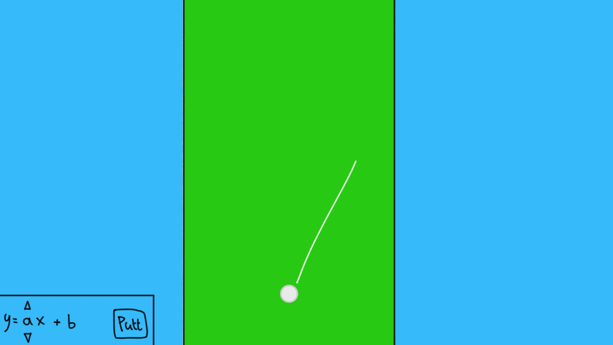

Players will see a trajectory of where their equation will shoot them towards. They can adjust the 'a' value to adjust accordingly. Once they press the 'Putt' button, a bar shows up to determine the strength of their putt.

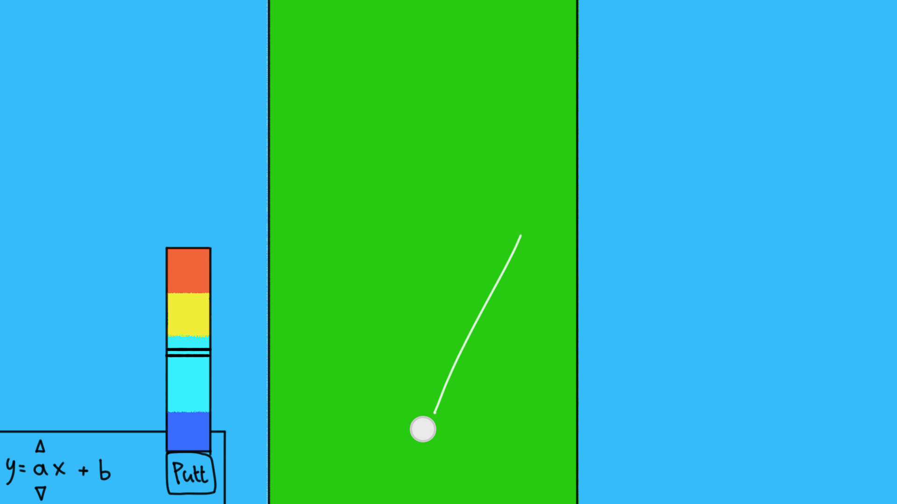

Players also have the option to 'Phone a friend'. This entails asking a player that has already finished the course to give them one input. If the player presses the 'Phone a friend' button, a pop up will appear for all the players that have already finished. The first person to respond is the one that'll get to give the input. Once the input has been given, the caller can decide to putt or adjust in case of sabotage. This encourages in class interaction with other students and gives the players that have already finished something to do.

Every course also has a secret hole that isn't as easy to reach/find as the normal hole. To illustrate how this would work, take a look at this example level:

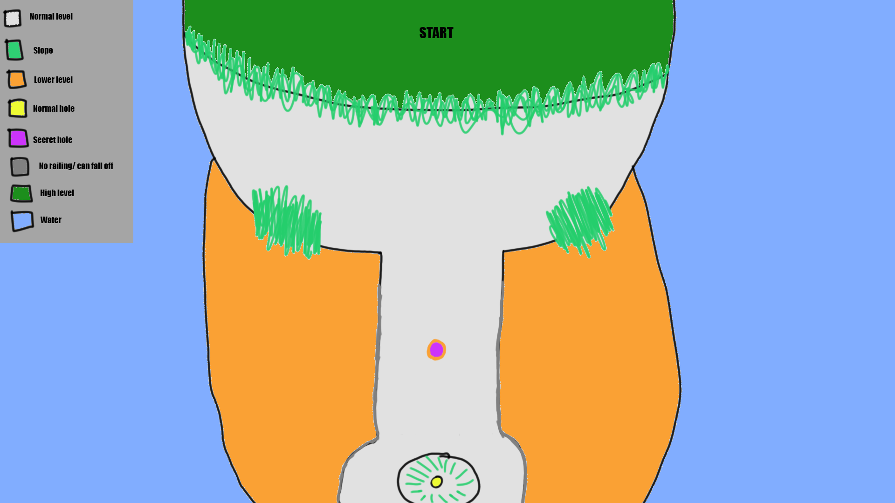

The purple circle is the secret hole. It's hidden underneath the bridge. If a player is obstructed by a higher plane/object, a small ring surrounds them so they can see the level they're on. If they are inquisitive enough to check under the bridge, they might spot the secret hole.

If the player gets in a secret hole, a metric will be updated for them that will keep track of how many secret holes the player finds at the end of the game.

As soon as a player putts their ball into a hole, they are no longer visible on the map. This ensures that player's can't just look at where other players are to find the secret hole.

A course is finished once all the players have putt their ball into a hole. There is no need for a time limit because of the 'Phone a friend' mechanic.

Once a course is finished, an overview pops up on the host's screen that displays:

- the amount of time each player spent
- how many strokes each player has done in the course
- the amount of total strokes the player has in the game
- if the player putt their ball in a secret hole or normal one

After all the courses are done, the game is over. The metrics will be tallied up and show the top 3 of all categories:

- fastest player (spent the least time)
- most accurate player (least amount of strokes)
- columbus (most secret holes)

There is no overall winner because that would devalue the achievement of the explorers. It's possible for one player to be number 1 in all categories but all they would get is personal achievement.

Alternatively, the game also has a conveyerbelt mode. This mode works the same as the regular gamemode but the teacher can constantly supply equations that will show up for the players on a conveyerbelt. If the player picks a card from the converyerbelt, the trajectory for the golfball is set and then the player has to decide the power of the putt. The phone a friend button allows a different player to pick a card for you, it would **NOT** consume the card before the asker decides to putt in that trajectory. So they have an option to pick a different card regardless.

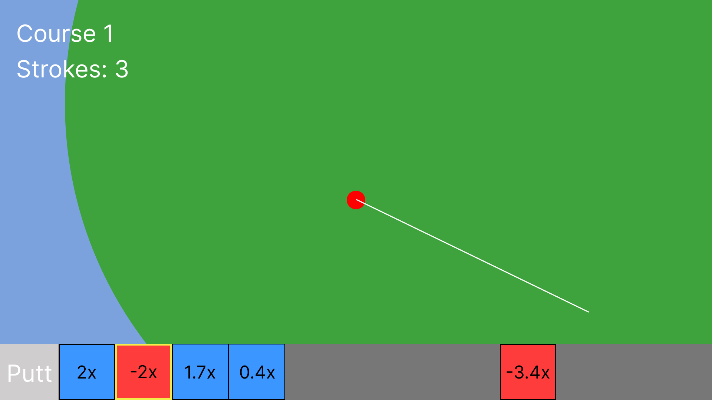

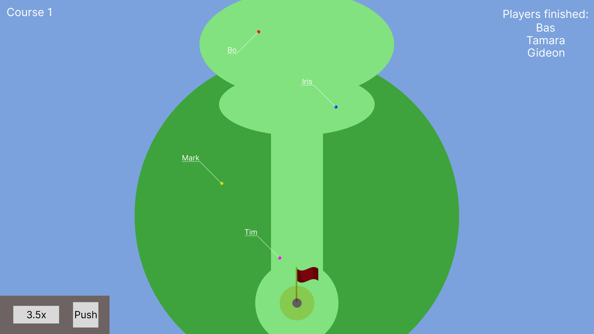

#### Math Didactics

##### Learning Goals

1. ~~Playing with the fundamental characteristics of a linear function first individually and then in combination.~~
2. Applying the fundamental characteristics to transform one representation (verbal, graph, formula, table) into another in a playful way.
3. Solving quests, tasks and problems involving multiple representations of linear function (verbal, graph, formula, table).
4. ~~Applying properties of linear functions to solve equations in a playful way.~~
5. Applying the appropriate function representation to solve a question or problem in the game.

##### Implementation

This concept is more focussed on making linear functions accessible and getting the students on board with math in a fun way. But it still encompasses most of the learning goals. The only one that isn't fully applicable is number 4. This is because the there is no deterministic solution to any of the courses since there is variance in the power bar. It's technically possible but we don't expect the students to have perfect control over every shot.

This game also intentionally doesn't give a way to shoot straight up or down. This is because a linear equation can never be perfectly straight up or down. Keeping this in will make the player question why the game doesn't allow perfectly straight up and down shots. At this point, the teacher can take the opertunity to explain this fundamental aspect of linear equations.

#### Economy

##### Consumables

There are no consumables.

In an alternate version of the game, there are consumables like in putt party. But the goal of the game is to have the player familiarize themselves with the workings of linear equations. Those powerups would introduce chaos and distract from our main objective.

#### Progression

The game starts with the host opening a lobby that other players can join. During the lobby, the host can change the rules and gamemode. Once the host deems the lobby to be full, they can start the game.

Once the game starts, the first course is introduced with a quick camera pan from the hole to the starting position of the players.

Each player can then individually start playing through the course. Whether they go for the normal hole or the secret one is up to the player.

Once every player has finished the course by entering either the normal or secret hole, the results for that course are shown and the host decides when to go to the next course.

This is repeated until all the courses have been played. Once that happens, the game is over and the final results are shown.

#### Loops

##### Game Loop

*Course progression*

```mermaid
flowchart TD
%% Nodes
A([Start course])
B(Putt)
D(Phone a friend)
G(Course done)
C(Clear course)
H(Course stats)
E(Wait for next course)
F(Help out)

%% Edge connections between nodes
    A --> B
    B -- Need input from another --> D
    B -- Go for normal hole --> C
    B -- Go for secret hole --> C
    C --> E
    E --> F --> D
    E -- Everyone cleared? --> G
    G -- Look at host's screen --> H
```

*Game session progression (from host's point of view)*

```mermaid
flowchart TD
%% Nodes
A([Start lobby])
B(Choose gamemode & Decide rules)
C(Choose course set)
D(Start game)
E(Course starts)
F(Course results)
G(Last course?)
J(Yes)
I(No)
H(Final results)
K(Play again?)
L(Yes)
M(No)
N([Session over])


%% Edge connections between nodes
    A --> B
    B --> C
    C --> D
    D --> E
    E -- Students play course --> F
    F --> G
    G --> I
    I -- Proceed to next course --> E
    G --> J
    J --> H
    H --> K
    K --> L
    L --> B
    K --> M
    M --> N

```

##### Feedback Loops

```mermaid
flowchart LR
%% Nodes
A(Putt)
B(Gain better understanding of linear equations)
C(Clear course)
D(Next course is harder)

A --> B --> C --> D --> A

```

```mermaid
flowchart LR
%% Nodes
A(Play course)
B(Finish course)
C(Idle)
D(Help out a friend)

A --> B --> C --> D --> A

```

### Implementation

#### Target Platform

The target platform for this game will be mobile-web and desktop-web.

#### Camera

Each player has a camera on their ball. It doesn't rotate.

The host's camera is a zoomed out shot of the entire course.

Once a player has finished a course, the camera will follow a different player's ball that's still playing. The finished player can click anywhere on the screen to go to the next player in the queue.

#### Controls

The game controls with mouse.

#### User Interface

##### Main Menu

##### Lobby

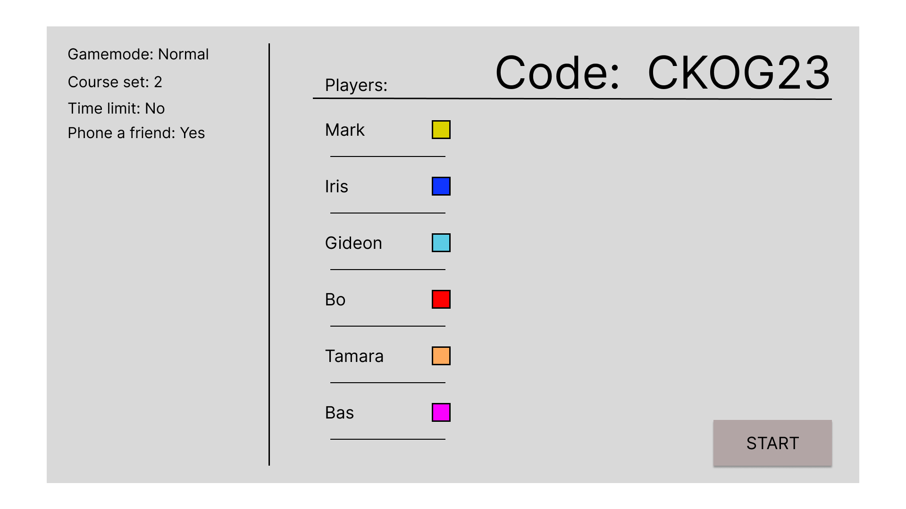

The gamemode is **NOT** a difficulty setting, rather it can be the regular gamemode or the conveyerbelt gamemode.

##### Host View

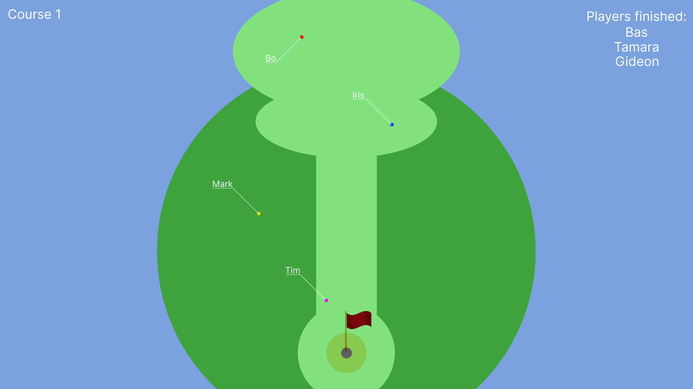

##### Player View

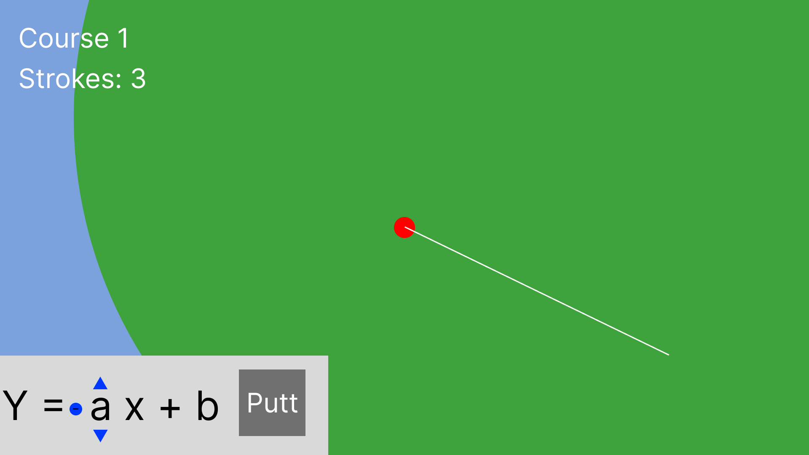

##### Direction

Because a linear equation goes through the origin and goes both directions, the player needs to have control over which way they want to putt. Pressing anywhere on the screen will toggle 'Left' or 'Right' direction.

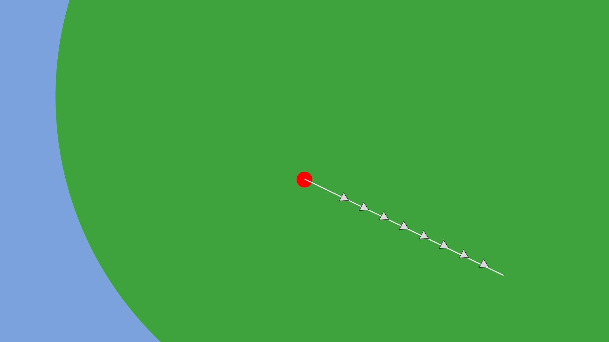

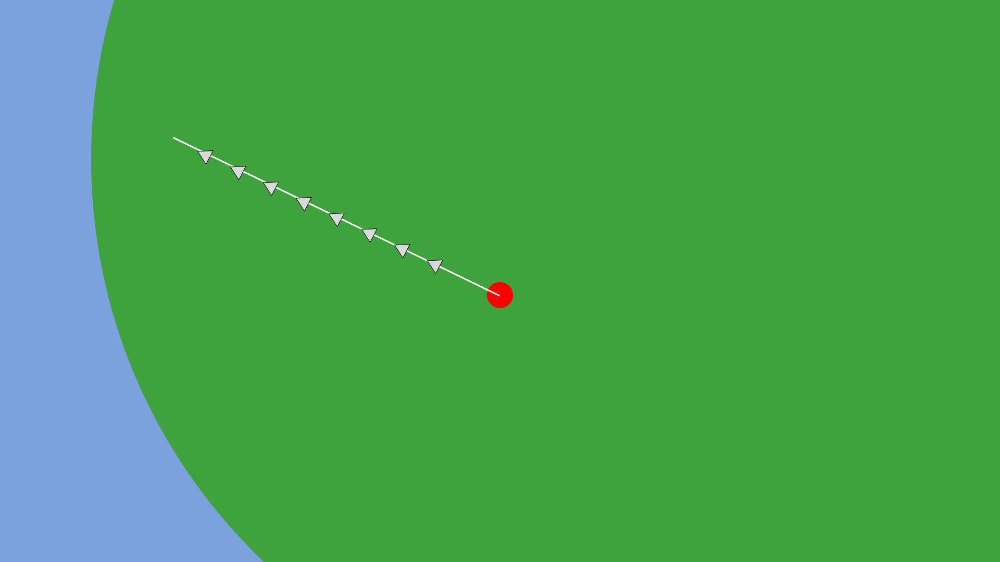

##### Putt

The player can switch between a negative and positive 'a' value. If the player presses the circle, they toggle positive or negative.

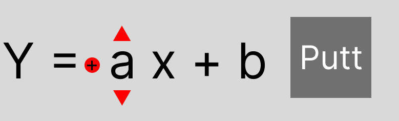

When the player presses the 'putt' button, a bar appears that has a slider moving between the minimum and maximum value. The player presses the 'putt' button again to determine the strenght of the putt, depending on where the slider is at that moment.

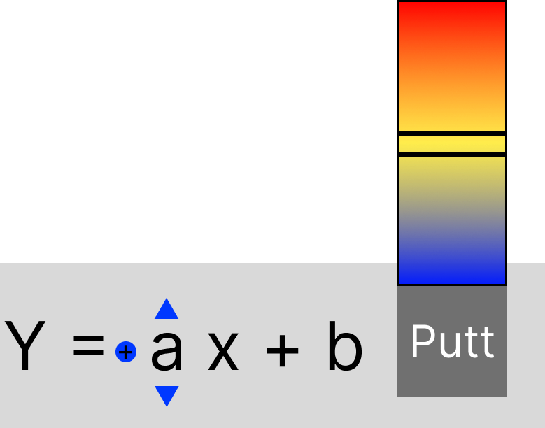

##### Course Results

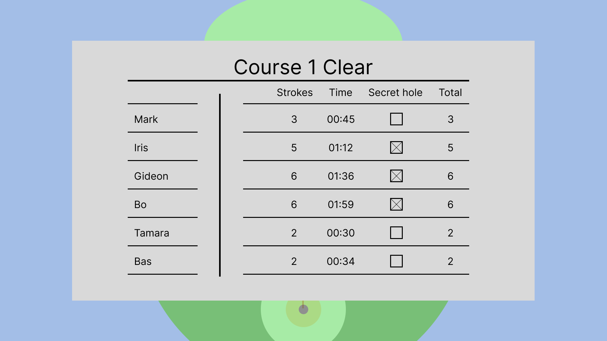

##### Final Results

After all the courses of the set have been cleared, the game transitions to the final results on the host's screen. The students can look at the screen to see if they placed in the top 3 for three separate categories:

- Sniper, most accurate player. 
> The lower amount of total strokes, the higher the player will be placed.
- Speedy Gonzales, the quickest player.
> The lower the total amount of time spent on the course, the higher the player will be placed.
- Columbus, the most explorative player.
> The more times a player clears a course by putting their golf ball in a **secret** hole, the higher they're placed.

#### Game Objects

Describe the different game objects in the game, their purpose and how they interact with the player.

##### Golf ball

This is the player. Used to depict progression through the level. The player can use the putt mechanic to move the golf ball. Each player has their own instance and colour. Players don't collide with each other.

##### Normal Hole

This is the goal for the player. They need to putt their golf ball into the a hole. The normal hole is shown to the player when the course starts and pans back to the player. The normal hole is always visible on the host's overview screen.

##### Secret Hole

This is a hidden hole in every course that a player has to explore the level thoroughly for. Putting the golf ball into the secret hole finishes the course just like the normal hole, but the game will update a metric for the player.

#### Polish

#### Story

There is no story.

#### Sound

During the setup phase, the game needs to have a simple, catchy melody. Something that communicates to the kids in the classroom they're about to play Slope Swing. Something akin to the [Kahoot lobby theme](https://www.youtube.com/watch?v=yjwJIjNuniQ).

As for the music during gameplay, it depends on the theme of the course set. For a generic golf theme, the music needs to keep the player engaged with an upbeat atmosphere. Think of the [BBC golf classic theme](https://www.youtube.com/watch?v=a-bd5j18N0s) but less eccentric.

#### Art

The art should be vibrant and evoke a comfortable feeling. We want the children to be in a relaxed mindset so they are less likely to stress out over the math. Golf Story is a good example. But for this game, the art's complexity would have to be toned down to facilitate WebGL.

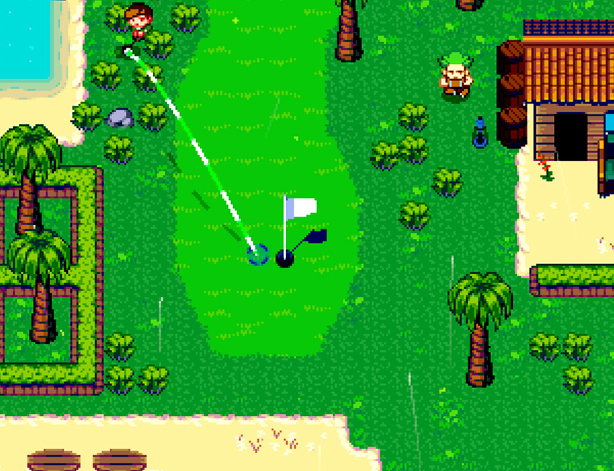
