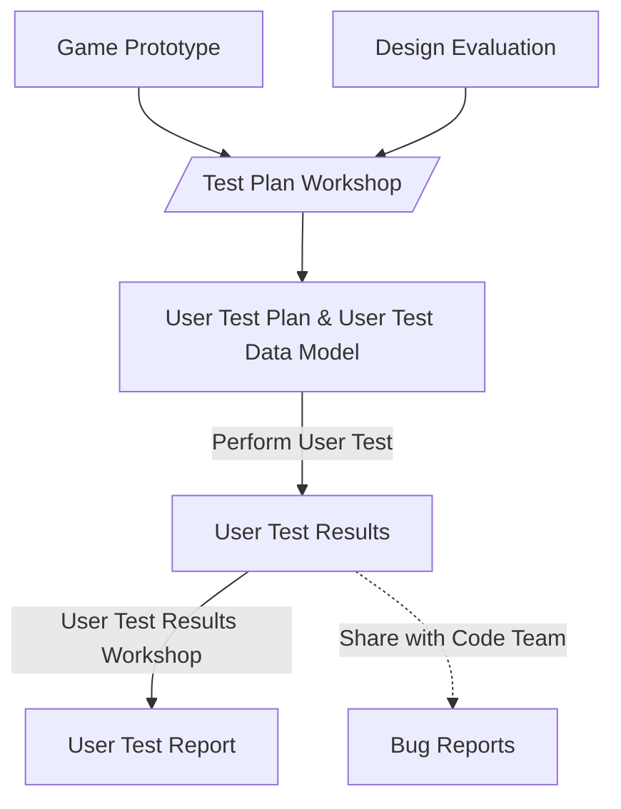

# User Testing: Substantiation & Process

This document outlines the goals, themes, products, and process of user testing for our project.

## Project Context

To provide context for the user testing phase of our project, we will first outline the goals and themes of our project.

### Goal

The goal of user testing within the context of our project, is to gather feedback from potential users to inform the design efficacy of our concepts as serious math games for middle school students. This feedback will be used to inform the design of the games, and to substantiate the efficacy of the games as entertaining learning tools.

### Themes

For our project we have identified a set of main themes that we would like to explore through user testing. These are based on the `HBOi Domain Description`[^1] and our client's values as described in `01 Conceptual Exploration & Process`:

- Functionality
- User Experience
- Accessibility
- Didactic Efficacy
- Game Flow

To further narrow down these themes, we have identified a set of questions that we would like to answer through user testing. These questions are based on the themes and goals of our project and can be found in `02 Benchmarks & Metrics`.

## Products

During the user testing phase of our project, we will produce the following products per concept:

---

### User Test Plan

The `User Test Plan` outlines the specific data that will be collected during user testing and the methods that will be used to collect this data.

### User Test Data Model

The `User Test Data Model` organizes and structures the data that will be collected during user testing. It provides a framework for collecting data in a consistent manner. 

### User Test Report

The `User Test Report` is a document that outlines the results of user testing, and provides an analysis of the collected data. It will include insights and recommendations for each concept based on the `User Test Results`. 

---

Each product has a corresponding template: `04 User Test Plan Template`, `05 User Test Data Model Template`, and `06 User Test Report Template`.

## Process

> The blocks are products, while the arrows and trapezoids are processes.

[^1]: HBOi Domain Model: https://www.hbo-i.nl/wp-content/uploads/2024/05/24040_HBOi_Domeinbeschrijving_ENG.pdf