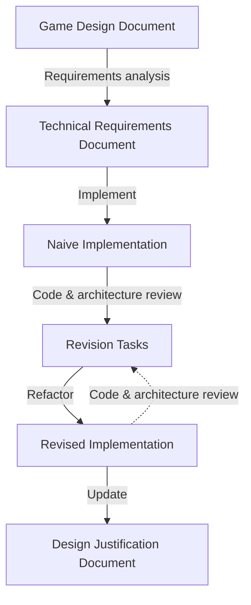

# Code Design & Core Values

To support the design process, this document outlines the necessary information needed when designing our systems. This includes, core values, tools, and design process.

## Core Values

The main core value of our project is: `KISS&EF: Keep It Simple, Stupid & Editor First`.

### Keep it simple

`Keep it simple:` is satisfied by the following guidelines:

#### Code Design

- SOLID principles
- Structs & classes over tuples
- Composition over inheritance (only one level deep, if applied)
- Static extensions & utility classes over inheritance

#### Code Style

- Clear & full naming, no abbreviations
- Documentation comments on all public members
- Only use code comments when necessary to explain complex code (e.g. math formulas, algorithms, etc.)

### Keep it stupid

`Keep it stupid:` encompasses the following guidelines, which should only be breached if necessary to reach a design goal:

- No `Unity` jobs
- No `Unity` DOTS
- No `Unity` burst
- No native plugins

### Keep it editor first

When designing an implementation, the `Unity` editor should be the first thing to consider. Game designers should be able to use the editor to create and modify games without needing to write code.

`Keept it editor first:` comes down to the following guidelines:

- Modular plug & play behaviour over hardcoded solutions
- Custom inspectors, property drawers, editor windows, etc.
- Use the `Unity` equivalent of a feature if it exists, e.g. `UnityEvent` over C# `event`, `UnityAction` over C# `Action` etc.

## Tools

For designing our systems we will be using the following tools:

- `Unity` for the game engine
- `draw.io` & `mermaid.js` for our diagrams (e.g. UML, flowcharts, etc.)
- `GitHub` for the version control of our designs and knowledge base to store our documents

## Design Process

During the implementation phase, the architecture will change and evolve. To support this changing nature, the design process will roughly follow the following flow and create several products:

- `Game Design Document` -> Requirements Analysis -> `Technical Requirements`
  
  The design team provides the code team with a game design document which is then analysed and translated into a `technical requirements` document.
  
  This document will describe the needed features and systems using the following template:
  
  ```markdown
  # Feature: Cannon
  
  ## Description

  > Describes the feature in general terms, while making sure to include possible end-users and the relation of this feature to their goals.
  
  A cannon is a game object which shoots projectiles in a specific direction.
  
  - The player will use this to shoot at targets in a game level
  - The level designer wants to to understand which impact the placement of the object is going to have
  - The game designer wants to define which relation the object has to the rest of the game
  
  ## Functional Requirements

  > These are requirements that describe how the system should function.
  
  - It should be able to translate a float variable into a rotation around it's origin
  - It should be able to shoot a projectile 
  
  ## Acceptance Criteria

  > These are requirements that describe how the system should be implemented
  
  - It should use multiple scripts for its functional behaviour to allow for reusability
  - It should use object pooling for managing it's projectiles
  
  ## Dependencies
  
  > List of features where this feature depends upon.

  None
  ```

- `Technical Requirements` -> Implement  -> `Naive Implementation`
  
  After having turned this design into technical requirements, it is naively implemented. 

- `Naive Implementation` -> Code & Architecture Review -> `Revision Tasks`
  
  After a first `naive implementation`, it is looked at during the code & architecture review meeting. During this meeting the codebase is scrutinised and revised by the team, it should support sharing knowledge and being critical of self-provided work. The meeting should generate `revision tasks` which outline necessary changes.

- `Revision Tasks` -> Refactor -> `Revised Implementation` -> Update `Design Justification`
  
  After the meeting, the changes are applied to the codebase and the original requirements document is updated to reflect these changes. The last product to be produced/updated is a `design justification` document, which outlines the reasoning for the current implementation choices.

### Diagram

> The blocks are products, while the arrows define a process.



## Sources

The information outlined in the document was discussed and agreed upon during:

- The code meeting of 19-04-24
- The code meeting of 25-04-24